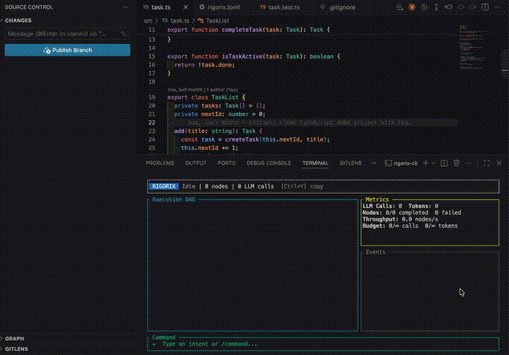

# Rigorix

[](https://crates.io/crates/rigorix)
[](LICENSE-MIT)
[](https://github.com/arman-jalili/rigorix-oss/actions/workflows/ci.yml)
[](https://doc.rust-lang.org/edition-guide/rust-2024/index.html)

**A deterministic coding-agent runtime for repeatable, auditable AI software engineering.**

Rigorix compiles natural-language development tasks into executable Directed Acyclic Graphs (DAGs). Instead of relying on an open-ended agent loop, it separates planning from execution: the execution plan is generated, validated, and then executed within configurable policy, permission, and budget constraints. The result is AI-assisted software engineering that is repeatable, inspectable, and suitable for automated environments such as CI/CD.

The LLM generates code; Rigorix governs execution.

Rigorix operates through three modes:

- **CLI** (`rigorix`) — Interactive TUI + flag-based scripting for local development
- **GitHub Action** (`rigorix-action`) — PR governance and automated code generation in CI/CD
- **Engine** — The core library powering both

---

## Why Rigorix Exists

Modern coding agents are remarkably capable. They can write code, edit projects, execute commands, and iterate on failures. But they share a fundamental problem: **they are unpredictable, unauditable, and difficult to govern in automated contexts.**

Every agent loop today works the same way: an LLM decides what to do, does it, checks the result, and loops. That loop is powerful — but it has no structure. There's no distinction between planning and execution. There's no audit trail beyond conversation history. There's no way to say "execute this plan but only if it stays within these boundaries."

This works fine when a human is watching every step. It breaks down when you want to:

- **Run in CI/CD** — without a human to approve every tool call
- **Audit what happened** — when conversation history isn't enough for compliance
- **Enforce policies** — "deny any change that touches the auth module" or "flag diffs that modify payment processing"
- **Budget costs** — cap LLM spending per run so a runaway agent doesn't burn your API key


Rigorix is opinionated: it intentionally gives up some **flexibility** in exchange for **repeatability, governance, and deterministic execution.**

The core idea is simple: instead of an LLM deciding what to do at each step, you compile the intent into a DAG first — a deterministic, reviewable plan. The DAG says: *read these files, generate this patch, run these tests, verify these conditions.* The LLM fills in the content; the DAG controls the flow. This is the same pattern that made build systems (Make, Bazel) and data pipelines (Airflow, Dagster) reliable: separate *what* from *how*, validate the plan before running it, and record every execution.

This approach makes tradeoffs. Rigorix is not as flexible as a free-form agent loop. It can't have a "conversation" with you or improvise mid-execution. If you want a coding assistant that chats, Rigorix is the wrong tool. But if you want a CI/CD pipeline that generates code, enforces policies, produces auditable records, and can run without supervision — Rigorix exists for that.

**Rigorix achieves this through bounded autonomy:** every execution is constrained by configurable risk policies, permission rules, execution budgets, and quality gates. The model is intentionally restrictive: the LLM decides what to generate within the execution graph, while Rigorix determines what is allowed to happen.

```
 Natural language task
        ↓
 Classifier — maps intent to a template
        ↓
 Template — defines the execution structure
        ↓
 Parameters — extracted from the task
        ↓
 DAG — deterministic execution graph
        ↓
 Execution — tools, retry, recovery
        ↓
 Validation — quality gates, policies
        ↓
 Audit — signed, timestamped record
```

---

## Templates

Templates encode repeatable engineering workflows. Instead of asking the model to rediscover how to perform a common task each time, Rigorix selects an appropriate template, extracts parameters, builds an execution graph, and lets the LLM focus on generating code within that structure.

Repeatable means the same intent produces the same execution structure under the same templates and policies. The generated code may differ, but the workflow, validation steps, and governance remain consistent.

A template defines:

- **What** files to read and what to generate from them
- **Which** commands to run for verification (type-check, test, lint)
- **How** to handle dependencies between steps
- **Where** the output goes (new files, patches, test results)

Here is a minimal template — it reads a file, runs a regex filter, and writes the result:

```yaml
name: extract-function-docs
description: Extract JSDoc comments from a TypeScript file
parameters:
  - name: file_path
    type: string
    description: Path to the TypeScript file
nodes:
  - id: read_file
    action: file_read
    params:
      path: "{{ file_path }}"
  - id: extract_docs
    action: llm_generate
    depends_on: [read_file]
    params:
      prompt: >-
        Extract all JSDoc comments from the file below.
        Return them as a markdown list.
      input: "{{ read_file.output }}"
  - id: write_output
    action: file_write
    depends_on: [extract_docs]
    params:
      path: "docs/{{ file_path | basename }}.md"
      content: "{{ extract_docs.output }}"
```

When a user runs `rigorix plan "Extract docs from src/api.ts"`, Rigorix classifies the intent, maps it to this template, prompts the LLM to fill `file_path`, and builds the 3-node DAG. **The LLM generates the doc content; the template controls the flow.**

When no existing template matches the intent — or confidence is low — Rigorix prompts the LLM to generate a new template dynamically. Generated templates can be cached and reused for future executions, reducing the need to regenerate common workflows.

---

## How Rigorix Compares

| Dimension | Rigorix | Claude Code | Copilot / Cursor | Aider | SWE-Agent |
|-----------|---------|-------------|------------------|-------|-----------|
| **Execution** | Template-driven DAG | Agent loop | Agent loop | Agent loop | Agent loop |
| **Safety** | Risk gating, budgets, permissions | Permission prompts | Permission prompts (Cursor) | Git auto-commit | Docker sandbox |
| **PR governance** | Built-in policy.toml | External CI | ✗ | ✗ | ✗ |
| **Audit** | HMAC-signed envelopes | Conversation history | Conversation history | Git log | Ephemeral containers |
| **Quality gates** | Post-execution validation | ✗ | ✗ | ✗ | ✗ |
| **Self-correcting** | Validate loop (plan → verify → fix) | Retry loop | ✗ | Lint-then-fix loop | Retry loop |

Rigorix is designed for **deterministic, auditable, safely-bounded automation** — not open-ended agent loops. If you need a code assistant that chats with you, use Claude Code or Aider. If you need a CI/CD pipeline that enforces policies and generates auditable code changes, use Rigorix.

---

The example below shows the generated execution graph before anything is modified. The user can inspect the plan and choose whether to execute it.



*🎥 Demo: Rigorix planning and executing a TypeScript refactor — reading code, generating a patch, type-checking, and running tests.*

<details>
<summary>📋 CLI output (what the TUI shows step by step)</summary>

````
$ rigorix-cli plan  "Add a method to TaskList class in src/task.ts that returns only active tasks"
Plan: Add a method to TaskList class in src/task.ts that returns only active tasks (confidence 100%)
  Template: add-get-active-tasks-method | LLM: 2 calls, 1141 tokens
  Parameters:
    ├── file_path: "src/task.ts"
  Graph: 5 node(s), sealed=true
    · Read current task.ts file (root)
    · Insert getActiveTasks method after activeCount ← [Read current task.ts file]
    · Write extended task list test file ← [Read current task.ts file]
    · Type-check with tsc ← [Insert getActiveTasks method after activeCount, Write extended task list test file]
    · Run extended task list tests ← [Type-check with tsc, Write extended task list test file]

Run this plan now? [y/N]: y
2026-06-28T16:40:38.139935Z  INFO run: rigorix_engine::orchestrator::application::orchestrator_impl: Starting orchestrator run execution_id=019f0f1a-bbfb-7722-8c43-e3232eb88f9b
2026-06-28T16:40:46.026763Z  INFO run: rigorix_engine::orchestrator::application::orchestrator_impl: Orchestrator run completed execution_id=019f0f1a-bbfb-7722-8c43-e3232eb88f9b status=Completed
Run: Completed — 0 failed, 5 passed, 0 skipped (5 total)
  Template: add-get-active-tasks-method | LLM: 2 calls, 1210 tokens

  ✓ Read current task.ts file — Success
  ✓ Insert getActiveTasks method after activeCount — Success
  ✓ Write extended task list test file — Success
  ✓ Type-check with tsc — Success
  ✓ Run extended task list tests — Success
````

</details>

Rigorix currently supports Rust, TypeScript, Python, and Go as target codebases. TypeScript is the most mature integration today (it has a working failure-compiler step); the others are functional but earlier-stage.

---

## Quickstart

### Install

```bash
# From source
cargo install --git https://github.com/arman-jalili/rigorix-oss rigorix-cli

# Or build locally
git clone https://github.com/arman-jalili/rigorix-oss
cd rigorix-oss && cargo build --release -p rigorix-cli
./target/release/rigorix --help
```

### Set your API key

```bash
export RIGORIX__LLM__API_KEY="sk-ant-..."   # Anthropic
# or: export ANTHROPIC_API_KEY="sk-ant-..."
```

### Initialize a project

```bash
cd my-project
rigorix init
```

### Run your first task

```bash
rigorix run "Explain how the main module works"
```

Rigorix will: classify the intent → extract parameters → generate a DAG → execute nodes (file reads, edits, bash commands) → validate results.

### Plan before running (recommended)

```bash
rigorix plan "Add a new endpoint to the API"   # Review the DAG, then:
rigorix run "Add a new endpoint to the API"
```

Or just plan and confirm in one flow:

```bash
rigorix plan "Add error handling to the parser"
# Shows plan, then prompts:
# Run this plan now? [y/N]: y
```

---

## Architecture Overview

```
┌─────────────────────────────────────────────────────────────┐
│                   User (Developer)                           │
│            (CLI / TUI / GitHub Action)                       │
└──────────────────────────┬──────────────────────────────────┘
                           │
┌──────────────────────────▼──────────────────────────────────┐
│                     Planning Phase                           │
│                                                              │
│  Intent → Classify → Extract → Generate TaskGraph → Validate │
│                  ↕ (low-confidence fallback)                 │
│        Template System + LLM Template Generator              │
└──────────────────────────┬──────────────────────────────────┘
                           │
┌──────────────────────────▼──────────────────────────────────┐
│                     Execution Phase                          │
│                                                              │
│  DAG Engine (topo sort) → ParallelExecutor (tokio JoinSet)   │
│       → Tool System (file/git/command/LSP)                   │
│       → Retry/Recovery/Fallback                               │
│       → Cancellation (graceful/immediate)                    │
└──────────────────────────┬──────────────────────────────────┘
                           │
┌──────────────────────────▼──────────────────────────────────┐
│                  Observability & Persistence                  │
│                                                              │
│  Event Bus → State Persistence → Audit (HMAC-signed)         │
│         + Prometheus Metrics + Tracing                       │
└─────────────────────────────────────────────────────────────┘
```

---

## Repository Structure

```
rigorix-oss/
├── engine/              # Core library — all business logic
│   ├── src/             # Core engine (planning, execution, tools, governance)
│   └── .pi/             # Architecture docs, ADRs, diagrams
├── cli/                 # CLI binary — thin wrapper over engine
│   ├── src/cli_boundary/# Flag-based CLI (Clap, dispatch, config)
│   ├── src/tui/         # Interactive TUI (ratatui)
│   └── .pi/             # Architecture docs
├── actions/             # GitHub Action — thin adapter over engine
│   ├── src/             # 9 bounded-context modules
│   └── .pi/             # Architecture docs
├── Cargo.toml           # Workspace root
└── .pi/                 # Root-level architecture docs, prompts, scripts
```

---

## Development

### Prerequisites

- Rust 2024 edition (stable toolchain)
- LLM API key (set `ANTHROPIC_API_KEY` or `OPENAI_API_KEY`)

### CI as Continuous Verification

Rigorix treats CI as continuous verification rather than compilation and testing. Beyond formatting, linting, unit tests, and security scanning, every architectural capability is validated through proofing scripts that verify contracts, architecture readiness, documentation consistency, policy enforcement, and execution guarantees.

```
📦 86 automated verification steps

  Lint (12)     — formatting, clippy, CI validation × 3 crates
  Build (9)     — release build, static analysis, package × 3 crates
  Test (53)     — cargo test, unit/integration stages, 30 module proofing scripts
  Security (7)  — cargo audit, secret scan, stage security, security validation
  Docs (13)     — canonical, architecture, readiness, ubiquitous language × all crates
  Integration (2) — integration and operations validation
```

```bash
# Run the full CI suite (86 steps, ~2 min)
bash .pi/scripts/local-ci.sh

# Run a specific stage
bash .pi/scripts/local-ci.sh --stage=lint      # lint only
bash .pi/scripts/local-ci.sh --stage=build     # build only
bash .pi/scripts/local-ci.sh --stage=test      # test only
bash .pi/scripts/local-ci.sh --stage=security  # security only
bash .pi/scripts/local-ci.sh --stage=docs      # documentation only
bash .pi/scripts/local-ci.sh --stage=integration  # integration only

# Run a specific crate
bash .pi/scripts/local-ci.sh --crate=engine
bash .pi/scripts/local-ci.sh --crate=cli
bash .pi/scripts/local-ci.sh --crate=actions

# Quick mode — skip release builds, use cargo check instead
bash .pi/scripts/local-ci.sh --quick

# Save report to a file (auto-gitignored under .pi/output/)
bash .pi/scripts/local-ci.sh --save

# List all available CI validation scripts
bash .pi/scripts/local-ci.sh --list

# On failure, the report ends with a summary of exactly which steps failed
# and why — no scrolling through 2 minutes of output to find the error.
```

---

## Architecture Documentation

Each crate has its own `.pi/architecture/` directory with:
- **Module specs** — Detailed interface contracts for each bounded context
- **ADRs** — Architecture Decision Records explaining key design choices
- **Diagrams** — System context, data flow, deployment

---

## Contributing

We welcome contributions! Please read [CONTRIBUTING.md](CONTRIBUTING.md) for our development process, coding standards, and pull request workflow.

Key guidelines:
- Every edit must pass `cargo clippy --workspace` and `cargo fmt --check`
- All modules follow Clean Architecture with frozen contracts (see `.pi/architecture/`)
- Run `cargo test --workspace` before submitting
- New features require architecture documentation (see `.pi/prompts/feature-development.md`)

---

## License

Licensed under either of:

- MIT license ([LICENSE-MIT](LICENSE-MIT))
- Apache License, Version 2.0 ([LICENSE-APACHE](LICENSE-APACHE))

at your option.
