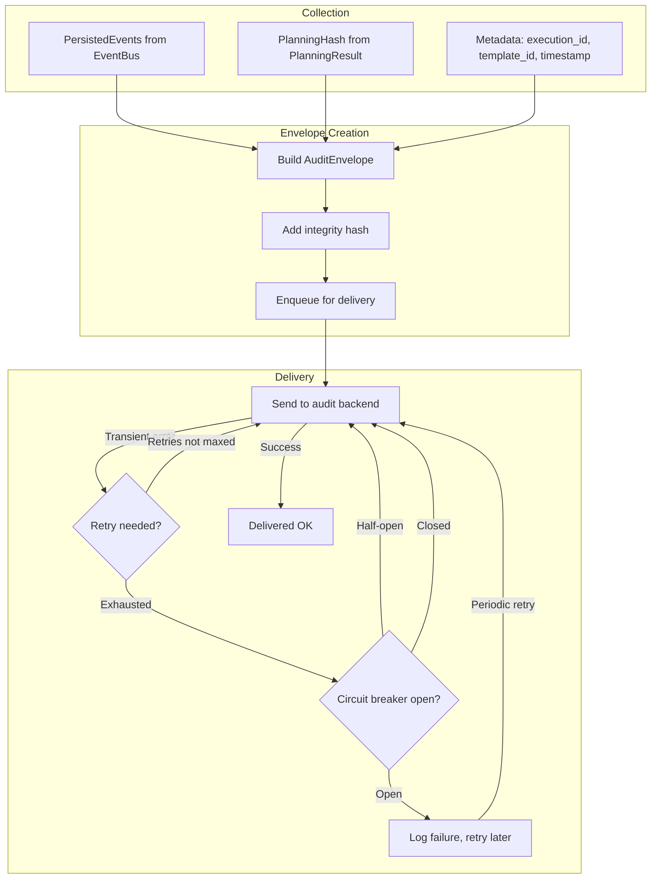

# Audit — Envelope Lifecycle



## CLI Audit Commands

```
rigorix audit list              # List audit envelopes (execution_id, date, status)
rigorix audit show <id>         # Show full envelope details  
rigorix audit diff <id1> <id2>  # Diff two execution plans (planning_hash comparison)
```

*Part of: Audit module*
