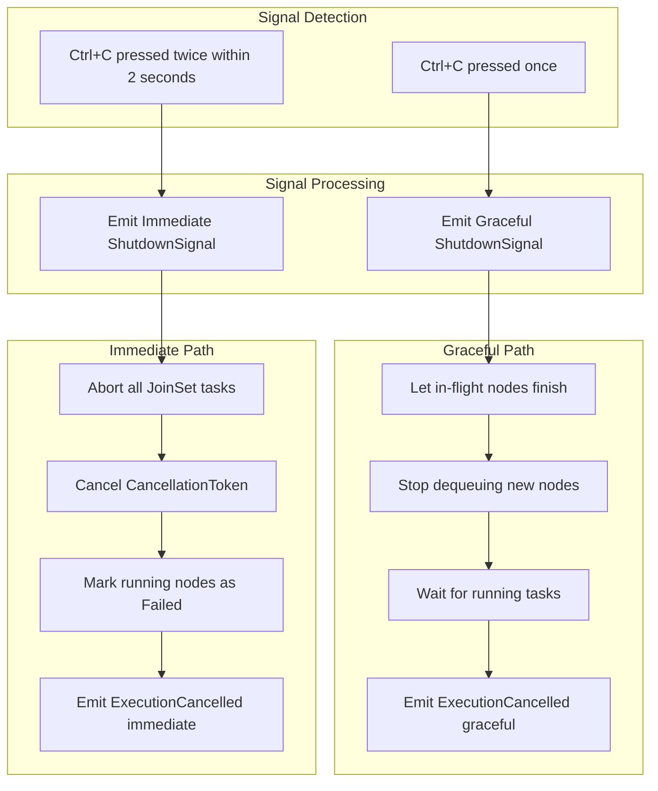

# Cancellation — Two-Level Shutdown



## Implementation

```rust
// Signal handler detects single vs double Ctrl+C
pub enum ShutdownSignal {
    Graceful,   // Finish in-flight, then stop
    Immediate,  // Abort all immediately
}
```

*Part of: Cancellation module*
