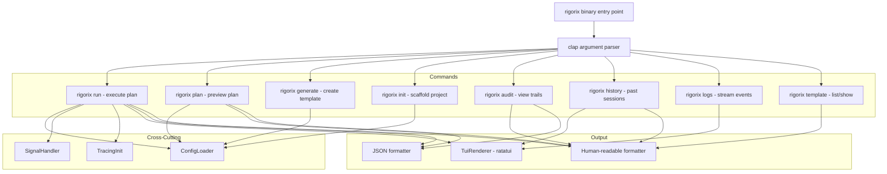

# CLI Boundary — Command Dispatch Flow

```mermaid
graph TB
    ENTRY[rigorix binary entry point]
    ARGS[clap argument parser]
    
    subgraph "Commands"
        RUN[rigorix run - execute plan]
        PLAN[rigorix plan - preview plan]
        GENERATE[rigorix generate - create template]
        INIT[rigorix init - scaffold project]
        AUDIT_CMD[rigorix audit - view trails]
        HISTORY[rigorix history - past sessions]
        LOGS[rigorix logs - stream events]
        TEMPLATE_CMD[rigorix template - list/show]
    end

    subgraph "Cross-Cutting"
        CONFIG[ConfigLoader]
        SIGNAL[SignalHandler]
        TRACING[TracingInit]
    end

    subgraph "Output"
        TUI[TuiRenderer - ratatui]
        JSON[JSON formatter]
        HUMAN[Human-readable formatter]
    end

    ENTRY --> ARGS
    ARGS --> RUN
    ARGS --> PLAN
    ARGS --> GENERATE
    ARGS --> INIT
    ARGS --> AUDIT_CMD
    ARGS --> HISTORY
    ARGS --> LOGS
    ARGS --> TEMPLATE_CMD
    
    RUN --> CONFIG
    RUN --> SIGNAL
    RUN --> TRACING
    PLAN --> CONFIG
    GENERATE --> CONFIG
    INIT --> CONFIG

    RUN --> TUI
    RUN --> JSON
    RUN --> HUMAN
    PLAN --> HUMAN
    PLAN --> JSON
    AUDIT_CMD --> HUMAN
    AUDIT_CMD --> JSON
    HISTORY --> TUI
    HISTORY --> HUMAN
    LOGS --> TUI
    TEMPLATE_CMD --> HUMAN
```

*Part of: CLI Boundary module*
