# DAG Engine — Two-Phase Construction Lifecycle

```mermaid
graph LR
    subgraph "Phase 1: Construction (Unsealed)"
        CREATE[Create empty TaskGraph]
        ADD1[add_unchecked Node A - deps: none]
        ADD2[add_unchecked Node B - deps: A]
        ADD3[add_unchecked Node C - deps: A]
        ADD4[add_unchecked Node D - deps: B, C]
        CREATE --> ADD1 --> ADD2 --> ADD3 --> ADD4
    end

    subgraph "Phase 2: Seal"
        VALIDATE[Validate dependencies]
        KAHN[Kahn topological sort]
        CYCLE{Cycle detected?}
        READY[Build O1 ready queue]
        SEALED[Graph sealed OK]
    end

    ADD4 --> VALIDATE
    VALIDATE --> KAHN
    KAHN --> CYCLE
    CYCLE --> |No| READY
    CYCLE --> |Yes| ERROR[DagError CycleDetected]
    READY --> SEALED

    subgraph "Execution"
        MARK[mark_completed node_id]
        UPDATE[Update in-degree of dependents]
        ENQUEUE[Add newly-ready nodes to queue]
    end

    SEALED --> MARK
    MARK --> UPDATE --> ENQUEUE
    ENQUEUE --> MARK
```



## Data Structures

```rust
// Core types (frozen contracts in engine/src/dag_engine/domain/graph.rs)
pub struct TaskGraph {
    nodes: Vec<TaskNode>,
    topological_order: Option<Vec<Uuid>>,
    sealed: bool,
    execution_state: ExecutionState,
}

pub struct TaskNode {
    id: Uuid,
    name: String,
    tool: String,
    dependencies: Vec<Uuid>,
    policy: ExecutionPolicy,
    intent: String,
    validation_rule: Option<ValidationRule>,
}
```

*Part of: DAG Engine module*
