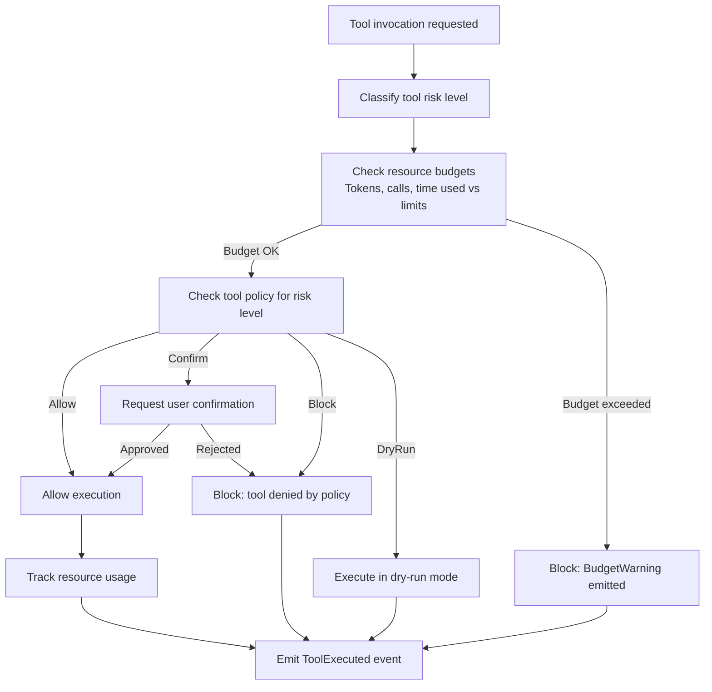

# Enforcement — Tool Execution Gating Flow

## Policy Matrix

| Risk Level | Default Policy | TUI Behavior |
|------------|---------------|--------------|
| Low | Allow | Auto-execute, show in log |
| Medium | Confirm | Show prompt: "Allow [tool]? (y/N)" |
| High | DryRun | Show what would happen, ask to confirm |
| Critical | Block | Deny, log to audit trail |

*Part of: Enforcement module*
