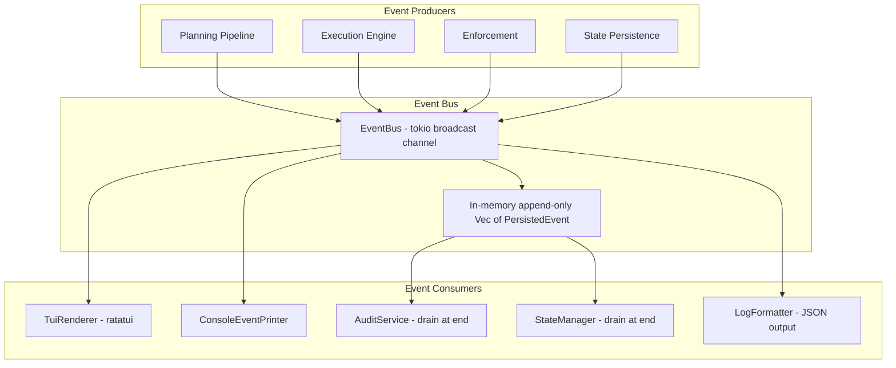

# Event System — Pub-Sub Architecture

## 11 ExecutionEvent Variants

| # | Variant | Payload | Emitted By |
|---|---------|---------|------------|
| 1 | PlanningStarted | execution_id, intent | Orchestrator |
| 2 | PlanningCompleted | execution_id, template_id, confidence, params | PlanningPipeline |
| 3 | NodeStarted | execution_id, node_id, node_name | ParallelExecutor |
| 4 | NodeCompleted | execution_id, node_id, duration_ms, output | ParallelExecutor |
| 5 | NodeFailed | execution_id, node_id, error, attempt | ParallelExecutor |
| 6 | NodeRetrying | execution_id, node_id, attempt, delay_ms | ParallelExecutor |
| 7 | ToolExecuted | execution_id, node_id, tool, risk_level, skipped | ExecutionEnforcer |
| 8 | ExecutionCompleted | execution_id, duration_ms, nodes_executed | Orchestrator |
| 9 | ExecutionFailed | execution_id, error | Orchestrator |
| 10 | ExecutionCancelled | execution_id | Orchestrator |
| 11 | BudgetWarning | execution_id, resource, used, limit | ExecutionEnforcer |

*Part of: Event System module*
