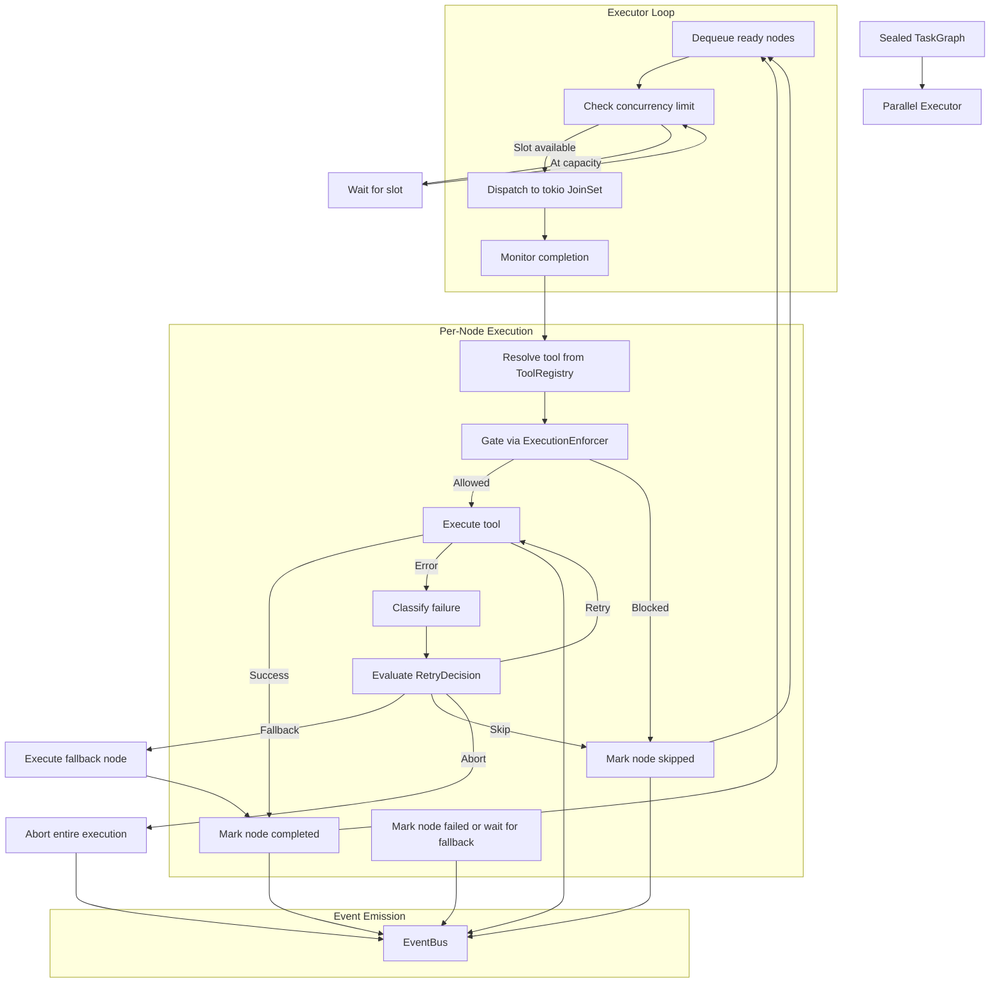

# Execution Engine — Parallel DAG Execution Flow

```mermaid
graph TB
    SEALED[Sealed TaskGraph] --> EXEC[Parallel Executor]

    subgraph "Executor Loop"
        DEQUEUE[Dequeue ready nodes]
        CONCUR[Check concurrency limit]
        DISPATCH[Dispatch to tokio JoinSet]
        MONITOR[Monitor completion]
    end

    DEQUEUE --> CONCUR
    CONCUR --> |Slot available| DISPATCH
    CONCUR --> |At capacity| WAIT[Wait for slot]
    WAIT --> CONCUR
    DISPATCH --> MONITOR

    subgraph "Per-Node Execution"
        RESOLVE[Resolve tool from ToolRegistry]
        GATE[Gate via ExecutionEnforcer]
        EXECUTE[Execute tool]
        CLASSIFY[Classify failure]
        RETRY[Evaluate RetryDecision]
        COMPLETE[Mark node completed]
        FAIL[Mark node failed or wait for fallback]
        SKIP[Mark node skipped]
    end

    MONITOR --> RESOLVE
    RESOLVE --> GATE
    GATE --> |Allowed| EXECUTE
    GATE --> |Blocked| SKIP
    EXECUTE --> |Success| COMPLETE
    EXECUTE --> |Error| CLASSIFY
    CLASSIFY --> RETRY
    RETRY --> |Retry| EXECUTE
    RETRY --> |Fallback| FALLBACK[Execute fallback node]
    RETRY --> |Skip| SKIP
    RETRY --> |Abort| ABORT[Abort entire execution]
    FALLBACK --> COMPLETE

    COMPLETE --> DEQUEUE
    SKIP --> DEQUEUE

    subgraph "Event Emission"
        EVENTS[EventBus]
    end

    EXECUTE --> EVENTS
    COMPLETE --> EVENTS
    FAIL --> EVENTS
    SKIP --> EVENTS
    ABORT --> EVENTS
```

*Part of: Execution Engine module*
