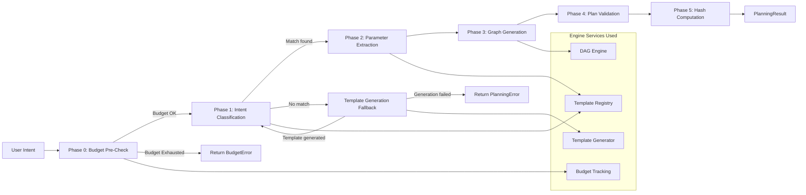

# Planning Pipeline — 6-Phase Flow

```mermaid
graph LR
    START[User Intent] --> PHASE0[Phase 0: Budget Pre-Check]
    PHASE0 --> |Budget OK| PHASE1[Phase 1: Intent Classification]
    PHASE0 --> |Budget Exhausted| ERROR[Return BudgetError]

    PHASE1 --> |Match found| PHASE2[Phase 2: Parameter Extraction]
    PHASE1 --> |No match| FALLBACK[Template Generation Fallback]
    FALLBACK --> |Template generated| PHASE1
    FALLBACK --> |Generation failed| ERROR2[Return PlanningError]

    PHASE2 --> PHASE3[Phase 3: Graph Generation]
    PHASE3 --> PHASE4[Phase 4: Plan Validation]
    PHASE4 --> PHASE5[Phase 5: Hash Computation]
    PHASE5 --> DONE[PlanningResult]

    subgraph "Engine Services Used"
        TEMPLATES[Template Registry]
        BUDGET[Budget Tracking]
        GEN[Template Generator]
        DAG[DAG Engine]
    end

    PHASE1 --> TEMPLATES
    PHASE2 --> TEMPLATES
    PHASE0 --> BUDGET
    FALLBACK --> GEN
    PHASE3 --> DAG
```

*Part of: Planning Pipeline module*
