# State Persistence — Atomic Write-Rename Flow

```mermaid
graph TB
    subgraph "Write Path"
        SERIALIZE[Serialize state to JSON]
        TMP[Write to temp file .rigorix/state/id.tmp]
        FSYNC[fsync temp file]
        RENAME[Rename tmp to target .rigorix/state/id.json]
        DONE[State persisted OK]
        SERIALIZE --> TMP --> FSYNC --> RENAME --> DONE
    end

    subgraph "Read Path"
        CHECK[Check for state files]
        EXISTS{State file exists?}
        LOAD[Load and deserialize]
        RESUME[Offer to resume execution]
        NOOP[Start fresh]

        CHECK --> EXISTS
        EXISTS --> |Yes| LOAD --> RESUME
        EXISTS --> |No| NOOP
    end

    subgraph "Crash Recovery"
        CRASH[Process crashes mid-write]
        TMP_ORPHAN[Orphan .tmp file remains write never completed]
        REAL_FILE[Target .json is old state rename never happened]
        CLEANUP[Startup: delete orphan .tmp files]
        
        CRASH --> TMP_ORPHAN
        CRASH --> REAL_FILE
        TMP_ORPHAN --> CLEANUP
        REAL_FILE --> CLEANUP
    end
```



## File Layout

```
.rigorix/
├── state/
│   ├── <execution_id>.json       # ExecutionState (overall + per-node)
│   ├── <execution_id>-graph.json # ExecutionGraph (for TUI history)
│   └── <timestamp>.tmp           # Orphan temp file (cleaned on startup)
├── templates/
│   ├── builtin-*.toml            # 13 built-in templates
│   └── user-*.toml               # User-generated templates
└── rigorix.toml                  # Configuration
```

*Part of: State Persistence module*
