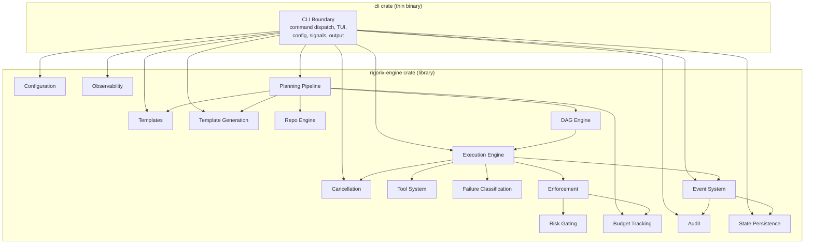

# System Context — CLI wrapping Rigorix Engine



## Key Principle

**The CLI crate has one module: `cli_boundary`.** All domain logic, execution, planning, templates, etc. live in the `rigorix-engine` crate. The CLI calls engine APIs directly — no wrapper traits, no mirror DTOs, no parallel domain layers.

## Dependency Flow

```
User → rigorix binary → clap parsing → dispatch → engine API → format output
```

*Updated: 2026-06-16*
*Reflects single-module CLI architecture*
