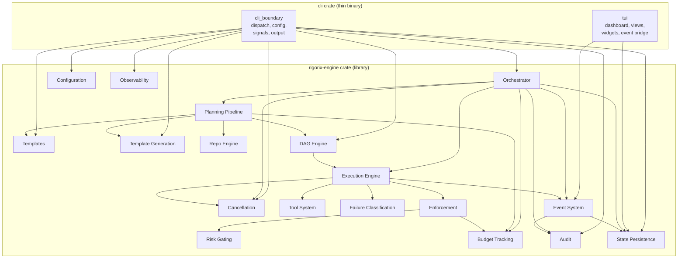

# System Context — CLI wrapping Rigorix Engine



## Entry Point Flow

```
$ rigorix  (no args)
    → tui::run(config)
    → user types intent in command bar
    → tokio::spawn(orchestrator.run(RunInput { intent }))
    → EventBridge subscribes to orchestrator.event_bus()
    → UI updates in real-time, user can cancel/inspect
    → orchestrator completes → return to command bar

$ rigorix run "add auth"  (with args)
    → cli_boundary::dispatch(Run, config)
    → build orchestrator, run, format output, print to stdout
    → exit
```

## Key Principle

**Two peer modules in the CLI crate:**
- `cli_boundary/` — dispatch, config, signals, output formatting
- `tui/` — terminal UI dashboard, EventBridge, views, widgets, input

All domain logic, execution, planning, templates, etc. live in the `rigorix-engine` crate. The CLI calls engine APIs directly — no wrapper traits, no mirror DTOs, no parallel domain layers.

## Dependency Flow

```
User → rigorix binary
    │
    ├── cli_boundary::dispatch() → engine API → format output
    │
    └── tui::run() → subscribe to EventBus → render views
```

## Module Boundaries

| Module | Depends On | Knows About Engine |
|--------|-----------|-------------------|
| `cli_boundary` | engine (orchestrator, config, state, audit, cancellation, dag, templates, template_generation) | Many engine types |
| `tui` | engine (event_system::EventBus, state_persistence) | Only EventBus + ExecutionState |

The TUI's engine surface is intentionally minimal — it reads two things:
- `EventBus` for real-time events
- `StateManager` for past execution loading

*Updated: 2026-06-16*
*Reflects two-module CLI architecture*
