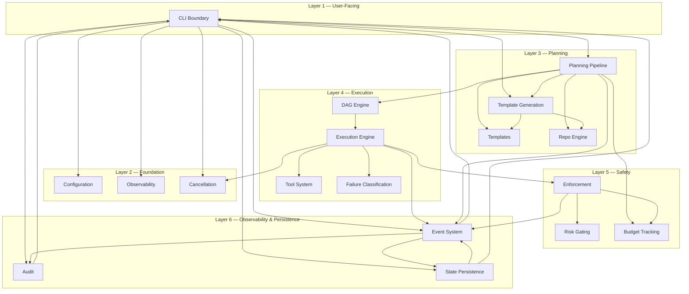

# System Context Diagram — Bounded Context Dependency Flow

## Context

18 bounded contexts organized into 6 layers. Arrows show dependency direction. CLI Boundary is the entry point; Event System is the backbone for observability.

## Layer Table

| Layer | Purpose | Contexts |
|-------|---------|----------|
| 1 — User-Facing | Entry point: commands, TUI, output | CLI Boundary |
| 2 — Foundation | Cross-cutting infrastructure | Configuration, Observability, Cancellation |
| 3 — Planning | Intent → executable DAG | Planning Pipeline, Templates, Template Generation, Repo Engine |
| 4 — Execution | DAG execution with concurrency & retry | DAG Engine, Execution Engine, Tool System, Failure Classification |
| 5 — Safety | Budgets, risk gates, enforcement | Enforcement, Risk Gating, Budget Tracking |
| 6 — Observability | Events, audit, persistence | Event System, Audit, State Persistence |

## Dependency Rules

1. **Layers depend only on layers at the same or lower level** — no upward dependencies
2. **Event System is a sink** — contexts emit events into it; no context depends on Event System for core logic
3. **CLI Boundary depends on everything** — it's the thin wrapper that wires engine to terminal
4. **No circular dependencies** — verified by the layered structure

---

*Session: 71e2b81a-a7a1-48ee-ab8f-56284bbec92d*
*Last updated: 2026-06-16*
