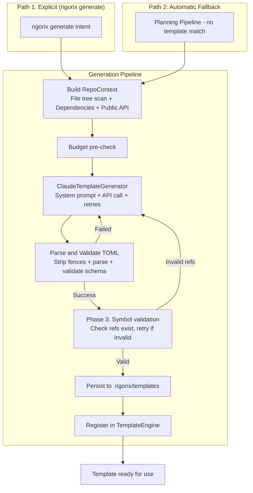

# Template Generation — Two Trigger Paths

```mermaid
graph TB
    subgraph "Path 1: Explicit (rigorix generate)"
        CLI_GEN[rigorix generate intent]
    end

    subgraph "Path 2: Automatic Fallback"
        PLAN_FALLBACK[Planning Pipeline - no template match]
    end

    subgraph "Generation Pipeline"
        CONTEXT[Build RepoContext<br/>File tree scan + Dependencies + Public API]
        BUDGET_CHK[Budget pre-check]
        LLM[ClaudeTemplateGenerator<br/>System prompt + API call + retries]
        PARSE[Parse and Validate TOML<br/>Strip fences + parse + validate schema]
        SYMBOL_VAL[Phase 3: Symbol validation<br/>Check refs exist, retry if invalid]
        PERSIST[Persist to .rigorix/templates]
        REGISTER[Register in TemplateEngine]
    end

    CLI_GEN --> CONTEXT
    PLAN_FALLBACK --> CONTEXT
    CONTEXT --> BUDGET_CHK
    BUDGET_CHK --> LLM
    LLM --> PARSE
    PARSE --> |Success| SYMBOL_VAL
    PARSE --> |Failed| LLM
    SYMBOL_VAL --> |Valid| PERSIST
    SYMBOL_VAL --> |Invalid refs| LLM
    PERSIST --> REGISTER
    REGISTER --> READY[Template ready for use]
```

*Part of: Template Generation module*
