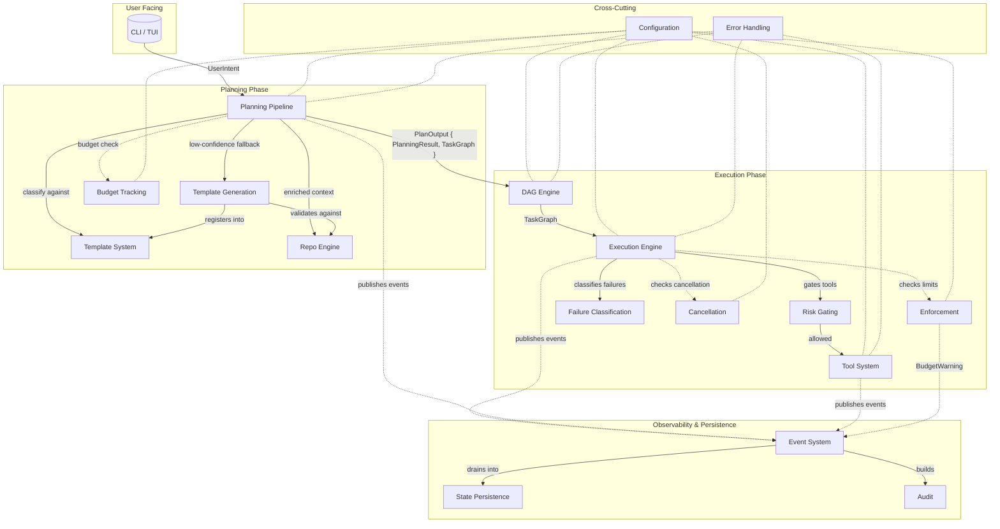
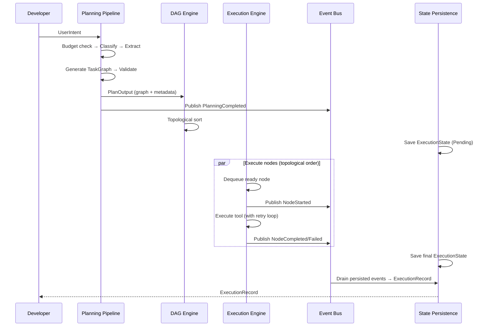

# System Context Diagram

<!--
Canonical Reference: .pi/architecture/diagrams/system-context.md
Blueprint Source: Domain Exploration Session 63c25384
-->

## Context

Rigorix is a deterministic coding CLI built in Rust. It operates as a task graph compiler with execution profiles. The system context below shows how the 17 bounded contexts interact.

## Bounded Contexts Interaction Flow

## Execution Lifecycle Flow

---

*Generated from session: 63c25384-1902-4b72-83bb-257f3f682af5*
*Date: 2026-06-13*
