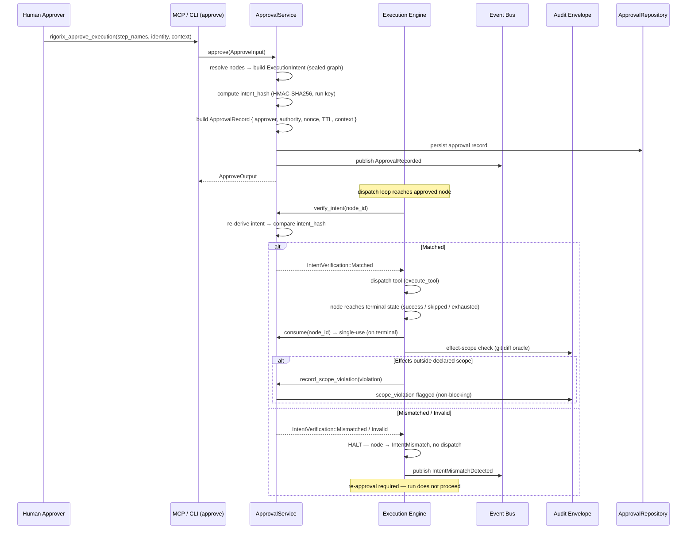

# Approval Binding Architecture

<!--
Canonical Reference: .pi/architecture/modules/approval.md
Rationale: Bind human approval to the exact resolved execution intent — replay protection at the step level, first-class signed evidence, and effect-scope verification
Blueprint Source: Requirements v1 — 2026-08-28 (approved, NOT YET BUILT)
-->

## Overview

The Approval Binding module upgrades Rigorix's human sign-off from a node-level gate to a **consequence-bound decision**. Today `approve_node` takes step names and inserts node IDs into `session.approved` — an approval is bound to a *node*, not to a *consequence*. If the step's effective payload changes between approval and dispatch (state-file tampering, cross-process resume against a modified graph, render/approve mismatch), the stale approval still authorizes execution.

This module binds approval to the **resolved execution intent** — the exact `(tool, intent payload, declared scope)` that will dispatch — captures **who** approved, **when**, **under what authority**, and **what they were shown**, records it as a first-class signed audit event, and verifies **pre-dispatch** that the executing call matches the approved call. A mismatch **halts** the run (re-approval required) — no replay of an approved call against a mutated one.

This closes, at the workflow-and-evidence level, the same replay gap Agent Hooks closes at the call level. It directly answers the industry questions raised in the OpenAI/Hugging Face incident postmortems and the Portotify "Capability Is Not Authority" stress-test (see [ADR-011](./decisions/ADR-011-approval-binding.md)).

## The Binding Chain

The defensible property this module establishes:

> **Shown = Dispatched = Executed (at dispatch level).**
> What the human was shown (`decision_context`) is derived from the same canonical `ExecutionIntent` that is hashed at approval time (`intent_hash`) and re-derived at dispatch time. The signed envelope proves the chain.

The remaining gap — process-level behavior of `run_command` (a shell process can spawn children, mutate files not in the declared scope) — is the **documented honest boundary**. It is caught post-hoc by effect-scope verification ([R5](#r5--effect-scope-verification)), never prevented by the binding layer.

## Binding Classes

Not every step can be bound with equal strength. Two classes are defined explicitly:

| Class | Step types | What is bound | Strength |
|-------|-----------|---------------|----------|
| **Payload-anchored** | `run_command`, `file_write`, `file_append`, `edit_file`, `git_stage`, `git_commit` — deterministic tool calls | The full dispatch payload: `tool` + resolved `intent` JSON + declared scope | Airtight at dispatch level — re-derivation is byte-identical to what dispatches |
| **Input-anchored** | `llm_generate` — generative steps | The **assembled prompt** (resolved `prompt_template` + `LlmStepContext` — deterministic given the same inputs, per the llm-step contract) | Binding covers the exact input fed to the LLM; generated output is inherently non-deterministic and verified post-hoc (validation loop, quality gates) |

This distinction is stated explicitly so the feature is never over-sold as "approval guarantees consequence" for generative steps.

## Requirements (R1–R5)

### R1 — Approval Intent Capture

At approval time, the engine captures the step's **execution intent** — `tool` + `intent` payload from the sealed `TaskNode` (the exact bytes that will dispatch) + optional declared scope. The intent is serialized and hashed → `intent_hash`.

```text
intent_hash = HMAC-SHA256(run_key, canonical_serialize(tool ‖ intent ‖ declared_scope))
```

`ApprovalRecord` = `{ step_name, node_id, intent_hash, intent_payload (canonical, as shown), approver_id, authority, decided_at, expires_at, nonce, token_claims_ref }`

### R2 — Pre-Dispatch Verification (replay protection at the step level)

Before dispatching an approved node, the engine re-derives the current intent from the sealed graph and compares it to the recorded `intent_hash`:

- **Match** → dispatch
- **Mismatch** → **HALT** — new node state `IntentMismatch`, audit event emitted, run does not proceed, **re-approval required**. Never auto-retry (retrying a mismatched node with the same broken intent is a loop — see failure classification).

Verification happens at the **single dispatch choke point** (`run_dispatch_loop`), covering both `execute_graph` and `resume_execution` (GAP-3 hydrate) — every entry path into dispatch is verified.

**Per-attempt semantics:** verification runs once per dispatch attempt. A legitimate retry re-verifies (same intent → passes); a replay against a mutated intent fails. `nonce` on the approval record disambiguates legitimate retries from replays of consumed approvals (single-use semantics, [R3](#r3--signed-approval-event)).

### R3 — Signed Approval Event

- New audit event variant: `ApprovalRecorded { step_name, node_id, intent_hash, approver_id, authority, decided_at, decision_context_ref }` — emitted at the moment of approval, included in the final HMAC-signed envelope.
- `approve` API carries identity: `approver_id` (required) + `authority` (optional structured field — role/policy id; a **captured fact, not a judgment**).
- **Token binding:** the identity/token claims used at approval time are captured into the approval record (`token_claims_ref`) — a replayed approval with a different credential fails (Portotify: "can another credential be substituted?").
- **TTL + single-use:** `ApprovalRecord` carries `expires_at` and is **consumed on terminal outcome** (`status: Pending → Consumed` when the node reaches a terminal state — success, skipped, or exhausted failure — after at least one dispatch). One dispatch-chain per approval: failed attempts do NOT consume, so a legitimate retry re-verifies the same intent while still `Pending`. A consumed approval cannot be replayed; a non-terminal interruption (run cancelled mid-node, cross-process resume) keeps the approval `Pending` so the resumed run can verify and continue.

### R4 — Decision Context Capture ("the recorded why")

At approval time, capture what the human was shown:

- Rendered step (command/args/scope — the canonical render, same source as the hashed intent)
- Upstream evidence (test results, plan excerpt, scoring results)
- State snapshot (git commit, branch, node states)

Stored as `decision_context` in the approval record; **summarized** into the envelope (`decision_context_ref` + summary); full payload opt-in (follows the `planning_prompt` privacy pattern — see `audit.md`). The audit trail answers "why was this approved" with the actual evidence, not a claim.

### R5 — Effect-Scope Verification (post-execution)

- Declared scope (from R1) is compared against **recorded effects**.
- **Effect oracle:** git diff — the engine snapshots `git status` / `git diff --stat` at dispatch (post-approval, pre-execution) and post-execution; the actual changed path set is the oracle. `file_paths` (engine-visible file tools) alone would miss side-effects from `run_command` scripts (the exact case motivating effect-scope verification) — git diff does not.
- Effects outside the declared scope → `scope_violation` flag in the envelope (**non-blocking, first-class evidence**; R2 is the blocking check).

**Honest boundary (unchanged):** a side-effect on `src/auth.ts` via a script can still happen — it is now *detected and recorded* as a violation in the signed record.

## External Stress-Test → Design Requirements (Portotify ALLOW-Matrix)

The Portotify stress-test questions map one-to-one onto this module's contract (see [ADR-011](./decisions/ADR-011-approval-binding.md) for the full mapping):

| Portotify question | Requirement |
|---|---|
| "One exact action and target" | R1 intent hash — `(tool, intent, scope)` |
| "Can parameters change after the decision?" | R2 pre-dispatch re-derivation → halt |
| "Can another credential be substituted?" | R3 token binding (`token_claims_ref`) |
| "How long does authorization survive? Single-use?" | R3 TTL + single-use (consume-on-terminal) |
| "Legitimate retry vs replay" | R2 per-attempt verification + nonce |
| "Can more data leave than the decision point evaluated?" | R5 effect-scope via git-diff oracle |

## DDD Layers

This module follows Clean Architecture with 3 DDD layers (no `interfaces/` — API is exposed through the service trait and consumed by `execution_engine`), matching `quality_gates` and `scored_evaluation`.

| Layer | Purpose | Tech |
|-------|---------|------|
| `domain/` | Pure business logic: intent, hash, record, violation, errors | Zero framework imports, `thiserror` |
| `application/` | Service orchestration, DTOs, verification | Traits + async |
| `infrastructure/` | Durable approval record repository | State persistence |

**Dependency rule:** `domain → application → infrastructure` (inward)

## Components by Layer

#### Domain Layer (`domain/`)
| Component | Description | Framework? |
|-----------|-------------|------------|
| ExecutionIntent | Canonical step payload: `tool` + `intent` + `declared_scope` | ❌ No |
| IntentHash | HMAC-SHA256 digest over canonical intent serialization | ❌ No |
| ApprovalRecord | Aggregate: intent hash, payload, approver, authority, timestamps, nonce, status | ❌ No |
| ApprovalStatus | Enum: `Pending`, `Consumed`, `Expired`, `Superseded` | ❌ No |
| ScopeViolation | Recorded effect outside declared scope | ❌ No |
| ApprovalError | Typed error enum (thiserror), `is_retriable()` | ❌ No |

#### Application Layer (`application/`)
| Component | Description | Type |
|-----------|-------------|------|
| ApprovalService | Service trait: `approve`, `verify_intent`, `consume`, `record_scope_violation` | Service |
| ApproveInput / ApproveOutput | DTOs (see contract) | DTO |

#### Infrastructure Layer (`infrastructure/`)
| Component | Description | Connects to |
|-----------|-------------|-------------|
| ApprovalRepository | Persist/load approval records | State persistence (`ExecutionState`) |

## Component Details

### ExecutionIntent

**Purpose:** Canonical representation of what a step will dispatch — the byte-level source of truth for both display and hashing

**DDL Layer:** `domain/`

**Implementation File:** `engine/src/approval/domain/intent.rs`

**Canonical Reference:** `.pi/architecture/modules/approval.md#component-details`

```rust
#[derive(Debug, Clone, Serialize, Deserialize, PartialEq, Eq)]
pub struct ExecutionIntent {
    /// Tool/action string, e.g. "run_command", "file_write", "edit_file", "llm_generate".
    pub tool: String,
    /// The resolved intent payload (post-template-resolution) exactly as stored on the TaskNode.
    pub intent: serde_json::Value,
    /// Optional declared effect scope (files this step intends to touch).
    pub declared_scope: Vec<String>,
}

impl ExecutionIntent {
    /// Build from a sealed TaskNode — the exact bytes that will dispatch.
    pub fn from_node(node: &TaskNode) -> Self;
    /// Canonical serialization for hashing — deterministic field order.
    pub fn canonical_bytes(&self) -> Vec<u8>;
    /// Human-readable render — the SAME renderer used for display and hashing.
    pub fn render(&self) -> String;
}
```

**Invariant:** `render()` and `canonical_bytes()` must derive from the same canonical serialization — what the human sees is what is hashed. There is exactly one renderer.

**Canonical serialization (all binding classes):** `canonical_bytes()` serializes `{ tool, intent, declared_scope }` as **sorted-key JSON** (recursively sorted keys, stable field order) so identical payloads always hash identically. For `llm_generate` nodes (input-anchored), `intent` carries the **assembled prompt** — the resolved `prompt_template` plus the filled `LlmStepContext` (source excerpts, failure analysis; deterministic given the same inputs per the llm-step contract). Dynamic runtime context that is only knowable at dispatch time (e.g., live file reads by the tool) is **excluded from the hash** and recorded in `decision_context` as evidence instead — the binding stays deterministic.

**States:**
- **Populated:** tool + intent from a sealed graph node
- **Error:** node missing tool or intent

**Dependencies:** `TaskNode` (dag_engine). (Approver identity lives on `ApprovalRecord`, not the intent — see `identity` module.)

---

### IntentHash

**Purpose:** Deterministic digest binding the approval to the exact dispatch payload

**DDL Layer:** `domain/`

**Implementation File:** `engine/src/approval/domain/hash.rs`

**Canonical Reference:** `.pi/architecture/modules/approval.md#component-details`

```rust
#[derive(Debug, Clone, PartialEq, Eq, Serialize, Deserialize)]
pub struct IntentHash(pub String);

impl IntentHash {
    /// HMAC-SHA256 over canonical intent bytes with the run key.
    pub fn compute(intent: &ExecutionIntent, run_key: &[u8]) -> Self;
    pub fn verify(&self, intent: &ExecutionIntent, run_key: &[u8]) -> bool;
}
```

**Key material decision** (see ADR-011 §key): the run key is the same key used for the envelope HMAC. Approval hashes are computed at approval time (mid-run); the envelope's end-of-run signature covers the approval records transitively. Durable standalone verification is a documented trust model — see [Durability](#durability).

**Dependencies:** `ExecutionIntent`

---

### ApprovalRecord

**Purpose:** The durable, queryable, meaningful record of a human decision

**DDL Layer:** `domain/`

**Implementation File:** `engine/src/approval/domain/record.rs`

**Canonical Reference:** `.pi/architecture/modules/approval.md#component-details`

```rust
#[derive(Debug, Clone, Serialize, Deserialize)]
pub struct ApprovalRecord {
    pub step_name: String,
    pub node_id: Uuid,
    pub intent_hash: IntentHash,
    pub intent_payload: serde_json::Value, // canonical, as shown to the human
    pub approver_id: String,               // identity subject — see identity module
    pub authority: Option<String>,         // role / policy id (captured fact)
    pub decided_at: DateTime<Utc>,
    pub expires_at: DateTime<Utc>,         // TTL — approval lapses
    pub nonce: Uuid,                       // retry-vs-replay disambiguation
    pub token_claims_ref: Option<String>,  // IdP token/claims used at approval time
    pub status: ApprovalStatus,            // Pending → Consumed | Expired | Superseded
    pub decision_context: DecisionContext, // R4 — what the human was shown
}

#[derive(Debug, Clone, Serialize, Deserialize)]
pub struct DecisionContext {
    pub rendered_step: String,
    pub upstream_evidence: Option<serde_json::Value>, // test results, plan excerpt, scores
    pub state_snapshot: Option<serde_json::Value>,    // git commit, branch, node states
    pub summary: String,                              // always in the envelope
    pub full_payload: Option<serde_json::Value>,      // opt-in (privacy pattern)
}
```

**Invariants:**
- `intent_hash` must match `canonical_bytes(tool ‖ intent ‖ declared_scope)` at record construction
- `status` transitions: `Pending → Consumed | Expired | Superseded` (single-use)
- `Superseded` triggers: (a) a **re-plan** replaces the sealed graph for a paused run (same dag_id, new graph — old approvals no longer authorize); (b) a **newer approval** for the same node replaces an older one (re-approval after `IntentMismatch` or after expiry-then-reapproval); (c) the run is **cancelled and re-executed** with the same dag_id
- `Consumed` transitions on **terminal outcome** (success, skipped, or exhausted failure after ≥1 dispatch) — failed attempts stay `Pending` so legitimate retries re-verify; non-terminal interruptions keep it `Pending` for cross-process resume
- `expires_at` enforced at verification time; expired approvals never dispatch

**Dependencies:** `IntentHash`, `DecisionContext`, `IdentityClaim` (identity)

---

### DecisionContext

**Purpose:** What the human was shown at approval time — the rendered step, upstream evidence, and state snapshot (R4 — "the recorded why")

**DDL Layer:** `domain/`

**Implementation File:** `engine/src/approval/domain/record.rs`

**Canonical Reference:** `.pi/architecture/modules/approval.md#component-details`

```rust
#[derive(Debug, Clone, Serialize, Deserialize)]
pub struct DecisionContext {
    pub rendered_step: String,
    pub upstream_evidence: Option<serde_json::Value>, // test results, plan excerpt, scores
    pub state_snapshot: Option<serde_json::Value>,    // git commit, branch, node states
    pub summary: String,                              // always in the envelope
    pub full_payload: Option<serde_json::Value>,      // opt-in (privacy pattern)
}
```

**States:**
- **Populated:** rendered step + summary; evidence/snapshot/payload optional
- **Degraded:** summary only (evidence unavailable)

**Dependencies:** None

---

### ScopeViolation

**Purpose:** First-class evidence that recorded effects exceeded the approved scope

**DDL Layer:** `domain/`

**Implementation File:** `engine/src/approval/domain/violation.rs`

**Canonical Reference:** `.pi/architecture/modules/approval.md#component-details`

```rust
#[derive(Debug, Clone, Serialize, Deserialize)]
pub struct ScopeViolation {
    pub node_id: Uuid,
    pub step_name: String,
    pub declared_scope: Vec<String>,
    pub actual_effects: Vec<String>,   // from git-diff oracle
    pub out_of_scope: Vec<String>,
    pub detected_at: DateTime<Utc>,
}
```

**Dependencies:** None

---

### ApprovalService

**Purpose:** Service trait for the full approval lifecycle — capture, verify, consume, report

**DDL Layer:** `application/`

**Implementation File:** `engine/src/approval/application/service.rs`

**Canonical Reference:** `.pi/architecture/modules/approval.md#component-details`

```rust
#[async_trait]
pub trait ApprovalService: Send + Sync {
    /// R1+R3 — capture intent + identity at approval time, emit ApprovalRecorded.
    async fn approve(&self, input: ApproveInput) -> Result<ApproveOutput, ApprovalError>;

    /// R2 — re-derive current intent and compare to the recorded hash.
    async fn verify_intent(&self, node_id: Uuid) -> Result<IntentVerification, ApprovalError>;

    /// R3 — single-use: consume the approval on terminal outcome (success/exhausted failure).
    /// Failed attempts stay Pending so legitimate retries re-verify.
    async fn consume(&self, node_id: Uuid) -> Result<(), ApprovalError>;

    /// R5 — record a post-execution scope violation into the envelope evidence.
    async fn record_scope_violation(&self, violation: ScopeViolation) -> Result<(), ApprovalError>;

    /// Query the durable record (for TUI, audit, debugging).
    async fn get_approval(&self, node_id: Uuid) -> Result<Option<ApprovalRecord>, ApprovalError>;
}

pub enum IntentVerification {
    /// Hash matches — dispatch.
    Matched,
    /// Hash differs — HALT; re-approval required.
    Mismatched { expected: IntentHash, actual: IntentHash },
    /// Approval expired or already consumed.
    Invalid(ApprovalStatus),
}
```

**Dependencies:** `ApprovalRecord`, `IntentHash`, `ExecutionIntent`, `ApprovalError`

---

### ApproveInput / ApproveOutput

**Purpose:** Typed DTOs for the approval boundary (replaces the bare `step_names` surface)

**DDL Layer:** `application/`

**Implementation File:** `engine/src/approval/application/dto/mod.rs`

**Canonical Reference:** `.pi/architecture/modules/approval.md#component-details`

```rust
#[derive(Debug, Clone, Serialize, Deserialize)]
pub struct ApproveInput {
    pub dag_id: Uuid,
    pub step_names: Vec<String>,
    pub approver_id: String,              // required — human identity (see identity module)
    pub authority: Option<String>,        // role / policy id (captured fact)
    pub decision_context: Option<DecisionContext>, // R4 — what the human was shown
    pub token_claims_ref: Option<String>, // IdP token/claims presented at approval
}

#[derive(Debug, Clone, Serialize, Deserialize)]
pub struct ApproveOutput {
    pub dag_id: Uuid,
    pub approved: Vec<String>,
    pub not_found: Vec<String>,
    pub still_pending: Vec<String>,
    pub approval_records: Vec<ApprovalRecord>,
}
```

**Dependencies:** `DecisionContext`, `ApprovalRecord`

---

### ApprovalError

**Purpose:** Typed error enum for all approval binding failure modes

**DDL Layer:** `domain/`

**Implementation File:** `engine/src/approval/domain/error.rs`

**Canonical Reference:** `.pi/architecture/modules/approval.md#error-handling`

See the [Error Handling](#error-handling) section for the full enum. Follows the project pattern: `use thiserror::Error;` + `#[derive(Debug, Error)]` + `is_retriable()` for execution policy integration. `IntentMismatch` is **non-retriable** — re-approval is the only recovery.

**Dependencies:** None

---

## Data Flow



**Flow Description:**
1. The human approves steps with identity + decision context; `ApprovalService` captures the canonical `ExecutionIntent` from the sealed graph, hashes it, and persists a single-use `ApprovalRecord`
2. An `ApprovalRecorded` event enters the audit stream at the moment of approval
3. At dispatch, the engine calls `verify_intent` at the single choke point — the re-derived hash must match
4. Match → dispatch → execute → **consume on terminal outcome** (single-use) → post-hoc effect-scope verification via the git-diff oracle; out-of-scope effects are flagged into the envelope as non-blocking evidence
5. Mismatch → **halt**, `IntentMismatch` state, no execution, re-approval required

## Durability

| Tier | Artifact | Guarantee |
|------|----------|-----------|
| **Evidence (end-state)** | Approval records are **content of the signed envelope** (`approval_events[]`) | Tamper-evident when envelope signing is on; covered transitively by the envelope HMAC |
| **Operational (mid-run)** | Approval records appended to the persisted `ExecutionState` file (`approval_records`) | Survives cross-process resume (GAP-3); queryable via `ApprovalService::get_approval` |
| **Trust model note** | Standalone off-band verification requires the run key — available to authorized verifiers; never claim independent signature chains outside the envelope | Documented in ADR-011 §key |

**Signing toggle:** when envelope signing is disabled (`signature: None`), approval records are operational evidence only — docs and UI must never claim tamper-evidence for unsigned runs.

## Migration Rule

Existing persisted `approved: Vec<Uuid>` sets (pre-binding) carry **no intent hash and no decision record**. On hydrate:

- Legacy approvals are **invalidated** → re-approval required.
- No records are fabricated for legacy approvals — fabricating would break the binding guarantee on upgrade.
- This is a security-validator pass/fail item (see ADR-011 §migration).

## User Intents

| Intent | Triggered By | Handled By | Domain Event |
|--------|-------------|------------|--------------|
| StepRequiresApproval | DAG dispatch reaches `requires_approval` node | Execution Engine → `AwaitingApproval` | NodeAwaitingApproval |
| HumanApprovesStep | MCP/CLI approve call | ApprovalService | ApprovalRecorded |
| DispatchOfApprovedNode | Dispatch loop | Execution Engine → `verify_intent` | NodeDispatched / IntentMismatchDetected |
| EffectsExceedScope | Post-execution git-diff oracle | ApprovalService | ScopeViolationRecorded |

## Design Principles

- **One renderer, one hash**: `render()` and `canonical_bytes()` derive from the same canonical serialization — shown = dispatched
- **Single choke point**: verification lives in `run_dispatch_loop` — every dispatch path (execute + resume/hydrate) is covered by one insertion
- **Payload-anchored binding, input-anchored for generative steps**: never over-sell consequence binding for `llm_generate`
- **Single-use, time-bound**: approvals consume on **terminal outcome**; TTL enforced at verification
- **Honest boundary**: binding governs agent-mediated tool dispatch; effect-scope is evidence, not prevention
- **Identity is a captured fact**: `approver_id`/`authority` are attributed claims (see identity module), not authentication

## Degradation Strategy

| Feature | When Unavailable | Behavior |
|---------|-----------------|----------|
| Pre-dispatch verification | Approval service error | **Fail-closed** — node is not dispatched; run halts with `ApprovalError` |
| Effect-scope oracle (git diff) | git unavailable / not a repo | Scope verification skipped with explicit `scope_verification: skipped` marker in the envelope — never silently absent |
| Envelope signing | Signing disabled | Approval records remain operational evidence; documented non-tamper-evident state |
| Durable repository | State persistence unavailable | Approval records held in-memory; warning logged (same pattern as EvaluationRepository) |

## Acceptance Criteria

| # | Component | Criterion | Verify In |
|---|-----------|-----------|-----------|
| 1 | ExecutionIntent | `from_node` on sealed node produces canonical intent; `canonical_bytes` deterministic (property test) | unit test |
| 2 | IntentHash | Same tool+intent+scope → same hash; any byte change → different hash | unit test |
| 3 | ApprovalRecord | Serde round-trip preserves all fields; status transitions valid (Pending → Consumed/Expired/Superseded) | unit test |
| 4 | ApprovalService | approve → dispatch identical intent → executes; envelope contains signed `ApprovalRecorded` | integration test |
| 5 | ApprovalService | approve → intent mutated (simulated upstream change / tampered state) → **HALT before dispatch**, `IntentMismatch`, tool never called (spy tool asserts) | integration test |
| 6 | ApprovalService | Cross-process: pause in A, tamper persisted intent in state file, resume in B → halted, re-approval required | integration test |
| 7 | ApprovalService | Retry path: failed approved node retries with same intent → per-attempt verify passes; a failed attempt does NOT consume; consume happens once on terminal outcome | integration test |
| 8 | ApprovalService | Replay: consumed approval replayed against same step → rejected (single-use + nonce) | integration test |
| 9 | ApprovalService | TTL: approval expires between approve and dispatch → `Invalid(Expired)`, no dispatch | unit test |
| 10 | ApprovalService | Migration: persisted `approved` without records → invalidated on hydrate, re-approval required | integration test |
| 11 | ScopeViolation | File tool outside declared scope → `scope_violation` flagged in envelope | integration test |
| 12 | ScopeViolation | `run_command` side-effect on `src/auth.ts` (script) → caught by **git-diff oracle** → `scope_violation` | integration test |
| 13 | DecisionContext | approve with decision_context → envelope contains context ref + summary; full payload opt-in | integration test |
| 14 | DecisionContext | api_key inside decision_context → redacted in summary (SpanPrivacy reuse) | unit test |
| 15 | ApprovalError | All variants, `Display`, `is_retriable()` (IntentMismatch → non-retriable) | unit test |

## Dependencies

### Depends On
- **DAG Engine**: `TaskNode` (tool + intent + requires_approval) — the intent source
- **Execution Engine**: dispatch choke point (`run_dispatch_loop`), `AwaitingApproval`/`IntentMismatch` node states
- **Identity**: `IdentityClaim` for `approver_id`/`authority`/`token_claims_ref`
- **Audit**: `ApprovalRecorded` event, envelope `approval_events[]` / `scope_violations[]` / `decision_context_ref`
- **State Persistence**: durable approval records in `ExecutionState` (+ migration rule)
- **Event System**: `ApprovalRecorded`, `IntentMismatchDetected`, `ScopeViolationRecorded` event variants
- **Failure Classification**: `IntentMismatch` failure type (non-retriable)
- **Configuration**: run key, approval TTL, scope-declaration policy

### Used By
- **Execution Engine**: verification at dispatch, post-execution scope check
- **Orchestrator**: wiring approve → execute → envelope
- **MCP Execution Tools**: `rigorix_approve_execution` (identity + context params)
- **TUI**: approval prompts showing rendered intent + decision context

## Integration with Existing Modules

### Execution Engine — Dispatch Choke Point

Verification is inserted between `pop_dispatchable` and `execute_tool` inside `run_dispatch_loop` (the single loop used by both `execute_graph` and `resume_execution`):

```rust
// in run_dispatch_loop, after pop_dispatchable:
match approval_service.verify_intent(node_id).await {
    IntentVerification::Matched => {
        // dispatch the tool (execute_tool)
        // ... on terminal outcome (success / skipped / exhausted failure):
        approval_service.consume(node_id).await?;
    }
    IntentVerification::Mismatched { .. } | IntentVerification::Invalid(_) => {
        // HALT: node → NodeStatus::IntentMismatch, emit IntentMismatchDetected, requeue nothing
    }
}
```

`NodeStatus` gains `IntentMismatch` alongside `AwaitingApproval`. `ApproveNodeInput`/`ApproveNodeOutput` migrate to the `ApprovalService` contract (the engine API surface retains `approve_node` for compatibility, delegating internally).

### Audit — Envelope Extension

```rust
pub struct AuditEnvelope {
    // ... existing fields ...
    /// Signed approval decisions, in approval order.
    #[serde(default, skip_serializing_if = "Vec::is_empty")]
    pub approval_events: Vec<ApprovalRecordRef>,

    /// Post-execution scope violations (non-blocking evidence).
    #[serde(default, skip_serializing_if = "Vec::is_empty")]
    pub scope_violations: Vec<ScopeViolationRef>,

    /// Reference + summary of decision context (full payload opt-in, stored locally).
    #[serde(default, skip_serializing_if = "Option::is_none")]
    pub decision_context_ref: Option<String>,

    /// Identity of the run author / approver (see identity module).
    #[serde(default, skip_serializing_if = "Option::is_none")]
    pub identity: Option<IdentityRef>,
}
```

### Event System — Event Type Extension

```rust
pub enum ExecutionEvent {
    // ... existing variants ...

    /// A human approved a step; the record is bound to the intent hash.
    ApprovalRecorded {
        execution_id: Uuid,
        node_id: String,
        step_name: String,
        intent_hash: String,
        approver_id: String,
        authority: Option<String>,
        decided_at: DateTime<Utc>,
        decision_context_ref: Option<String>,
    },

    /// Pre-dispatch verification failed — the executing call no longer matches what was approved.
    IntentMismatchDetected {
        execution_id: Uuid,
        node_id: String,
        step_name: String,
        expected_hash: String,
        actual_hash: String,
        timestamp: DateTime<Utc>,
    },

    /// Post-execution effects exceeded the declared scope.
    ScopeViolationRecorded {
        execution_id: Uuid,
        node_id: String,
        step_name: String,
        out_of_scope: Vec<String>,
        timestamp: DateTime<Utc>,
    },
}
```

### Failure Classification — New Failure Type

`FailureType::IntentMismatch` — **non-retriable** (re-approval is the only recovery; auto-retry is a replay loop). Maps to a fatal/abort decision at the node level with the node left in `IntentMismatch` for human re-approval.

### MCP Execution Tools — Interface Vocabulary (Layer Mapping)

The engine contract and the MCP tool schema use different identifiers by **existing layer convention** (the MCP facade translates; see execution-tools.md). The mapping is explicit and frozen:

| Engine (approval.md / ApproveNodeOutput) | MCP tool schema (execution-tools.md / ApprovalResult) |
|---|---|
| `dag_id` | `execution_id` |
| `approved` | `approved_steps` |
| `not_found` | `not_found` |
| `still_pending` | `still_pending` |
| `approval_records` | `approval_records` |

**The new field has ONE name everywhere: `approval_records`** (matches state-persistence.md; the envelope's event list is the distinct `approval_events`). No other naming variant is valid.

### Permission Enforcer — Orthogonal, Composes at Dispatch

Approval binding and permission mode are **different gates** that compose at dispatch:

| Gate | Question | Blocks |
|------|----------|--------|
| Permission mode | "May this *tool class* run under the active mode?" | Immediate, policy-based |
| Approval binding | "Was this *exact payload* approved by a human?" | Until human re-approval |

Permission denies instantly; approval halts for human decision. A tool allowed by mode still requires approval; an approved payload still requires mode permission.

## Configuration

```toml
# .rigorix/approval.toml
[approval]
# Default TTL for approval records (single-use, time-bound).
default_ttl_secs = 3600
# Fail-closed on verification errors.
fail_closed = true
# Declared-scope policy: "none" (no scope claims), "file_tools_only", "all".
scope_declaration = "file_tools_only"
# Effect oracle: git diff snapshot before/after dispatch.
effect_oracle = "git_diff"
# Run key source for intent hashing (envelope key material).
run_key_source = "config"
```

## Security Considerations

| Concern | Mitigation | Validator |
|---------|------------|-----------|
| Replay of approved call against mutated intent | R2 pre-dispatch verification at single choke point | security-validator |
| Replay of consumed approval | R3 single-use (consume-on-terminal) + nonce | security-validator |
| Credential substitution at approval | R3 `token_claims_ref` captured at approval time | security-validator |
| Legacy approvals without binding | Migration rule — invalidated, re-approval required | security-validator |
| Identity spoofing | Identity is an attributed claim (see identity module); authority is a captured fact, not judgment | security-validator |
| Decision context leaking secrets | `planning_prompt` privacy pattern + SpanPrivacy redaction; full payload opt-in | security-validator |
| Run key exposure | Same custody rules as envelope HMAC key; never logged | security-validator |
| Effect oracle misses script side-effects | git-diff oracle (not just engine-visible `file_paths`) | security-validator |
| Verification bypass via alternate dispatch path | Single choke point enforced by proofing (contract test asserts no other dispatch entry) | operations-validator |

## Testing Requirements

| Test Type | Coverage Target | Files |
|-----------|-----------------|-------|
| Unit | 90% | `engine/src/approval/` — per-component test modules |
| Integration | 80% | `engine/src/approval/tests/` |

**Key Test Scenarios:** see Acceptance Criteria table (15 scenarios) — the five canonical TDD cases from the requirements (identical-intent executes, mutated-intent halts, decision-context captured, scope-violation flagged, replay rejected) plus the cross-process, TTL, single-use, migration, privacy, and git-diff-oracle extensions.

## Error Handling

```rust
use thiserror::Error;

#[derive(Debug, Error)]
pub enum ApprovalError {
    #[error("No approval record for node {0}")]
    NotFound(Uuid),
    #[error("Approval already consumed for node {0}")]
    AlreadyConsumed(Uuid),
    #[error("Approval expired for node {0}")]
    Expired(Uuid),
    #[error("Intent verification failed for node {0}: expected {expected}, got {actual}")]
    IntentMismatch { node_id: Uuid, expected: String, actual: String },
    #[error("Invalid approval state: {0}")]
    InvalidState(String),
    #[error("Scope verification unavailable: {0}")]
    ScopeVerificationUnavailable(String),
    #[error("Internal error: {0}")]
    Internal(String),
}

impl ApprovalError {
    pub fn is_retriable(&self) -> bool {
        matches!(self, ApprovalError::ScopeVerificationUnavailable(_) | ApprovalError::Internal(_))
    }
}
```

**Recovery:**
- `NotFound`: not retriable — node was never approved; human action required
- `AlreadyConsumed` / `Expired`: not retriable — re-approval required
- `IntentMismatch`: **not retriable by design** — re-approval is the only recovery; auto-retry would be a replay loop
- `ScopeVerificationUnavailable`: retriable — retry the oracle; skip with explicit marker if persistently unavailable

## Module Structure

```
engine/src/approval/
├── mod.rs                          # Module root: re-exports, contract freeze header
├── domain/
│   ├── mod.rs
│   ├── intent.rs                   # ExecutionIntent value object
│   ├── hash.rs                     # IntentHash (HMAC-SHA256)
│   ├── record.rs                   # ApprovalRecord + DecisionContext + ApprovalStatus
│   ├── violation.rs                # ScopeViolation
│   └── error.rs                    # ApprovalError (thiserror)
├── application/
│   ├── mod.rs
│   ├── service.rs                  # ApprovalService trait
│   └── dto/
│       └── mod.rs                  # ApproveInput, ApproveOutput DTOs
└── infrastructure/
    ├── mod.rs
    └── repository/
        ├── mod.rs
        └── approval_repository.rs  # Durable records (via state persistence)
```

**Note:** No `interfaces/` directory initially — the module exposes its API through the application service trait, consumed by `execution_engine` at the dispatch choke point. MCP/HTTP interfaces live in the MCP crate (execution-tools).

## Guardian Build Checklist

- [ ] Module follows Clean Architecture: domain → application → infrastructure
- [ ] All domain types derive `Debug, Clone, Serialize, Deserialize`
- [ ] `ApprovalError` uses `thiserror` with `is_retriable()`
- [ ] `ExecutionIntent` renderer is the single source for display AND hashing
- [ ] Verification at the single dispatch choke point (proofing asserts no alternate dispatch entry)
- [ ] Every `mod.rs` has canonical reference header
- [ ] Module spec written to `engine/.pi/architecture/modules/approval.md`
- [ ] Contract freeze annotations on all public types
- [ ] Serde round-trip tests for `ApprovalRecord`, `DecisionContext`, `ScopeViolation`
- [ ] Proofing scripts: `check_approval_contracts.sh` + `check_approval_coverage.sh`
- [ ] Integration tests for cross-process resume with tampered intent (halt path)
- [ ] `cargo test --workspace` passes
- [ ] `cargo clippy --workspace` zero warnings

---

*Last updated: 2026-08-28*
*Module version: 1.0.0 (Planned)*

---

**Status:** Planned
**Implementation priority:** P0 — the binding core (R1+R2) first, then R3, R5, R4
