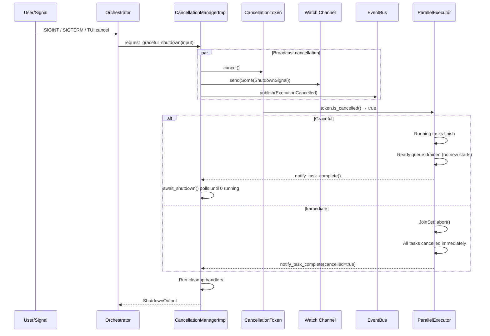

# Cancellation Architecture

<!--
Canonical Reference: .pi/architecture/modules/cancellation.md
Blueprint Source: Domain Exploration Session 63c25384
Implementation Status: COMPLETE (all 5 issues merged)
-->

## Overview

Manages graceful and immediate cancellation of running workflows. Uses CancellationToken (tokio-util) for coordinated propagation to all concurrent tasks, with two shutdown signal levels: Graceful (let running tasks finish) and Immediate (abort all in-flight work).

## Implementation Status

| Issue | Component | Status | PR |
|-------|-----------|--------|----|
| Contract Freeze | Interfaces, DTOs, events, API contracts | ✅ Merged | #27 |
| CancellationManager | Dual-level shutdown manager | ✅ Merged | #28 |
| ShutdownSignal | Enum with helpers + tests | ✅ Merged | #29 |
| Proofing & CI | Contract checks, coverage, CI stage | ✅ Merged | #30 |
| Architecture Readiness | Runbook, DR plan, doc sync | ✅ Active | #31 |

## Responsibilities

- Provide CancellationToken for coordinated task cancellation
- Support two shutdown levels: Graceful and Immediate
- Allow subscribers to watch for shutdown signals via watch channel
- Track task lifecycle (running, completed, cancelled counts)
- Support cleanup handler registration and execution
- Support child cancellation scopes (parent token propagation)
- Emit ExecutionCancelled event on cancellation

## Components

| Component | File Path | Purpose | Canonical Section |
|-----------|-----------|---------|-------------------|
| CancellationToken | `engine/src/cancellation/application/cancellation_service_impl.rs` | tokio-util cancellation token | #token |
| CancellationManagerImpl | `engine/src/cancellation/application/cancellation_service_impl.rs` | Manager with Graceful/Immediate signals | #manager |
| CancellationService | `engine/src/cancellation/application/service.rs` | Service trait with typed DTO operations | #service |
| CancellationManagerFactory | `engine/src/cancellation/application/factory.rs` | Factory for constructing managers | #factory |
| ShutdownSignal | `engine/src/cancellation/domain/signal.rs` | Enum: Graceful, Immediate | #signal |
| CancellationError | `engine/src/cancellation/domain/error.rs` | Typed error enum (7 variants) | #error |
| CancellationEvent | `engine/src/cancellation/domain/event/mod.rs` | Event payload schemas (7 events) | #event |
| CleanupHandler | `engine/src/cancellation/application/service.rs` | Trait for task-level cleanup during cancellation | #cleanup |

---

## Component Details

### CancellationManagerImpl

**Purpose:** Central manager for execution cancellation with dual shutdown levels

**Implementation File:** `engine/src/cancellation/application/cancellation_service_impl.rs`

```rust
pub struct CancellationManagerImpl {
    token: CancellationToken,
    signal_tx: watch::Sender<Option<ShutdownSignal>>,
    cancelled: AtomicBool,
    running_tasks: AtomicU32,
    completed_tasks: AtomicU32,
    cancelled_tasks: AtomicU32,
    request_time: Mutex<Option<Instant>>,
    cleanup_handlers: RwLock<Vec<(String, Box<dyn CleanupHandler>)>>,
    graceful_timeout_secs: u64,
}

impl CancellationManagerImpl {
    pub fn new(graceful_timeout_secs: u64) -> Self;
    pub fn child_of(parent_token: CancellationToken, graceful_timeout_secs: u64) -> Self;
}

impl CancellationService for CancellationManagerImpl {
    async fn request_graceful_shutdown(&self, input) -> Result<CancelExecutionOutput>;
    async fn request_immediate_abort(&self, input) -> Result<CancelExecutionOutput>;
    async fn await_shutdown(&self, input) -> Result<ShutdownOutput>;
    fn is_cancelled(&self) -> bool;
    fn current_signal(&self) -> Option<ShutdownSignal>;
    async fn status(&self) -> ShutdownStatusOutput;
    fn subscribe(&self) -> watch::Receiver<ShutdownSignal>;
    fn cancellation_token(&self) -> CancellationToken;
}
```

### ShutdownSignal

```rust
#[derive(Debug, Clone, Copy, PartialEq, Eq, Hash, Serialize, Deserialize)]
pub enum ShutdownSignal {
    Graceful,   // Let running tasks finish, don't start new ones
    Immediate,  // Abort all in-flight work immediately
}

impl ShutdownSignal {
    pub fn is_graceful(&self) -> bool;
    pub fn is_immediate(&self) -> bool;
    pub fn description(&self) -> &'static str;
    pub const fn all() -> [ShutdownSignal; 2];
}
```

### CleanupHandler

```rust
#[async_trait]
pub trait CleanupHandler: Send + Sync {
    async fn cleanup(&self, task_id: &str) -> Result<(), CancellationError>;
    async fn release(&self, task_id: &str) -> Result<(), CancellationError>;
}
```

---

## Data Flow



---

## API Contracts

| Method | Path | Purpose |
|--------|------|---------|
| POST | `/api/v1/execution/{id}/cancel` | Request graceful cancellation |
| POST | `/api/v1/execution/{id}/abort` | Request immediate abort |
| GET | `/api/v1/execution/{id}/status` | Get cancellation status |
| POST | `/api/v1/execution/{id}/await-shutdown` | Wait for shutdown completion |

---

## Dependencies

### Depends On
- **tokio**: Watch channel, async mutex, async sleep
- **tokio-util**: CancellationToken for coordinated task cancellation
- **Event System**: Emits ExecutionCancelled event (future integration)

### Used By
- **Execution Engine**: ParallelExecutor checks CancellationToken before each node
- **Planning Pipeline**: LlmBudget includes cancel_token for coordinated shutdown
- **Orchestrator**: Exposes cancel()/cancel_immediate() methods

---

## Testing

| Test Type | Coverage | Files |
|-----------|----------|-------|
| Unit (CancellationManager) | 17 tests | `cancellation_service_impl.rs` |
| Unit (ShutdownSignal) | 12 tests | `domain/signal.rs` |
| Unit (Factory) | 3 tests | `cancellation_manager_factory_impl.rs` |
| **Total** | **32 tests** | |

**Key Test Scenarios:**
- Cancel triggers graceful shutdown signal
- Cancel immediate triggers immediate shutdown signal
- Duplicate cancellation returns AlreadyCancelling error
- CancellationToken is triggered and propagates
- Watch channel subscribers receive the signal
- Task lifecycle tracking (register, complete, cancel)
- Shutdown timeout detection
- Child token propagation from parent
- Cleanup handler invocation
- Serde round-trip, hash consistency, Display

---

## Proofing & CI

| Check | Script | Status |
|-------|--------|--------|
| Contract implementation | `check_cancellation_contracts.sh` | 9 checks pass |
| Coverage threshold | `check_cancellation_coverage.sh` | ✅ Passes |
| CI stage | `stage_cancellation_proofing.sh` | ✅ Stage 13 |

---

## Operations

### Runbook
See `docs/runbook-cancellation.md`

### DR Plan
See `docs/dr-plan-cancellation.md`

---

Last updated: 2026-06-15
*Module version: 2.0.0 (implementation complete)*

---

**Status:** Implemented  
**Last verified:** 2026-06-15  
**Module version:** 1.0.0
