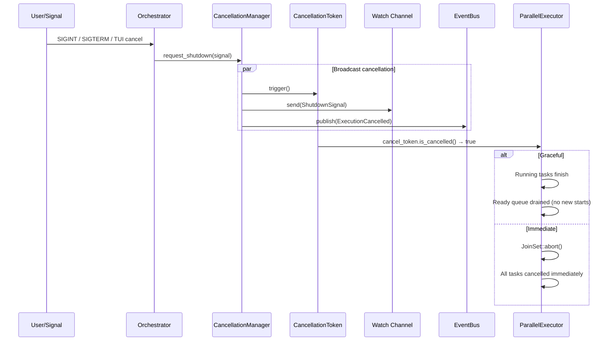

# Cancellation Architecture

<!--
Canonical Reference: .pi/architecture/modules/cancellation.md
Blueprint Source: Domain Exploration Session 63c25384
-->

## Overview

Manages graceful and immediate cancellation of running workflows. Uses CancellationToken (tokio-util) for coordinated propagation to all concurrent tasks, with two shutdown signal levels: Graceful (let running tasks finish) and Immediate (abort all in-flight work).

## Responsibilities

- Provide CancellationToken for coordinated task cancellation
- Support two shutdown levels: Graceful and Immediate
- Allow subscribers to watch for shutdown signals via watch channel
- Emit ExecutionCancelled event on cancellation
- Propagate cancellation to LLM budget (LlmBudget.cancel_token)

## Components

| Component | File Path | Purpose | Canonical Section |
|-----------|-----------|---------|-------------------|
| CancellationToken | `rigorix/src/cancellation.rs` | tokio-util cancellation token | #token |
| CancellationManager | `rigorix/src/cancellation.rs` | Manager with Graceful/Immediate signals | #manager |
| ShutdownSignal | `rigorix/src/cancellation.rs` | Enum: Graceful, Immediate | #signal |

---

## Component Details

### CancellationManager

**Purpose:** Central manager for execution cancellation with dual shutdown levels

**Implementation File:** `rigorix/src/cancellation.rs`

```rust
pub struct CancellationManager { /* token: CancellationToken, signal: watch::Sender<ShutdownSignal> */ }

impl CancellationManager {
    pub fn new() -> Self;
    pub fn token(&self) -> CancellationToken;
    pub fn shutdown_signal(&self) -> watch::Receiver<ShutdownSignal>;
    pub fn is_cancelled(&self) -> bool;
    pub fn request_shutdown(&self, signal: ShutdownSignal);
}
```

### ShutdownSignal

```rust
#[derive(Debug, Clone, Copy, PartialEq, Eq)]
pub enum ShutdownSignal {
    Graceful,   // Let running tasks finish, don't start new ones
    Immediate,  // Abort all in-flight work immediately
}
```

---

## Data Flow



**Flow Description:**
1. External signal (SIGINT/SIGTERM) or TUI command triggers cancellation
2. CancellationManager broadcasts signal to CancellationToken, watch channel, and EventBus
3. ParallelExecutor checks CancellationToken before each node execution
4. Graceful: running tasks finish, no new tasks started
5. Immediate: JoinSet aborts all in-flight work
```

---

## Dependencies

### Depends On
- **Event System**: Emits ExecutionCancelled event

### Used By
- **Execution Engine**: ParallelExecutor checks CancellationToken before each node
- **Planning Pipeline**: LlmBudget includes cancel_token for coordinated shutdown
- **Orchestrator**: Exposes cancel()/cancel_immediate() methods

---

## Testing Requirements

| Test Type | Coverage Target | Files |
|-----------|-----------------|-------|
| Unit | 95% | `rigorix/src/cancellation.rs` |

**Key Test Scenarios:**
- Cancel triggers graceful shutdown signal
- Cancel immediate triggers immediate shutdown signal
- is_cancelled() returns true after signal
- Watch channel subscribers receive the signal

---

*Last updated: 2026-06-13*
*Module version: 1.0.0*
