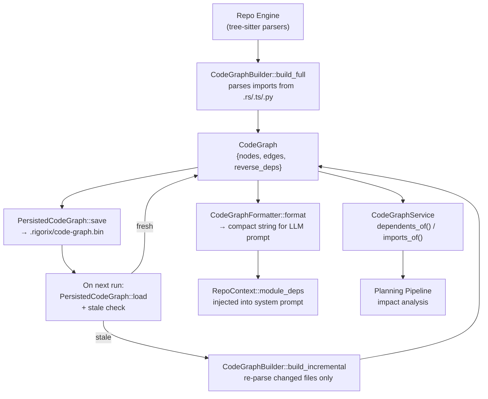

# Code Graph Architecture

<!--
Canonical Reference: .pi/architecture/modules/code-graph.md
Blueprint Source: Planning Session 2026-06-18
-->

## Overview

Constructs and persists a module-level dependency graph of the codebase via tree-sitter. Tracks which files import which, what symbols each file exports, and which files depend on each other. Builds on the existing Repo Engine's symbol-level indexing infrastructure to provide module-level visibility for template generation, impact analysis, and cross-file change ordering.

This is the module that makes Rigorix templates *correct* for multi-file changes: when generating a template that modifies `dag_engine/domain/graph.rs`, the code-graph tells the LLM that `execution_engine/domain/retry.rs` and `orchestrator/application/orchestrator_impl.rs` also need attention.

## Responsibilities

- Parse module-level imports/exports from Rust, TypeScript, and Python source files via tree-sitter
- Build a directed dependency graph: file → {files it imports, symbols imported}, file → {files that depend on it}
- Persist the graph to `.rigorix/code-graph.bin` for zero-cost reload across sessions
- Detect staleness: compare file mtimes against cached graph entries; rebuild only changed files
- Provide O(1) queries: "what depends on this file?", "what does this file import?"
- Format the graph into a compact string for LLM prompt injection
- Expose the graph to the Planning Pipeline for template generation context

## Components

| Component | File Path | Purpose | Canonical Section |
|-----------|-----------|---------|-------------------|
| CodeGraph | `engine/src/code_graph/domain/graph.rs` | Core directed graph data structure | #core-graph |
| ModuleNode | `engine/src/code_graph/domain/graph.rs` | Per-file node: exports, imports, mtime, hash | #module-node |
| ModuleEdge | `engine/src/code_graph/domain/graph.rs` | Edge: from_file → to_file with imported symbols | #module-edge |
| CodeGraphBuilder | `engine/src/code_graph/application/builder.rs` | Constructs CodeGraph from workspace files via tree-sitter | #builder |
| PersistedCodeGraph | `engine/src/code_graph/application/persistence.rs` | Serialization format and stale detection | #persistence |
| CodeGraphService | `engine/src/code_graph/application/service.rs` | Service trait for graph queries | #service |
| CodeGraphServiceImpl | `engine/src/code_graph/application/service_impl.rs` | Service implementation with lazy-load and incremental updates | #service-impl |
| CodeGraphError | `engine/src/code_graph/domain/error.rs` | Error types for graph construction and query failures | #errors |
| CodeGraphFormatter | `engine/src/code_graph/application/formatter.rs` | Formats graph into LLM prompt string | #formatter |

---

## Component Details

### CodeGraph

**Purpose:** Core directed multigraph of module-level dependencies. Nodes are source files; edges represent import relationships with specific symbols.

**Implementation File:** `engine/src/code_graph/domain/graph.rs`

**Dependencies:**
- ModuleNode
- ModuleEdge
- Repo Engine (reuses tree-sitter parsers)

**Interface:**

```rust
#[derive(Debug, Clone, Serialize, Deserialize)]
pub struct CodeGraph {
    /// All source files indexed, keyed by relative path from project root.
    pub nodes: HashMap<String, ModuleNode>,

    /// All import edges. Edges are directional: from imports to.
    pub edges: Vec<ModuleEdge>,

    /// Reverse index for fast "who depends on me?" queries.
    /// Built during construction and maintained on incremental updates.
    pub reverse_deps: HashMap<String, Vec<String>>,

    /// Timestamp of graph construction.
    pub built_at: DateTime<Utc>,

    /// Detected project type.
    pub project_type: String,
}

impl CodeGraph {
    /// Create an empty graph.
    pub fn new(project_type: String) -> Self;

    /// Add or update a module node.
    pub fn upsert_node(&mut self, node: ModuleNode);

    /// Add an edge. Updates reverse_deps automatically.
    pub fn add_edge(&mut self, edge: ModuleEdge);

    /// Query: files that import from the given file.
    pub fn dependents_of(&self, file: &str) -> &[String];

    /// Query: files that the given file imports from.
    pub fn imports_of(&self, file: &str) -> Vec<&ModuleEdge>;

    /// Total number of indexed source files.
    pub fn file_count(&self) -> usize;

    /// Total number of import edges.
    pub fn edge_count(&self) -> usize;
}
```

### ModuleNode

```rust
#[derive(Debug, Clone, Serialize, Deserialize)]
pub struct ModuleNode {
    /// Relative path from project root (e.g. "engine/src/dag_engine/domain/graph.rs").
    pub path: String,

    /// File modification timestamp (for stale detection).
    pub mtime: u64,

    /// Quick content hash for change detection (first 4KB + length).
    pub content_hash: u64,

    /// Symbols this file exports (functions, structs, traits, classes).
    pub exports: Vec<String>,

    /// Language of this file.
    pub language: SourceLanguage,
}

#[derive(Debug, Clone, Copy, PartialEq, Eq, Serialize, Deserialize)]
pub enum SourceLanguage {
    Rust,
    TypeScript,
    Python,
    Unknown,
}
```

### ModuleEdge

```rust
#[derive(Debug, Clone, Serialize, Deserialize)]
pub struct ModuleEdge {
    /// File that contains the import statement.
    pub from_file: String,

    /// File being imported.
    pub to_file: String,

    /// Specific symbols imported (empty = wildcard or module-level).
    pub symbols: Vec<String>,

    /// Whether this edge is conditional (e.g., #[cfg(test)], behind feature flag).
    pub conditional: bool,
}
```

### CodeGraphBuilder

**Purpose:** Scans the workspace, parses import statements via tree-sitter, constructs the CodeGraph.

**Implementation File:** `engine/src/code_graph/application/builder.rs`

```rust
pub struct CodeGraphBuilder {
    project_root: PathBuf,
    project_type: String,
}

impl CodeGraphBuilder {
    pub fn new(project_root: PathBuf) -> Self;

    /// Full build: scan all source files and construct graph from scratch.
    /// Uses tree-sitter parsers from Repo Engine for Rust/Python/TypeScript.
    pub fn build_full(&self) -> Result<CodeGraph, CodeGraphError>;

    /// Incremental build: only re-parse files with changed mtimes.
    /// Takes the existing persisted graph and updates affected nodes/edges.
    pub fn build_incremental(
        &self,
        existing: &CodeGraph,
    ) -> Result<CodeGraph, CodeGraphError>;

    /// Check if a cached graph is still valid.
    pub fn is_stale(cached: &PersistedCodeGraph, root: &Path) -> bool;
}
```

### PersistedCodeGraph

**Purpose:** On-disk serialization format stored at `.rigorix/code-graph.bin`.

**Implementation File:** `engine/src/code_graph/application/persistence.rs`

```rust
#[derive(Debug, Clone, Serialize, Deserialize)]
pub struct PersistedCodeGraph {
    /// The graph itself.
    pub graph: CodeGraph,

    /// Version of the persistence format (for forward compatibility).
    pub format_version: u32,

    /// When this was written to disk.
    pub persisted_at: DateTime<Utc>,
}

impl PersistedCodeGraph {
    /// Write to `.rigorix/code-graph.bin` using bincode.
    pub fn save(&self, root: &Path) -> Result<(), CodeGraphError>;

    /// Load from `.rigorix/code-graph.bin`.
    /// Returns `None` if no persisted graph exists.
    pub fn load(root: &Path) -> Result<Option<Self>, CodeGraphError>;
}
```

**Stale detection algorithm:**
```rust
fn is_stale(cached: &PersistedCodeGraph, root: &Path) -> bool {
    for (path, node) in &cached.graph.nodes {
        let full_path = root.join(path);
        // File deleted → stale
        if !full_path.exists() { return true; }
        // File modified → stale
        if let Ok(meta) = full_path.metadata() {
            if meta.modified()
                .map(|t| t.duration_since(UNIX_EPOCH).unwrap_or_default().as_secs())
                .ok() != Some(node.mtime)
            { return true; }
        }
    }
    // Check for new source files not in cache
    // Quick glob: count *.rs/*.ts/*.py files and compare to node count
    // (cheap heuristic; full rebuild catches the rest)
    false
}
```

### CodeGraphService

**Purpose:** Service interface for graph queries. Used by the Planning Pipeline and template generation.

**Implementation File:** `engine/src/code_graph/application/service.rs`

```rust
#[async_trait]
pub trait CodeGraphService: Send + Sync {
    /// Get the current code graph, building from scratch or from cache as needed.
    async fn get_graph(&self) -> Result<Arc<CodeGraph>, CodeGraphError>;

    /// Query dependents: which files import from the given file?
    async fn dependents_of(&self, file: &str) -> Result<Vec<String>, CodeGraphError>;

    /// Query imports: what does the given file import?
    async fn imports_of(&self, file: &str) -> Result<Vec<ModuleEdge>, CodeGraphError>;

    /// Format the graph into a string suitable for LLM prompt injection.
    async fn format_for_prompt(&self, max_edges: usize) -> Result<String, CodeGraphError>;

    /// Force a rebuild from scratch (e.g., after major refactor).
    async fn rebuild(&self) -> Result<Arc<CodeGraph>, CodeGraphError>;
}
```

### CodeGraphFormatter

**Purpose:** Formats the module dependency graph into a compact string for the LLM system prompt. Limits output to avoid blowing the context window.

**Implementation File:** `engine/src/code_graph/application/formatter.rs`

```rust
pub struct CodeGraphFormatter;

impl CodeGraphFormatter {
    /// Format the graph for prompt injection.
    ///
    /// Output format:
    /// ```
    /// MODULE DEPENDENCY GRAPH:
    ///   dag_engine/domain/error.rs → [graph.rs, tests.rs, orchestrator_impl.rs]
    ///   dag_engine/domain/graph.rs → [plan.rs, retry.rs]
    ///   ...
    ///
    /// Rule: when a template modifies a file, add validation nodes for
    /// all files that depend on it (listed in brackets).
    /// ```
    pub fn format(graph: &CodeGraph, max_edges: usize) -> String;

    /// Also format the forward view: "file X imports from Y, Z"
    pub fn format_imports(graph: &CodeGraph, max_edges: usize) -> String;
}
```

---

## Data Flow



**Flow Description:**
1. On first `rigorix generate`/`plan`/`run`: `CodeGraphBuilder` scans workspace via Repo Engine's tree-sitter parsers, constructs full graph
2. Graph is persisted to `.rigorix/code-graph.bin` via bincode serialization
3. On subsequent runs: load cached graph, check mtimes of indexed files
4. If stale: `build_incremental` re-parses only changed files, updates affected edges
5. `CodeGraphFormatter` compresses the graph into a prompt-safe string
6. `RepoContext::from_path()` calls the formatter and stores the result in `module_deps`
7. `build_system_prompt()` injects the formatted graph into the LLM prompt

---

## Dependencies

### Depends On
- **Repo Engine**: Reuses tree-sitter parsers (`RustIndexer`, `PythonIndexer`, `TypeScriptIndexer`) and symbol infrastructure. The CodeGraph operates at module-level granularity; Repo Engine operates at symbol-level granularity. They complement each other.
- **Configuration**: Reads project root from ConfigService.
- **Template Generation**: RepoContext consumes the formatted module dependency graph for LLM prompt injection.

### Used By
- **Planning Pipeline**: Consumes the CodeGraph for impact analysis during `plan_with_graph()` — determines which files need validation nodes based on what the template modifies.
- **Template Generation**: RepoContext includes `module_deps` field populated by CodeGraphFormatter.
- **Orchestrator**: Initialization sequence includes CodeGraphService construction.

---

## Security Considerations

| Concern | Mitigation | Validator |
|---------|------------|-----------|
| Graph reads arbitrary files from workspace | Only scans files matching source extensions (.rs/.ts/.py); skips hidden dirs and build artifacts | security-validator |
| Persisted graph could be tampered with | bincode deserialization is type-safe; tampered file will fail to deserialize and trigger full rebuild | security-validator |
| Large workspace causes memory pressure | Builder caps at 500 files / 2000 edges; formatter limits output to 100 edges for prompt | operations-validator |
| Stale graph produces wrong impact analysis | Every query checks the persisted graph's timestamp against file mtimes; forces rebuild on mismatch | correctness-validator |

---

## Testing Requirements

| Test Type | Coverage Target | Files |
|-----------|-----------------|-------|
| Unit | 80% | `engine/src/code_graph/tests.rs` |
| Integration | 80% | `engine/tests/code_graph_integration.rs` |

**Key Test Scenarios (target: ~40 tests):**
- Empty workspace → empty graph, no errors
- Single Rust file with `use crate::...` → one node, correct imports extracted
- Multi-file project with cross-module imports → correct edges, reverse deps built
- `pub use` re-exports → tracked as export on the re-exporting file
- `#[cfg(test)]` imports → marked as conditional edges
- Brace-expanded imports (`use crate::{A, B}`) → multiple edges from one statement
- `use super::...` and `self::...` → resolved to correct relative paths
- TypeScript `import { X } from './path'` → edges with symbols
- Python `from .module import X` → edges with relative resolution
- Multi-language workspace (Rust + TypeScript) → separate subgraphs
- Serialize → deserialize roundtrip preserves all nodes and edges
- `dependents_of("graph.rs")` returns correct list of importing files
- `imports_of("orchestrator_impl.rs")` returns correct list of dependencies
- Stale detection: changed mtime → `is_stale()` returns true
- Stale detection: deleted file → `is_stale()` returns true
- Incremental rebuild: unchanged files not re-parsed; changed file updated
- Formatter produces compact string within prompt budget (max 100 edges)
- Formatter output explicitly lists dependents per file
- Large workspace (500+ files) → builder respects limits, doesn't OOM

---

## Error Handling

```rust
#[derive(Debug, Error)]
pub enum CodeGraphError {
    /// Failed to read or parse a source file.
    #[error("Parse error in {file}: {detail}")]
    ParseError { file: String, detail: String },

    /// Failed to serialize/deserialize the persisted graph.
    #[error("Persistence error: {detail}")]
    PersistenceError { detail: String },

    /// Graph has not been built yet.
    #[error("CodeGraph not built — call build_full() first")]
    NotBuilt,

    /// Stale graph: must rebuild before querying.
    #[error("CodeGraph is stale — rebuild required")]
    Stale,

    /// IO error during file scanning.
    #[error("IO error: {io_error}")]
    Io { #[from] io_error: std::io::Error },
}
```

**Error Recovery:**
- `ParseError`: Skip the file, log warning, continue with other files. Graph may be incomplete but still useful.
- `PersistenceError`: Delete the corrupted cache file and perform a full rebuild.
- `Stale`: Automatically trigger rebuild on next `get_graph()` call.
- `NotBuilt`: Caller should invoke `build_full()` or `build_incremental()`.

---

## Performance Considerations

| Metric | Target | Monitoring |
|--------|--------|------------|
| Full build time (1,000 Rust files) | < 500ms | Tracing span on `build_full()` |
| Incremental build (1 file changed) | < 50ms | Tracing span on `build_incremental()` |
| `dependents_of()` query | O(1) amortized | HashMap lookup |
| Persisted load time | < 10ms | bincode deserialization span |
| Prompt string generation | < 5ms, ≤ 100 edges | Formatter output length check |
| Memory (graph for 1,000 files) | < 50 MB | Node + edge count × sizeof |

---

## Integration Points

### Into RepoContext::from_path()

```rust
// In engine/src/template_generation/domain/generator.rs
pub fn from_path(dir: &Path) -> io::Result<Self> {
    // ... existing code ...
    let module_deps = if let Ok(graph) = PersistedCodeGraph::load(dir) {
        CodeGraphFormatter::format(&graph.graph, 100)
    } else if let Ok(graph) = CodeGraphBuilder::new(dir.to_path_buf()).build_full() {
        let _ = PersistedCodeGraph { graph: graph.clone(), format_version: 1, persisted_at: Utc::now() }.save(dir);
        CodeGraphFormatter::format(&graph, 100)
    } else {
        String::new()
    };
    // ... include in RepoContext ...
}
```

### Into the LLM System Prompt

After Phase 4b, the system prompt gains a new section after `PUBLIC API SURFACE`:

```
MODULE DEPENDENCY GRAPH:
When modifying a file, check all files that depend on it (listed in brackets):

Sources and their dependents:
  dag_engine/domain/error.rs → [graph.rs, tests.rs, orchestrator_impl.rs]
  dag_engine/domain/graph.rs → [plan.rs, execution_engine/domain/retry.rs]
  failure_classification/domain/failure_type.rs → [dag_engine/domain/graph.rs, dag_engine/tests.rs]
  ...

Rule: if a template node modifies a source file, add a node afterward that
runs validation (type_check or test_pass) on ALL dependent files.
```

### Into the Orchestrator

The `build_orchestrator()` function gains an optional CodeGraphService construction step. If construction succeeds, the service is available to the Planning Pipeline for impact analysis during `plan_with_graph()`.

---

## Implementation Plan

| Phase | What | Effort |
|-------|------|--------|
| 1 | Create `engine/src/code_graph/` module with domain types (CodeGraph, ModuleNode, ModuleEdge, CodeGraphError) | 1 hour |
| 2 | Implement `CodeGraphBuilder` using existing Repo Engine tree-sitter parsers | 3 hours |
| 3 | Implement `PersistedCodeGraph` with bincode serialization and stale detection | 1 hour |
| 4 | Implement `CodeGraphFormatter` for LLM prompt output | 30 min |
| 5 | Integrate into `RepoContext::from_path()` and `build_system_prompt()` | 30 min |
| 6 | Implement `CodeGraphService` and wire into orchestrator | 1 hour |
| 7 | Write tests (~40 test scenarios) | 2 hours |

**Total: ~9 hours**

**Current blocker resolved:** The Repo Engine already has tree-sitter parsers (`RustIndexer`, `PythonIndexer`, `TypeScriptIndexer`). The CodeGraph module sits *on top* of these — it calls the parsers to extract import statements, then builds the module-level graph. No new tree-sitter dependencies needed.

---

*Last updated: 2026-06-18*
*Module version: 0.1.0 (design phase — not yet implemented)*
