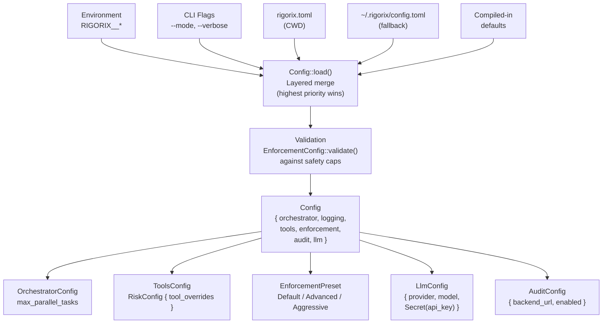

# Configuration Architecture

<!--
Canonical Reference: .pi/architecture/modules/configuration.md
Blueprint Source: Domain Exploration Session 63c25384
-->

## Overview

Loads and validates configuration from `rigorix.toml`, environment variables (`RIGORIX__*`), and programmatic defaults with layered merging. Manages all sub-configs: orchestrator, logging, tools (risk), enforcement preset, audit, and LLM provider settings.

## Responsibilities

- Load configuration from `rigorix.toml` in CWD with fallback to `~/.rigorix/config.toml`
- Override via environment variables (`RIGORIX__LOGGING__LEVEL=debug`)
- Support programmatic overrides via builder/CLI flags
- Validate enforcement config against safety hard-caps
- Wrap API keys in `Secret` type with redacted Debug/Display
- Provide typed Config struct with serde deserialization

## Components

| Component | File Path | Purpose | Canonical Section |
|-----------|-----------|---------|-------------------|
| Config | `rigorix/src/config.rs` | Top-level config with all sub-configs | #config |
| OrchestratorConfig | `rigorix/src/config.rs` | Execution parameters (parallelism, retries) | #orchestrator |
| LoggingConfig | `rigorix/src/config.rs` | Log level, format, destination | #logging |
| ToolsConfig | `rigorix/src/config.rs` | Tool settings, RiskConfig | #tools |
| EnforcementPreset | `rigorix/src/config.rs` | Enum: Default, Advanced, Aggressive | #enforcement |
| AuditConfig | `rigorix/src/config.rs` | Audit backend URL, API key, retry config | #audit |
| LlmConfig | `rigorix/src/config.rs` | LLM provider, model, API key, base URL | #llm |
| RiskConfig | `rigorix/src/config.rs` | Per-tool risk overrides | #risk |
| Secret | `rigorix/src/core.rs` | API key wrapper with redacted output | #secret |

---

## Component Details

### Config

**Purpose:** Top-level configuration with multi-source loading

**Implementation File:** `rigorix/src/config.rs`

```rust
#[derive(Debug, Clone, Default, Serialize, Deserialize)]
pub struct Config {
    pub orchestrator: OrchestratorConfig,
    pub logging: LoggingConfig,
    pub tools: ToolsConfig,
    pub enforcement: EnforcementPreset,
    pub audit: AuditConfig,
    pub llm: LlmConfig,
}

impl Config {
    /// Load from rigorix.toml + RIGORIX__* env vars + defaults
    pub fn load() -> Result<Self, ConfigError>;
}
```

**Load order (highest priority wins):**
1. CLI flags (set programmatically after loading)
2. Environment variables (`RIGORIX__*`, separator `__`)
3. `rigorix.toml` in the working directory
4. `~/.rigorix/config.toml` (fallback)
5. Compiled-in defaults

### Secret

**Purpose:** API key wrapper that redacts in all output

**Implementation File:** `rigorix/src/core.rs`

```rust
pub struct Secret(String);

impl Secret {
    pub fn new(s: impl Into<String>) -> Self;
    pub fn expose(&self) -> &str;   // Only way to access the value
    pub fn is_empty(&self) -> bool;
}

// Debug:  "[REDACTED]" or "<empty>"
// Display: same as Debug
// Serialize: transparent (exposes value in serde)
```

---

## Dependencies

### Depends On
- `config` crate (multi-source layered loading)
- serde (deserialization)

### Used By
- **All contexts**: Config is loaded at startup and shared via Orchestrator

---

## Security Considerations

| Concern | Mitigation | Validator |
|---------|------------|-----------|
| API key leaked in logs | Secret type with redacted Debug/Display | security-validator |
| Env var exposure | Config loaded at startup, env vars not re-read | security-validator |

---

## Data Flow



**Flow Description:**
1. Config loads from multiple sources with layered priority (CLI > Env > CWD > Home > Defaults)
2. EnforcementConfig validates against absolute safety caps at startup
3. API keys are wrapped in Secret type with redacted Debug/Display
4. All sub-configs are accessible from the root Config struct

## Example `rigorix.toml`

```toml
[orchestrator]
max_parallel_tasks = 4

[logging]
level = "debug"

[tools.risk]
tool_overrides = { "run_command" = "high" }
auto_confirm_low = true
require_review_medium = true
dry_run_high = true

[enforcement]
preset = "default"

[audit]
enabled = true
backend_url = "https://api.example.com"

[llm]
provider = "anthropic"
model = "claude-sonnet-4-6"
# api_key loaded from ANTHROPIC_API_KEY env var
```

---

*Last updated: 2026-06-13*
*Module version: 1.0.0*
