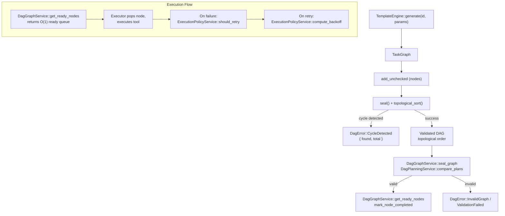

# DAG Engine Architecture

<!--
Canonical Reference: .pi/architecture/modules/dag-engine.md
Blueprint Source: Domain Exploration Session 63c25384
-->

## Overview

Compiles templates into executable Directed Acyclic Graphs. Handles two-phase graph construction (add nodes → seal), topological sorting (Kahn's algorithm), cycle detection, O(1) ready queue, and per-node execution policies with retry configuration.

## Responsibilities

- Two-phase DAG construction: add_unchecked then seal topological sort
- Cycle detection with cycle path reporting
- Kahn's algorithm topological sort with O(1) ready queue
- Per-node ExecutionPolicy (max_retries, retry_on, retry_strategy, fallback)
- ValidationRule support (LintPass, TestPass, TypeCheck, Custom)
- PlanDiff and ImpactLevel computation for audit
- Retry decision logic (should_retry, compute_backoff, validate_policy)

## Components

| Component | File Path | Purpose | Canonical Section |
|-----------|-----------|---------|-------------------|
| TaskGraph | `engine/src/dag_engine/domain/graph.rs` | Core DAG data structure with two-phase construction | #graph |
| TaskNode | `engine/src/dag_engine/domain/graph.rs` | Single node: id, name, tool, deps, policy, intent | #node |
| ExecutionPolicy | `engine/src/dag_engine/domain/graph.rs` | Per-node retry/fallback/validation config | #policy |
| ValidationRule | `engine/src/dag_engine/domain/graph.rs` | Post-execution validation (TypeCheck, TestPass, etc.) | #validation |
| PlanDiff | `engine/src/dag_engine/domain/plan.rs` | Structured comparison between two plans for audit | #plandiff |
| ImpactLevel | `engine/src/dag_engine/domain/plan.rs` | Impact classification for plan changes | #impact |
| DagGraphService | `engine/src/dag_engine/application/service.rs` | Service trait for DAG lifecycle | #dag_graph_service |
| DagGraphServiceImpl | `engine/src/dag_engine/application/service_impl.rs` | In-memory graph management implementation | #dag_graph_impl |
| DagPlanningService | `engine/src/dag_engine/application/service.rs` | Plan comparison and impact analysis | #dag_planning_service |
| ExecutionPolicyService | `engine/src/dag_engine/application/service.rs` | Retry/backoff/validation policy evaluation | #execution_policy_service |

---

## Component Details

### TaskGraph

**Purpose:** Core DAG data structure supporting two-phase construction

**Implementation File:** `engine/src/dag_engine/domain/graph.rs`

**Dependencies:**
- TaskNode
- ExecutionPolicy
- DagError

**Interface:**

```rust
pub struct TaskGraph {
    pub nodes: Vec<TaskNode>,
    pub topological_order: Option<Vec<Uuid>>,
    pub sealed: bool,
    pub execution_state: ExecutionState,
}

impl TaskGraph {
    pub fn new() -> Self;
    pub fn add_unchecked(&mut self, node: TaskNode) -> Result<(), DagError>;
    pub fn seal(&mut self) -> Result<(), DagError>;
    pub fn mark_completed(&mut self, node_id: Uuid) -> Result<(), DagError>;
    pub fn ready_nodes(&self) -> Vec<Uuid>;
    pub fn pop_ready_node(&mut self) -> Option<Uuid>;
    pub fn is_execution_complete(&self) -> bool;
    pub fn get_node(&self, node_id: Uuid) -> Option<&TaskNode>;
    pub fn nodes(&self) -> impl Iterator<Item = &TaskNode>;
    pub fn node_count(&self) -> usize;
    pub fn is_empty(&self) -> bool;
    pub fn topological_order(&self) -> Option<&[Uuid]>;
    pub fn completed_nodes(&self) -> &HashSet<Uuid>;
    pub fn in_degree(&self) -> &HashMap<Uuid, usize>;
}
```

### ExecutionPolicy

**Purpose:** Per-node execution and retry configuration

**Implementation File:** `engine/src/dag_engine/domain/graph.rs`

```rust
pub struct ExecutionPolicy {
    pub max_retries: u8,              // default 3
    pub retry_on: Vec<FailureType>,    // default [Transient, LspConflict]
    pub retry_strategy: RetryStrategy, // default SameOperation
    pub fallback_node: Option<Uuid>,
    pub validation_rule: Option<ValidationRule>,
    pub backoff_ms: u64,              // default 100
    pub backoff_multiplier: f64,      // default 2.0
    pub max_backoff_ms: u64,          // default 30_000
}
```

### DagGraphService

**Purpose:** Service interface for DAG lifecycle management

**Implementation File:** `engine/src/dag_engine/application/service.rs`

```rust
#[async_trait]
pub trait DagGraphService {
    async fn construct_graph(&self, input: ConstructGraphInput) -> Result<ConstructGraphOutput, DagError>;
    async fn add_node(&self, input: AddNodeInput) -> Result<AddNodeOutput, DagError>;
    async fn seal_graph(&self, input: SealGraphInput) -> Result<SealGraphOutput, DagError>;
    async fn get_graph(&self, input: GetGraphInput) -> Result<GetGraphOutput, DagError>;
    async fn get_node(&self, input: GetNodeInput) -> Result<GetNodeOutput, DagError>;
    async fn list_nodes(&self, input: ListNodesInput) -> Result<ListNodesOutput, DagError>;
    async fn mark_node_completed(&self, dag_id: Uuid, node_id: Uuid) -> Result<(), DagError>;
    async fn get_ready_nodes(&self, dag_id: Uuid) -> Result<Vec<Uuid>, DagError>;
    async fn is_sealed(&self, dag_id: Uuid) -> Result<bool, DagError>;
}
```

---

## Data Flow



**Flow Description:**
1. TemplateEngine produces TaskGraph with nodes via add_unchecked
2. seal() triggers Kahn's algorithm topological sort
3. Cycle detection catches invalid graphs with {found, total} counts
4. DagGraphService manages graph lifecycle (construct, add, seal, query)
5. DagPlanningService provides plan comparison via PlanDiff::compute
6. ExecutionPolicyService evaluates retry decisions, backoff, and validation
7. Ready queue provides O(1) access to nodes with all dependencies satisfied

---

## Dependencies

### Depends On
- **Template System**: TemplateEngine produces TaskGraph nodes (planned)
- **Failure Classification**: ExecutionPolicy references FailureType

### Used By
- **Execution Engine**: Consumes TaskGraph for execution (planned)
- **Planning Pipeline**: Validates TaskGraph via CompositeValidator (planned)

---

## Testing Requirements

| Test Type | Coverage Target | Files |
|-----------|-----------------|-------|
| Unit | 80% | `engine/src/dag_engine/tests.rs` |

**Key Test Scenarios (67 tests):**
- Add nodes and seal → valid topological order (linear, diamond, independent, 10-node chain)
- Add cycle → CycleDetected error (self-loop, 2-node, 3-node circular)
- Ready queue returns nodes with all deps satisfied
- mark_completed updates ready queue correctly
- ExecutionPolicy defaults are set correctly
- PlanDiff computation (identical, added, removed, modified)
- ImpactLevel ordering (None < Low < Medium < High < Breaking)
- ExecutionPolicyService retry decisions (retriable, non-retriable, exhausted, custom)
- Backoff computation (1st, 2nd, 3rd, capped, custom)
- Policy validation (default valid, zero backoff, low multiplier, max < base)
- Service integration (construct, add, seal, query, cycle detection)
- Serialization roundtrip

---

## Error Handling

```rust
#[derive(Debug, Error)]
pub enum DagError {
    #[error("Cycle detected: processed {found} of {total} nodes")]
    CycleDetected { found: usize, total: usize },
    #[error("Task not found: {id}")]
    TaskNotFound { id: Uuid },
    #[error("Dependencies not found: {missing:?}")]
    DependencyNotFound { missing: Vec<Uuid> },
    #[error("Duplicate task ID: {id}")]
    DuplicateTaskId { id: Uuid },
    #[error("Invalid graph: {reason}")]
    InvalidGraph { reason: String },
    #[error("Node {node_id} failed: {failure_type:?} - {message}")]
    NodeExecutionFailed { node_id: Uuid, failure_type: FailureType, message: String },
    #[error("Retry limit exceeded for node {node_id}: max_retries={max_retries}")]
    RetryLimitExceeded { node_id: Uuid, max_retries: u8 },
    #[error("Validation failed for node {node_id}: {rule:?} - {message}")]
    ValidationFailed { node_id: Uuid, rule: String, message: String },
    #[error("I/O error: {detail}")]
    IoError { detail: String },
    #[error("Failed to serialise graph: {detail}")]
    SerialisationError { detail: String },
    #[error("Failed to deserialise graph: {detail}")]
    DeserialisationError { detail: String },
    #[error("Internal error: {detail}")]
    InternalError { detail: String },
}
```

---

## Performance Considerations

| Metric | Target | Monitoring |
|--------|--------|------------|
| DAG compilation | < 100ms for 100 nodes | Benchmark (planned) |
| Topological sort | O(V + E) | Kahn's algorithm |
| Ready queue | O(1) amortized | In-degree tracking |

## Runbook

See `docs/runbook-dag-engine.md` for operational procedures, startup sequence,
failure modes, and observability configuration.

## DR Plan

See `docs/dr-plan-dag-engine.md` for backup strategy, restore procedures, RTO/RPO
targets, and failover plans.

---

*Last updated: 2026-06-14*
*Module version: 1.0.0*
