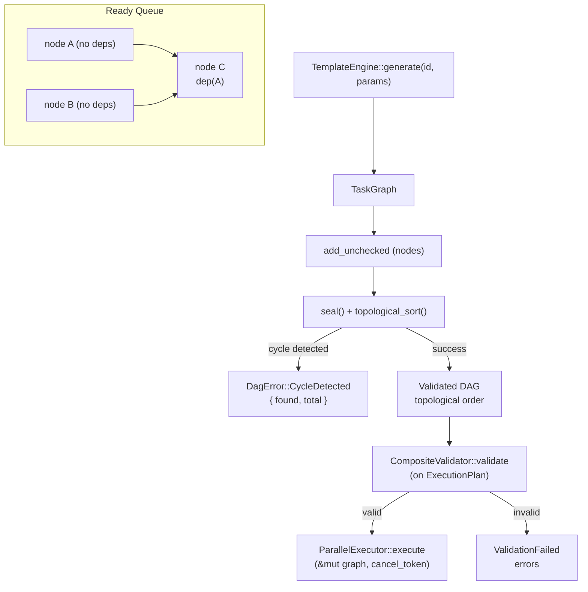

# DAG Engine Architecture

<!--
Canonical Reference: .pi/architecture/modules/dag-engine.md
Blueprint Source: Domain Exploration Session 63c25384
-->

## Overview

Compiles templates into executable Directed Acyclic Graphs. Handles two-phase graph construction (add nodes → seal), topological sorting (Kahn's algorithm), cycle detection, O(1) ready queue, and per-node execution policies with retry configuration.

## Responsibilities

- Two-phase DAG construction: add_unchecked then seal topological sort
- Cycle detection with cycle path reporting
- Kahn's algorithm topological sort with O(1) ready queue
- Per-node ExecutionPolicy (max_retries, retry_on, retry_strategy, fallback)
- ValidationRule support (LintPass, TestPass, TypeCheck, Custom)
- PlanDiff and ImpactLevel computation for audit

## Components

| Component | File Path | Purpose | Canonical Section |
|-----------|-----------|---------|-------------------|
| TaskGraph | `rigorix/src/dag/graph.rs` | Core DAG data structure with two-phase construction | #graph |
| TaskNode | `rigorix/src/dag/graph.rs` | Single node: id, name, tool, deps, policy, intent | #node |
| ExecutionPolicy | `rigorix/src/dag/graph.rs` | Per-node retry/fallback/validation config | #policy |
| ValidationRule | `rigorix/src/dag/graph.rs` | Post-execution validation (TypeCheck, TestPass, etc.) | #validation |
| PlanDiff | `rigorix/src/dag/plan.rs` | Structured comparison between two plans for audit | #plandiff |
| ImpactLevel | `rigorix/src/dag/plan.rs` | Impact classification for plan changes | #impact |

---

## Component Details

### TaskGraph

**Purpose:** Core DAG data structure supporting two-phase construction

**Implementation File:** `rigorix/src/dag/graph.rs`

**Dependencies:**
- TaskNode
- ExecutionPolicy
- dag::plan (PlanDiff)

**Interface:**

```rust
pub struct TaskGraph { /* nodes, edges, adjacency lists */ }

impl TaskGraph {
    pub fn new() -> Self;
    pub fn add_unchecked(&mut self, node: TaskNode) -> Result<(), DagError>;
    pub fn seal(&mut self) -> Result<(), DagError>;
    pub fn topological_sort(&mut self) -> Result<Vec<Uuid>, DagError>;
    pub fn nodes(&self) -> impl Iterator<Item = &TaskNode>;
    pub fn node_count(&self) -> usize;
    pub fn is_empty(&self) -> bool;
    pub fn ready_nodes(&self) -> Vec<Uuid>;
    pub fn mark_completed(&mut self, node_id: Uuid);
}
```

### ExecutionPolicy

**Purpose:** Per-node execution and retry configuration

**Implementation File:** `rigorix/src/dag/graph.rs`

```rust
pub struct ExecutionPolicy {
    pub max_retries: u8,              // default 3
    pub retry_on: Vec<FailureType>,    // default [Transient, LspConflict]
    pub retry_strategy: RetryStrategy, // default SameOperation
    pub fallback_node: Option<Uuid>,
    pub validation_rule: Option<ValidationRule>,
    pub backoff_ms: u64,              // default 100
}
```

---

## Data Flow



**Flow Description:**
1. TemplateEngine produces TaskGraph with nodes via add_unchecked
2. seal() triggers Kahn's algorithm topological sort
3. Cycle detection catches invalid graphs with {found, total} counts
4. Validated DAG is converted to ExecutionPlan for CompositeValidator
5. Ready queue provides O(1) access to nodes with all dependencies satisfied
```

---

## Dependencies

### Depends On
- **Template System**: TemplateEngine produces TaskGraph nodes
- **Failure Classification**: ExecutionPolicy references FailureType

### Used By
- **Execution Engine**: Consumes TaskGraph for execution
- **Planning Pipeline**: Validates TaskGraph via CompositeValidator

---

## Testing Requirements

| Test Type | Coverage Target | Files |
|-----------|-----------------|-------|
| Unit | 95% | `rigorix/src/dag/graph.rs`, `rigorix/src/dag/plan.rs` |
| Benchmark | — | `rigorix/benches/dag_bench.rs` |

**Key Test Scenarios:**
- Add nodes and seal → valid topological order
- Add cycle → CycleDetected error with found/total count
- Ready queue returns nodes with all deps satisfied
- ExecutionPolicy defaults are set correctly

---

## Error Handling

```rust
#[derive(Debug, Error)]
pub enum DagError {
    #[error("Cycle detected: processed {found} of {total} nodes")]
    CycleDetected { found: usize, total: usize },
    #[error("Task not found: {id}")]
    TaskNotFound { id: Uuid },
    #[error("Dependencies not found: {missing:?}")]
    DependencyNotFound { missing: Vec<Uuid> },
    #[error("Duplicate task ID: {id}")]
    DuplicateTaskId { id: Uuid },
    #[error("Invalid graph: {reason}")]
    InvalidGraph { reason: String },
}
```

---

## Performance Considerations

| Metric | Target | Monitoring |
|--------|--------|------------|
| DAG compilation | < 100ms for 100 nodes | Benchmark: `dag_bench.rs` |
| Topological sort | O(V + E) | Kahn's algorithm |

---

*Last updated: 2026-06-13*
*Module version: 1.0.0*
