# Error Handling Architecture

<!--
Canonical Reference: .pi/architecture/modules/error-handling.md
Blueprint Source: Domain Exploration Session 63c25384
-->

## Overview

Structured error types using thiserror across all modules. Root `CoreOrchestratorError` wraps all domain-specific errors via `#[from]` for consistent error propagation and Display chains.

## Responsibilities

- Define all domain-specific error enums with thiserror derive
- Provide root `CoreOrchestratorError` that aggregates via `#[from]`
- Support reqwest HTTP error conversion with structured diagnostics
- Ensure all errors implement std::error::Error for library compatibility
- Never use anyhow in library code

## Components

### CoreOrchestratorError

**Purpose:** Root error type with `#[from]` for all sub-errors

**Implementation File:** `src/error.rs` (frozen)

status: frozen

depends: none

### ExecutionError

**Purpose:** Execution task failures, timeouts, fallback handling

**Implementation File:** `src/execution/domain/error.rs` (frozen)

status: frozen

depends: none

---

## Error Hierarchy

```
CoreOrchestratorError (root)
├── DagError { CycleDetected, TaskNotFound, DependencyNotFound, DuplicateTaskId, InvalidGraph }
├── PlanningError { BudgetExhausted, NoMatchingTemplate, MissingParameter, ValidationFailed,
│                    ClassificationError, ExtractionError, InvalidState, RepositoryError,
│                    TemplateEngineError, DownstreamError, Cancelled }
├── EnforcementError { ToolBlocked, BudgetExceeded, ExecutionLimitReached, PolicyNotFound,
│                      BudgetNotFound, InvalidConfiguration, InvalidState }
├── LlmBudgetError { MaxCallsExceeded, MaxTokensExceeded, ReservationFailed,
│                    NotInitialized, Internal }
├── ExecutionError { TaskFailed, Timeout, NotInitialized, AlreadyRunning, RequiresReplan,
│                    FallbackRequired }
├── ToolError { InvalidInput, ExecutionFailed, NotFound, PathDenied, RequiresConfirmation }
├── RepoEngineError { DuplicateSymbol, SymbolNotFound, ParseError, ... }
├── ConfigurationError { NotFound, ParseError, InvalidConfig, EnvVarError, Io }
├── CancellationError { TaskNotFound, AlreadyCancelled, AlreadyCancelling, NoSubscribers, ... }
├── EventSystemError { SubscriberLagged, NoSubscribers, SerializationFailed, ... }
├── AuditError { SendFailed, CircuitBreakerOpen, SerializationFailed, SignatureMismatch, ... }
├── StateError { StateNotFound, NodeNotFound, InvalidTransition, ... }
├── TemplateError { Parse, MissingParameter, NotFound, InvalidParameter, ... }
├── FailureClassificationError { ClassificationFailed, MissingStrategy, ... }
├── Cancelled(String)
├── Io(std::io::Error)
├── Json(serde_json::Error)
└── Http { message, status, url }
```

---

## Error Handling Pattern

```rust
// All library code uses thiserror, NEVER anyhow
use thiserror::Error;

// Each domain has its own error enum (in domain/{module}/error.rs)
#[derive(Debug, Error)]
pub enum DagError {
    #[error("Cycle detected: processed {found} of {total} nodes")]
    CycleDetected { found: usize, total: usize },
    // ...
}

// Root error aggregates via #[from] — see src/error.rs for the full enum
#[derive(Debug, Error)]
pub enum CoreOrchestratorError {
    #[error("DAG error: {0}")]
    Dag(#[from] DagError),
    #[error("Execution error: {0}")]
    Execution(#[from] ExecutionError),
    #[error("IO error: {0}")]
    Io(#[from] std::io::Error),
    #[error("Operation cancelled: {0}")]
    Cancelled(String),
    // ... 15+ more variants covering all modules
}
```

---

## Dependencies

### Depends On
- thiserror crate
- std::error::Error trait

### Used By
- **All contexts**: Every module uses its own error type

---

## Data Flow

```mermaid
flowchart TB
    DAG["DagError
CycleDetected, TaskNotFound
DependencyNotFound"] --> ROOT["CoreOrchestratorError
(root, via #[from])"]
    PLAN["PlanningError
BudgetExhausted, Classification
Validation, DownstreamError"] --> ROOT
    ENF["EnforcementError
ToolBlocked, BudgetExceeded
ExecutionLimitReached"] --> ROOT
    BUD["LlmBudgetError
MaxCalls, MaxTokens"] --> ROOT
    EXEC["ExecutionError
TaskFailed, Timeout
RequiresReplan, Fallback"] --> ROOT
    TOOL["ToolError
InvalidInput, ExecutionFailed
PathDenied, NotFound"] --> ROOT
    REPO["RepoEngineError
SymbolNotFound, ParseError
DuplicateSymbol, Io"] --> ROOT
    CFG["ConfigurationError
NotFound, ParseError
InvalidConfig, EnvVarError"] --> ROOT
    CANC["CancellationError
TaskNotFound, AlreadyCancelled
ShutdownTimeout, NoSubscribers"] --> ROOT
    EVT["EventSystemError
SubscriberLagged, NoSubscribers
SerializationFailed, CapacityTooLow"] --> ROOT
    AUDIT["AuditError
SendFailed, CircuitBreakerOpen
SignatureMismatch, QueueFull"] --> ROOT
    STATE["StateError
StateNotFound, InvalidTransition
RetryLimitExceeded, CorruptedState"] --> ROOT
    TEMPL["TemplateError
Parse, MissingParameter
NotFound, GenerationFailed"] --> ROOT
    FC["FailureClassificationError
ClassificationFailed, MissingStrategy
InvalidExpansionLevel, InvalidInput"] --> ROOT
    IO["std::io::Error
(via #[from])"] --> ROOT
    JSON["serde_json::Error
(via #[from])"] --> ROOT
    HTTP["reqwest::Error
→ Http { message, status, url }"] --> ROOT
    CANCEL["Cancelled(String)"] --> ROOT
    
    style ROOT fill:#e1f5fe,stroke:#01579b
    style DAG fill:#fff3e0,stroke:#e65100
    style PLAN fill:#e8f5e9,stroke:#1b5e20
    style ENF fill:#fce4ec,stroke:#b71c1c
    style TOOL fill:#f3e5f5,stroke:#4a148c
    style REPO fill:#ffe0b2,stroke:#e65100
    style CANC fill:#f1f8e9,stroke:#33691e
    style EVT fill:#e0f2f1,stroke:#004d40
    style AUDIT fill:#fce4ec,stroke:#880e4f
    style STATE fill:#e8eaf6,stroke:#1a237e
    style TEMPL fill:#fff8e1,stroke:#f57f17
    style FC fill:#f3e5f5,stroke:#4a148c
```



**Error propagation pattern:**
```rust
// Every domain returns its own error type
fn dag_operation() -> Result<_, DagError> { ... }
fn planning_operation() -> Result<_, PlanningError> { ... }

// Orchestrator aggregates via `?` with automatic conversion
async fn run() -> Result<_, CoreOrchestratorError> {
    let plan = planning_operation()?;  // PlanningError → CoreOrchestratorError via #[from]
    let graph = dag_operation()?;       // DagError → CoreOrchestratorError via #[from]
    Ok(())
}
```

## Anti-Patterns (NEVER DO)

```rust
// ❌ Using anyhow in library code
use anyhow::Result;

// ✅ Use thiserror for library errors
use thiserror::Error;

// ❌ unwrap() in production code
let value = result.unwrap();

// ✅ Proper error handling with ?
let value = result?;

// ❌ Blocking in async context
let data = std::fs::read_to_string("file");

// ✅ Use async-friendly APIs
let data = tokio::fs::read_to_string("file").await;
```

---

## Testing & Validation

### Unit Tests

CoreOrchestratorError has 6 unit tests covering:
- `error_code()` mapping for all variants
- `http_status()` mapping for all variants
- `is_retriable()` for I/O and HTTP errors
- Comprehensive sanity check: every variant has a non-empty error_code

Run tests:
```bash
cargo test --lib error
```

### Contract Validation (CI Stage)

A dedicated CI stage (`24 - error-handling_proofing`) validates:
- `check_error-handling_contracts.sh` (48 checks)
  - CoreOrchestratorError enum exists with all 15 domain sub-errors via #[from]
  - ExecutionError enum exists with all 6 variants
  - All 13 domain error enums exist across modules
  - Helper methods: is_retriable(), error_code(), http_status()
  - Module registration in lib.rs
  - Architecture docs compliance (referenced in 14+ files)
- `check_error-handling_coverage.sh` (≥ 80% coverage, ≥ 6 test functions)

Run manually:
```bash
bash engine/.pi/scripts/ci/stage_error-handling_proofing.sh
```

## Observability

The error-handling module supports observability through:
- **Structured error messages:** All variants use `#[error("...")]` with field interpolation for machine-parseable log messages
- **Error codes:** `error_code()` returns machine-readable codes (e.g., `"DAG_ERROR"`, `"CANCELLED"`)
- **HTTP mapping:** `http_status()` maps each error to an appropriate HTTP status code
- **Retriability:** `is_retriable()` signals whether an operation can be retried
- **Debug output:** `#[derive(Debug)]` on all enums for detailed diagnostic logging

## Monitoring

| Metric | Source | Description |
|--------|--------|-------------|
| `error_code()` | Per-domain | Identifies which module/error caused the failure |
| `http_status()` | Per-variant | Maps to HTTP response status codes |
| `is_retriable()` | Per-variant | Guides retry logic at the caller level |

## Related Documentation

| Document | Path |
|----------|------|
| Runbook | `docs/runbook-error-handling.md` |
| DR Plan | `docs/dr-plan-error-handling.md` |
| Source | `src/error.rs` |
| Source | `src/execution/domain/error.rs` |
| CI Script | `.pi/scripts/ci/check_error-handling_contracts.sh` |
| CI Script | `.pi/scripts/ci/stage_error-handling_proofing.sh` |

---

*Last updated: 2026-06-14*
*Module version: 1.2.0*
