# Error Handling Architecture

<!--
Canonical Reference: .pi/architecture/modules/error-handling.md
Blueprint Source: Domain Exploration Session 63c25384
-->

## Overview

Structured error types using thiserror across all modules. Root `CoreOrchestratorError` wraps all domain-specific errors via `#[from]` for consistent error propagation and Display chains.

## Responsibilities

- Define all domain-specific error enums with thiserror derive
- Provide root `CoreOrchestratorError` that aggregates via `#[from]`
- Support reqwest HTTP error conversion with structured diagnostics
- Ensure all errors implement std::error::Error for library compatibility
- Never use anyhow in library code

## Components

### CoreOrchestratorError

**Purpose:** Root error type with `#[from]` for all sub-errors

**Implementation File:** `src/error.rs` (planned)

status: planned

depends: none

---

## Error Hierarchy

```
CoreOrchestratorError (root)
├── DagError { CycleDetected, TaskNotFound, DependencyNotFound, DuplicateTaskId, InvalidGraph }
├── PlanningError { TemplateParse, Classification, ParameterExtraction, Validation, LowConfidence }
├── EnforcementError { MaxRetriesExceeded, TotalRetriesExceeded, TimeLimitExceeded,
│                     ToolCallLimitExceeded, DynamicNodeLimitExceeded, InvalidConfig, LockPoisoned }
├── LlmBudgetError { MaxCallsExceeded, MaxTokensExceeded, ReservationFailed }
├── ExecutionError { TaskFailed, Timeout, NotInitialized, AlreadyRunning, RequiresReplan, FallbackRequired }
├── ToolError { NotFound, ExecutionFailed, ValidationFailed, RequiresConfirmation }
├── SymbolGraphError { SymbolNotFound, IndexingFailed, LockPoisoned, InvalidationFailed }
├── ConfigurationError { NotFound, ParseError, InvalidConfig }
├── Cancelled(String)
├── Io(std::io::Error)
├── Json(serde_json::Error)
└── Http { message, status, url }
```

---

## Error Handling Pattern

```rust
// All library code uses thiserror, NEVER anyhow
use thiserror::Error;

// Each domain has its own error enum
#[derive(Debug, Error)]
pub enum DagError {
    #[error("Cycle detected: processed {found} of {total} nodes")]
    CycleDetected { found: usize, total: usize },
}

// Root error aggregates via #[from]
#[derive(Debug, Error)]
pub enum CoreOrchestratorError {
    #[error("DAG error: {0}")]
    Dag(#[from] DagError),
    #[error("Execution error: {0}")]
    Execution(#[from] ExecutionError),
    #[error("IO error: {0}")]
    Io(#[from] std::io::Error),
    #[error("Operation cancelled: {0}")]
    Cancelled(String),
}
```

---

## Dependencies

### Depends On
- thiserror crate
- std::error::Error trait

### Used By
- **All contexts**: Every module uses its own error type

---

## Data Flow

```mermaid
flowchart TB
    DAG["DagError
CycleDetected, TaskNotFound
DependencyNotFound"] --> ROOT["CoreOrchestratorError
(root, via #[from])"]
    PLAN["PlanningError
TemplateParse, Classification
Validation, LowConfidence"] --> ROOT
    ENF["EnforcementError
MaxRetries, TimeLimit
ToolCallLimit, InvalidConfig"] --> ROOT
    BUD["LlmBudgetError
MaxCalls, MaxTokens"] --> ROOT
    EXEC["ExecutionError
TaskFailed, Timeout
RequiresReplan, Fallback"] --> ROOT
    TOOL["ToolError
NotFound, ExecutionFailed
PathDenied"] --> ROOT
    SYM["SymbolGraphError
SymbolNotFound, IndexingFailed"] --> ROOT
    CFG["ConfigurationError
NotFound, ParseError"] --> ROOT
    IO["std::io::Error
(via #[from])"] --> ROOT
    JSON["serde_json::Error
(via #[from])"] --> ROOT
    HTTP["reqwest::Error
→ Http { message, status, url }"] --> ROOT
    CANCEL["Cancelled(String)"] --> ROOT
    
    style ROOT fill:#e1f5fe,stroke:#01579b
    style DAG fill:#fff3e0,stroke:#e65100
    style PLAN fill:#e8f5e9,stroke:#1b5e20
    style ENF fill:#fce4ec,stroke:#b71c1c
    style TOOL fill:#f3e5f5,stroke:#4a148c
```



**Error propagation pattern:**
```rust
// Every domain returns its own error type
fn dag_operation() -> Result<_, DagError> { ... }
fn planning_operation() -> Result<_, PlanningError> { ... }

// Orchestrator aggregates via `?` with automatic conversion
async fn run() -> Result<_, CoreOrchestratorError> {
    let plan = planning_operation()?;  // PlanningError → CoreOrchestratorError via #[from]
    let graph = dag_operation()?;       // DagError → CoreOrchestratorError via #[from]
    Ok(())
}
```

## Anti-Patterns (NEVER DO)

```rust
// ❌ Using anyhow in library code
use anyhow::Result;

// ✅ Use thiserror for library errors
use thiserror::Error;

// ❌ unwrap() in production code
let value = result.unwrap();

// ✅ Proper error handling with ?
let value = result?;

// ❌ Blocking in async context
let data = std::fs::read_to_string("file");

// ✅ Use async-friendly APIs
let data = tokio::fs::read_to_string("file").await;
```

---

*Last updated: 2026-06-13*
*Module version: 1.0.0*
