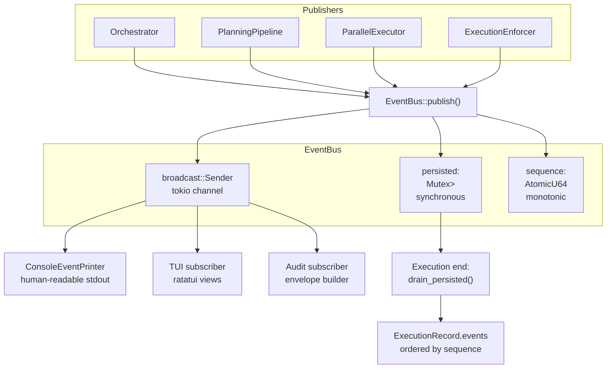

# Event System Architecture

<!--
Canonical Reference: .pi/architecture/modules/event-system.md
Blueprint Source: Domain Exploration Session 63c25384
-->

## Overview

Captures all execution events as an append-only log via tokio broadcast channel with synchronous in-memory persistence. Supports subscriber fan-out for real-time monitoring (ConsoleEventPrinter, TUI) and drain-at-end for ExecutionRecord persistence.

## Responsibilities

- Provide pub-sub event bus backed by tokio::sync::broadcast
- Persist all events synchronously in-memory with monotonic sequence numbers
- Support multiple subscribers (console, TUI, audit) with independent receivers
- Drain persisted events at execution end into ExecutionRecord
- Define the full ExecutionEvent enum (11 variants)
- Track event count and sequence for ordering

## Components

| Component | File Path | Purpose | Canonical Section |
|-----------|-----------|---------|-------------------|
| EventBus | `rigorix/src/event_bus.rs` | Central pub-sub with persistence | #bus |
| ExecutionEvent | `rigorix/src/event_bus.rs` | Tagged union of 11 event variants | #events |
| PersistedEvent | `rigorix/src/event_bus.rs` | Event with monotonic sequence number | #persisted |
| ConsoleEventPrinter | `rigorix/src/event_bus.rs` | Human-readable event printer | #printer |

---

## Component Details

### EventBus

**Purpose:** Central pub-sub event bus with synchronous in-memory persistence

**Implementation File:** `rigorix/src/event_bus.rs`

```rust
pub struct EventBus {
    sender: broadcast::Sender<ExecutionEvent>,
    persisted: Arc<Mutex<Vec<PersistedEvent>>>,
    sequence: AtomicU64,
}

impl EventBus {
    pub fn new(capacity: usize) -> Self;         // default: 1000
    pub fn publish(&self, event: ExecutionEvent); // non-blocking
    pub fn subscribe(&self) -> broadcast::Receiver<ExecutionEvent>;
    pub async fn drain_persisted(&self) -> Vec<PersistedEvent>;
    pub fn event_count(&self) -> u64;
}
```

### ExecutionEvent — All 11 Variants

```rust
#[derive(Debug, Clone, Serialize, Deserialize)]
#[serde(tag = "type", rename_all = "snake_case")]
pub enum ExecutionEvent {
    PlanningStarted   { execution_id, intent, timestamp },
    PlanningCompleted { execution_id, template_id, confidence, parameters, timestamp },
    NodeStarted       { execution_id, node_id, node_name, timestamp },
    NodeCompleted     { execution_id, node_id, duration_ms, output, timestamp },
    NodeFailed        { execution_id, node_id, error, attempt, timestamp },
    NodeRetrying      { execution_id, node_id, attempt, delay_ms, timestamp },
    ToolExecuted      { execution_id, node_id, tool, risk_level, skipped, timestamp },
    ExecutionCompleted  { execution_id, duration_ms, nodes_executed, timestamp },
    ExecutionFailed     { execution_id, error, timestamp },
    ExecutionCancelled  { execution_id, timestamp },
    BudgetWarning     { execution_id, resource, used, limit, timestamp },
}
```

---

## Data Flow



**Flow Description:**
1. Publishers across all phases emit ExecutionEvent variants via EventBus::publish()
2. Event broadcasts to all subscribers via tokio broadcast channel (non-blocking)
3. Event synchronously persists to Vec<PersistedEvent> with monotonic sequence number
4. At execution end, drain_persisted() returns ordered events for ExecutionRecord
```

---

## Dependencies

### Depends On
- tokio: broadcast channel
- chrono: timestamps
- serde: event serialization

### Used By
- **All contexts** publish events via EventBus
- **State Persistence**: ExecutionRecord collects drained events
- **Orchestrator**: Creates EventBus, drains at end

---

## Testing Requirements

| Test Type | Coverage Target | Files |
|-----------|-----------------|-------|
| Unit | 95% | `rigorix/src/event_bus.rs` (inline tests) |

**Key Test Scenarios:**
- Publish → subscriber receives event
- Publish → drain_persisted returns in sequence order
- drain_persisted empties buffer
- Multiple subscribers each receive all events
- Event count increments correctly

---

## Performance Considerations

| Metric | Target | Monitoring |
|--------|--------|------------|
| Publish latency | < 1µs | Synchronous Mutex write |
| Buffer capacity | 1,000 events (configurable) | Config |
| Subscriber lag | Non-blocking; lagged subscribers warned | RecvError::Lagged |

---

Last updated: 2026-06-15
*Module version: 1.0.0*

---

**Status:** Implemented  
**Last verified:** 2026-06-15  
**Module version:** 1.0.0
