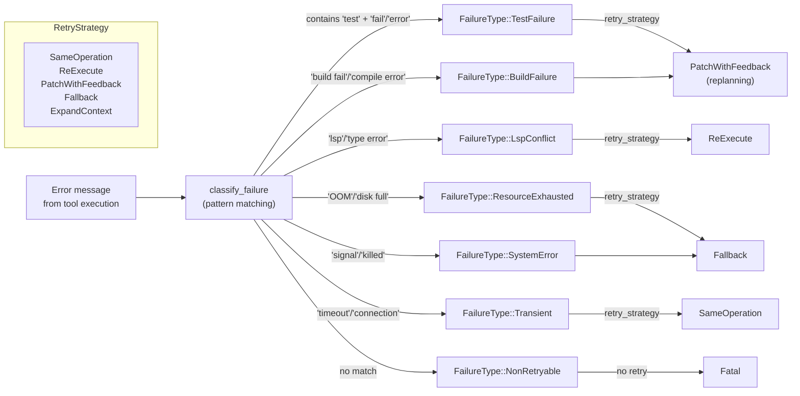

# Failure Classification Architecture

<!--
Canonical Reference: .pi/architecture/modules/failure-classification.md
Blueprint Source: Domain Exploration Session 63c25384
-->

## Overview

Classifies execution failures into typed categories for retry routing. Maps error messages to FailureType via pattern matching, and each FailureType maps to a recommended RetryStrategy. Used by the DAG executor to decide how to recover from failures.

## Responsibilities

- Define FailureType enum with 7 categories
- Classify error messages into FailureType via pattern matching
- Map each FailureType to its recommended RetryStrategy
- Expose is_retryable() for quick retry eligibility check
- Support RetryStrategy enum with 5 variants

## Components

| Component | File Path | Purpose | Canonical Section |
|-----------|-----------|---------|-------------------|
| FailureType | `rigorix/src/failure.rs` | Enum: Transient, TestFailure, BuildFailure, LspConflict, etc. | #types |
| RetryStrategy | `rigorix/src/retry.rs` | Enum: SameOperation, ReExecute, PatchWithFeedback, Fallback, ExpandContext | #strategies |
| classify_failure | `rigorix/src/failure.rs` | Pattern-matching function: error → FailureType | #classifier |

---

## Component Details

### FailureType

**Purpose:** Classify execution failures into typed categories

**Implementation File:** `rigorix/src/failure.rs`

```rust
#[derive(Debug, Clone, PartialEq, Eq)]
pub enum FailureType {
    Transient,           // Network hiccup, timeout → retry SameOperation
    TestFailure,         // Test suite failure → replan with feedback
    BuildFailure,        // Build/compile failure → patch with compiler output
    LspConflict,         // LSP type conflict → exponential backoff
    ResourceExhausted,   // OOM, disk full → try Fallback strategy
    SystemError,         // Process crash, I/O error → Fallback
    NonRetryable,        // Bad input, auth → Fatal
}
```

### RetryStrategy

**Purpose:** Define what to do on failure

**Implementation File:** `rigorix/src/retry.rs`

```rust
#[derive(Debug, Clone)]
pub enum RetryStrategy {
    SameOperation,                          // Retry the same operation
    ReExecute,                              // Re-execute from scratch
    PatchWithFeedback { feedback: String }, // Retry with error feedback
    Fallback,                               // Execute fallback task
    ExpandContext { level: u8 },            // Expand context and retry
}
```

### classify_failure()

```rust
pub fn classify_failure(error_message: &str) -> FailureType;
// Patterns:
//   "test" + "fail"/"error"          → TestFailure
//   "build fail"/"compile error"     → BuildFailure
//   "lsp"/"type error"/"type mismatch" → LspConflict
//   "out of memory"/"disk full"      → ResourceExhausted
//   "signal"/"process crash"/"killed" → SystemError
//   "timeout"/"connection"/"network" → Transient
//   else                              → NonRetryable
```

---

## Failure → Strategy Mapping

| FailureType | is_retryable | RetryStrategy |
|-------------|-------------|---------------|
| Transient | ✅ Yes | SameOperation |
| LspConflict | ✅ Yes | ReExecute |
| ResourceExhausted | ✅ Yes | Fallback |
| SystemError | ✅ Yes | Fallback |
| TestFailure | ❌ No | PatchWithFeedback (replanning) |
| BuildFailure | ❌ No | PatchWithFeedback (replanning) |
| NonRetryable | ❌ No | Fatal error, no retry |

---

## Dependencies

### Depends On
- **Retry module** (`rigorix/src/retry.rs`): RetryStrategy enum
- **Execution Engine**: ParallelExecutor uses classify_failure in retry loop

### Used By
- **Execution Engine**: Determines retry behavior per node
- **DAG Engine**: ExecutionPolicy.retry_on references FailureType

---

## Data Flow



**Flow Description:**
1. Error message from tool execution is classified via pattern matching
2. Each FailureType maps to a recommended RetryStrategy
3. Execution Engine uses is_retryable() to decide retry eligibility
4. TestFailure and BuildFailure require replanning (not auto-retry)

## Testing Requirements

| Test Type | Coverage Target | Files |
|-----------|-----------------|-------|
| Unit | 100% | `rigorix/src/failure.rs` (inline tests) |

**Key Test Scenarios:**
- classify_failure("tests failed with 3 errors") → TestFailure
- classify_failure("LSP type mismatch") → LspConflict
- classify_failure("connection timeout") → Transient
- classify_failure("invalid api key") → NonRetryable
- Each FailureType maps to correct RetryStrategy
- is_retryable() correct for each type

---

*Last updated: 2026-06-13*
*Module version: 1.0.0*
