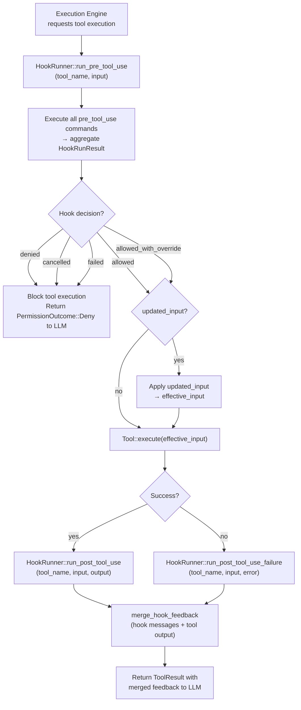

# Hook System Architecture

<!--
Canonical Reference: .pi/architecture/modules/hooks.md
Rationale: Extensible tool lifecycle interception without modifying engine code
-->

## Overview

The Hook System provides external script-based interception points around every tool execution. Hooks run as shell commands receiving JSON payloads on stdin and returning structured JSON decisions. They enable deployment-specific policies, CI/CD integration, audit enrichment, and custom pre/post-flight validation without modifying the engine or tool implementations.

## Adoption Rationale

hook system (PreToolUse, PostToolUse, PostToolUseFailure) is one of most powerful extensibility mechanisms. Rigorix currently has risk gating but no lifecycle hooks. Adding hooks enables:

- **Custom pre-flight validation per deployment**: corporate security policies, environment-specific constraints
- **CI/CD integration**: block destructive tools in CI environments, enforce review gates
- **Audit enrichment**: inject metadata into results without touching engine code
- **Recovery triggers**: automatically run `cargo fmt` after a `write_file`, or `cargo test` after a `git_commit`
- **Permission overrides**: hooks can elevate permissions for trusted operations

Unlike Rigorix's existing risk gating (which is declarative and static), hooks are **dynamic and programmable** — any shell script or binary can serve as a hook.

## Responsibilities

- Register hook commands per lifecycle event: PreToolUse, PostToolUse, PostToolUseFailure
- Execute hooks as external processes with JSON stdin/stdout protocol
- Support hook decisions: allow, deny, modify input, provide feedback messages
- Support hook permission overrides (elevate or restrict)
- Support abort signals for long-running hooks
- Emit hook lifecycle events for observability
- Merge hook feedback into tool result output for LLM context

## Components

| Component | File Path | Purpose | Canonical Section |
|-----------|-----------|---------|-------------------|
| HookEvent | `engine/src/hooks/domain/event.rs` | Enum: PreToolUse, PostToolUse, PostToolUseFailure | #hook-event |
| HookConfig | `engine/src/hooks/domain/config.rs` | Per-event command lists from config | #hook-config |
| HookRunResult | `engine/src/hooks/domain/result.rs` | Structured result: denied, failed, cancelled, messages, permission_override, updated_input | #hook-result |
| HookRunner | `engine/src/hooks/application/runner.rs` | Executes hook commands, aggregates results | #hook-runner |
| HookRunnerService | `engine/src/hooks/application/service.rs` | Service trait for hook execution | #hook-service |
| HookAbortSignal | `engine/src/hooks/domain/abort.rs` | Atomic abort flag for cooperative cancellation | #hook-abort |
| HookProgressReporter | `engine/src/hooks/domain/progress.rs` | Trait for progress event emission (TUI, logs) | #hook-progress |
| HookError | `engine/src/hooks/domain/error.rs` | Typed error enum for hook failures | #hook-error |
| HookEventPayload | `engine/src/hooks/domain/event_payload.rs` | Event payload schemas for hook lifecycle | #hook-events |

---

## Component Details

### HookEvent

**Purpose:** Identifies which lifecycle point a hook runs at

**Definition:** `engine/src/hooks/domain/event.rs`

```rust
#[derive(Debug, Clone, Copy, PartialEq, Eq, Serialize, Deserialize)]
#[serde(rename_all = "snake_case")]
pub enum HookEvent {
    /// Runs before tool execution. Can modify input, block, or override permissions.
    PreToolUse,
    /// Runs after successful tool execution. Can append feedback.
    PostToolUse,
    /// Runs after tool execution failure. Can trigger recovery.
    PostToolUseFailure,
}
```

### Hook Protocol

**Purpose:** JSON contract between the engine and hook scripts

**Stdin payload (PreToolUse):**
```json
{
    "event": "PreToolUse",
    "tool_name": "run_command",
    "tool_input": "{\"command\": \"cargo build --release\"}",
    "session_id": "exec_abc123",
    "workspace_root": "/home/user/project"
}
```

**Stdout response contract:**
```json
{
    "decision": "allow",
    "reason": "command is known and safe",
    "permission_override": null,
    "updated_input": null,
    "messages": ["Running in CI environment - sandbox enabled"]
}
```

**Decision variants:**
| decision | Effect |
|----------|--------|
| `"allow"` | Tool proceeds normally |
| `"deny"` | Tool blocked with reason (same turn) |
| `"allow_with_override"` | Tool proceeds with `permission_override` applied |
| `"modify"` | Tool proceeds with `updated_input` replacing original input |

### HookRunResult

**Purpose:** Aggregated result from running all hook commands for an event

**Definition:** `engine/src/hooks/domain/result.rs`

```rust
#[derive(Debug, Clone, PartialEq, Eq)]
pub struct HookRunResult {
    /// True if any hook command returned "deny"
    pub denied: bool,
    /// True if any hook command failed (non-zero exit + no JSON)
    pub failed: bool,
    /// True if the abort signal was set during execution
    pub cancelled: bool,
    /// Aggregated messages from all hooks
    pub messages: Vec<String>,
    /// Permission override from the last hook that provided one
    pub permission_override: Option<RiskLevel>,
    /// Reason for the permission override
    pub permission_reason: Option<String>,
    /// Updated tool input from the last hook that modified it
    pub updated_input: Option<ToolInput>,
}
```

### HookRunner

**Purpose:** Executes all registered hook commands for a given event and aggregates results

**Implementation File:** `engine/src/hooks/application/runner.rs`

```rust
pub struct HookRunner {
    config: HookConfig,
}

impl HookRunner {
    pub fn new(config: HookConfig) -> Self;
    
    /// Run all PreToolUse hooks for a tool invocation
    pub fn run_pre_tool_use(
        &self,
        tool_name: &str,
        tool_input: &ToolInput,
        abort_signal: Option<&HookAbortSignal>,
        reporter: Option<&mut dyn HookProgressReporter>,
    ) -> HookRunResult;
    
    /// Run all PostToolUse hooks after successful execution
    pub fn run_post_tool_use(
        &self,
        tool_name: &str,
        tool_input: &ToolInput,
        tool_output: &str,
        abort_signal: Option<&HookAbortSignal>,
        reporter: Option<&mut dyn HookProgressReporter>,
    ) -> HookRunResult;
    
    /// Run all PostToolUseFailure hooks after failed execution
    pub fn run_post_tool_use_failure(
        &self,
        tool_name: &str,
        tool_input: &ToolInput,
        error_output: &str,
        abort_signal: Option<&HookAbortSignal>,
        reporter: Option<&mut dyn HookProgressReporter>,
    ) -> HookRunResult;
}
```

### HookConfig

**Purpose:** Declarative hook command registration per event, loaded from config

**Definition:** `engine/src/hooks/domain/config.rs`

```rust
#[derive(Debug, Clone, PartialEq, Eq, Default, Serialize, Deserialize)]
pub struct HookConfig {
    /// Commands to run before every tool execution
    pub pre_tool_use: Vec<String>,
    /// Commands to run after every successful tool execution
    pub post_tool_use: Vec<String>,
    /// Commands to run after every failed tool execution
    pub post_tool_use_failure: Vec<String>,
}
```

**Configuration example (`.rigorix/hooks.toml`):**
```toml
[hooks]
pre_tool_use = [
    "rigorix-hook-validate-path",
    "rigorix-hook-ci-guard --env $RIGORIX_ENV",
]
post_tool_use = [
    "rigorix-hook-fmt-check --path $TOOL_PATH",
]
post_tool_use_failure = [
    "rigorix-hook-notify --channel alerts",
]
```

---

## Data Flow



**Flow Description:**
1. Execution Engine calls `HookRunner::run_pre_tool_use()` before every tool invocation
2. All registered PreToolUse commands execute in parallel (or sequentially per config)
3. If any hook returns `deny`, the tool is blocked and the denial reason is fed back to the LLM
4. If a hook provides `updated_input`, it replaces the original input for this execution
5. The tool executes with the effective input
6. PostToolUse or PostToolUseFailure hooks run based on execution outcome
7. Hook feedback messages are merged into the tool result output for LLM visibility

---

## Dependencies

### Depends On
- **Tool System**: `Tool` trait, `ToolInput`, `ToolResult` — hooks intercept tool invocation
- **Risk Gating**: `RiskLevel` — hooks can override risk levels via `permission_override`
- **Configuration**: Hook command lists loaded from `.rigorix/hooks.toml`
- **Event System**: Hook lifecycle events emitted for observability

### Used By
- **Execution Engine**: Integrates `HookRunner` into the tool execution pipeline
- **Orchestrator**: Constructs `HookRunner` from config during `OrchestratorBuilder::build()`

---

## Integration with Execution Engine

The Execution Engine wraps each tool invocation through the hook pipeline:

```rust
// Inside ParallelExecutionServiceImpl::execute_node()
pub async fn execute_node(
    &self,
    node: &TaskNode,
    hook_runner: &HookRunner,
    abort_signal: &HookAbortSignal,
) -> Result<TaskResult, ExecutionError> {
    let tool = self.tool_registry.get(&node.tool_name)?;
    let mut input = node.tool_input.clone();
    
    // ── PreToolUse hooks ──
    let pre_result = hook_runner.run_pre_tool_use(
        &node.tool_name,
        &input,
        Some(abort_signal),
        None,
    );
    
    if pre_result.is_denied() || pre_result.is_cancelled() {
        return Err(ExecutionError::ToolBlocked {
            tool: node.tool_name.clone(),
            reason: pre_result.messages().join("; "),
        });
    }
    
    if let Some(updated) = pre_result.modified_input() {
        input = updated;
    }
    
    // ── Tool execution ──
    let result = tool.execute(&input).await;
    
    // ── PostToolUse or PostToolUseFailure hooks ──
    match &result {
        Ok(output) => {
            let post_result = hook_runner.run_post_tool_use(
                &node.tool_name, &input, &output.output, Some(abort_signal), None,
            );
            // Merge hook feedback into output
            merge_hook_feedback(post_result.messages(), output)
        }
        Err(error) => {
            let failure_result = hook_runner.run_post_tool_use_failure(
                &node.tool_name, &input, &error.to_string(), Some(abort_signal), None,
            );
            // Append hook diagnostics to error context
            enrich_error_with_hook_feedback(error, failure_result.messages())
        }
    }
}
```

---

## Security Considerations

| Concern | Mitigation | Validator |
|---------|------------|-----------|
| Malicious hook script | Hooks run from `.rigorix/hooks/` directory only; commands must be relative to workspace or absolute with validation | security-validator |
| Hook blocks indefinitely | `HookAbortSignal` with configurable timeout (default 30s); cooperative cancellation | security-validator |
| Hook modifies unintended state | Hooks receive read-only context JSON; cannot mutate engine state directly | security-validator |
| Sensitive data in hook payload | `tool_input` is passed as-is; secrets must be redacted by the hook config author | security-validator |
| Hook privilege escalation | Hooks run with same privileges as the rigorix process; no sandbox by default | security-validator |

**Hook Execution Sandbox:**
- Hooks execute in the workspace root directory
- Environment variables available: `RIGORIX_TOOL_NAME`, `RIGORIX_EVENT`, `RIGORIX_SESSION_ID`, `RIGORIX_WORKSPACE`
- No network isolation by default (configurable per deployment)

---

## Testing Requirements

| Test Type | Coverage Target | Files |
|-----------|-----------------|-------|
| Unit | 90% | `engine/src/hooks/` — per-component test modules |
| Integration | 85% | Tests with real shell scripts as hooks |
| E2E | 80% | Full execution with hook pipeline active |

**Key Test Scenarios:**
- PreToolUse hook returns `allow` → tool executes normally
- PreToolUse hook returns `deny` → tool blocked, denial fed to LLM
- PreToolUse hook returns `modify` with `updated_input` → tool executes with modified input
- PostToolUse hook appends feedback → merged into tool output
- PostToolUseFailure hook runs on tool error → diagnostics appended
- Multiple hooks aggregate correctly (first deny wins, messages concatenate)
- Hook timeout via `HookAbortSignal` → cooperative cancellation
- Hook with non-zero exit and no valid JSON → treated as `failed`

---

## Error Handling

```rust
#[derive(Debug, Error)]
pub enum HookError {
    #[error("Hook command not found: {0}")]
    CommandNotFound(String),
    #[error("Hook execution timed out after {0}ms")]
    Timeout(u64),
    #[error("Hook returned invalid JSON: {0}")]
    InvalidJson(String),
    #[error("Hook process error: {0}")]
    ProcessError(String),
    #[error("Hook aborted by signal")]
    Aborted,
}
```

**Error Recovery:**
- `CommandNotFound`: Hook is skipped with a warning (not fatal to tool execution)
- `Timeout`: Hook is killed; if PreToolUse, tool is **blocked** (safety-first); if PostToolUse, tool result is returned without hook feedback
- `InvalidJson`: Treated as hook `failed` — tool may be blocked depending on event type
- `ProcessError`: Same as InvalidJson — fail-safe behavior
- `Aborted`: Treated as hook `cancelled` — tool execution proceeds unless the abort was for PreToolUse (in which case tool is blocked)

---

## Performance Considerations

| Metric | Target | Monitoring |
|--------|--------|------------|
| PreToolUse hook latency | < 500ms per hook | `hook_execution_duration_ms` metric |
| PostToolUse hook latency | < 2s per hook | `hook_execution_duration_ms` metric |
| Hook timeout | 30s default, configurable | `hook_timeout_count` counter |
| Hook process spawn overhead | < 10ms | Benchmarked at integration test level |

**Concurrency:**
- PreToolUse hooks run **sequentially** by default (each can modify input for the next)
- PostToolUse hooks can run **concurrently** (no input modification, only feedback)
- PostToolUseFailure hooks run **concurrently**

---

*Last updated: 2026-06-19*
*Module version: 1.0.0 (Planned)*

---

**Status:** Planned  
**Implementation priority:** P0 — foundational extensibility mechanism
