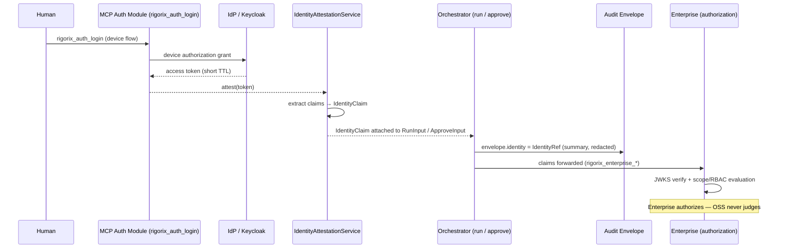

# Identity Attestation Architecture

<!--
Canonical Reference: .pi/architecture/modules/identity.md
Rationale: Attributed human identity in the evidence chain — OSS attests who acted; Enterprise authorizes what they may do
Blueprint Source: Requirements v1 — 2026-08-28 (approved, NOT YET BUILT)
-->

## Overview

The Identity Attestation module makes the human behind a run or an approval a **first-class, recorded fact**. Today `RunInput.author` is a self-asserted `Option<String>` and `approve_node` carries no identity at all — the audit envelope signs the run's execution events, but *who* approved, *when*, and *under what authority* is not attributable evidence.

This module defines the shared `IdentityClaim` value type and the attestation service that converts a presented IdP token (or local principal) into a structured, time-bound identity claim that flows into runs (`author`), approvals (`approver_id`), and the signed envelope.

**The seam (see ADR-012):**

> **OSS attests; Enterprise authorizes.** OSS records who was presented as acting (a captured, attributed fact). Enterprise evaluates whether that identity may act (scope/RBAC enforcement, policy, JWKS verification). OSS never makes authorization judgments; Enterprise is where "should this approver approve a production-switch?" is answered.

## Identity Model

### The Claim, Not the Person

An `IdentityClaim` is an **attributed, time-bound statement** — evidence of who was presented as authorizing, not proof of who the person is. This mirrors the discipline already applied to `authority`: "captured fact, not judgment." Identity claims are:

- **Attributed**: the presenter supplies the credential; the claim records it
- **Time-bound**: `issued_at` / `expires_at`; claims expire
- **Best-effort verifiable**: signature verification against the IdP's JWKS when online; the raw token is preserved for later off-band verification when offline
- **Never fail-closed for local development**: an unreachable IdP degrades to `IdentitySource::Unverified` — explicitly marked, never silent

### Verification Model — Three Options (ADR-012 decision: attestation + best-effort)

| Option | Behavior | Status |
|--------|----------|--------|
| **(a) Verify at the edge (JWKS)** | OSS fetches IdP JWKS and validates every token | Rejected — breaks offline-first; no IdP in OSS deployments |
| **(b) OSS mints its own local tokens** | Post-exchange local signing keys | Rejected — more key management, more theft surface |
| **(c) Attestation + best-effort (chosen)** | OSS extracts claims and records the raw token as evidence; verification when online, off-band verification otherwise | **Chosen** |

## DDD Layers

3 DDD layers (no `interfaces/` — consumed via service trait by `orchestrator`, `execution_engine`, `approval`, `audit`).

| Layer | Purpose | Tech |
|-------|---------|------|
| `domain/` | IdentityClaim, IdentitySource, Authority, errors | Zero framework imports, `thiserror` |
| `application/` | IdentityAttestationService, claim extraction | Traits + async |
| `infrastructure/` | Token verifier (best-effort), durable identity records | Reqwest (JWKS), state persistence |

**Dependency rule:** `domain → application → infrastructure` (inward)

## Components by Layer

#### Domain Layer (`domain/`)
| Component | Description | Framework? |
|-----------|-------------|------------|
| IdentityClaim | Value object: subject, issuer, roles/authority, auth method, exp | ❌ No |
| IdentitySource | Enum: `IdpToken`, `LocalPrincipal`, `Unverified` | ❌ No |
| Authority | Optional structured field: role/policy id (captured fact) | ❌ No |
| IdentityError | Typed error enum (thiserror) | ❌ No |

#### Application Layer (`application/`)
| Component | Description | Type |
|-----------|-------------|------|
| IdentityAttestationService | Trait: `attest`, `extract_claims`, `verify` (best-effort) | Service |
| AttestInput / AttestOutput | DTOs | DTO |

#### Infrastructure Layer (`infrastructure/`)
| Component | Description | Connects to |
|-----------|-------------|-------------|
| TokenVerifier | Best-effort JWKS verification; `NullVerifier` default (offline) | IdP JWKS endpoint |
| IdentityRepository | Durable identity records (attached to execution state) | State persistence |

## Component Details

### IdentityClaim

**Purpose:** The shared, serde-stable value type every identity-bearing surface uses — runs, approvals, envelope

**DDL Layer:** `domain/`

**Implementation File:** `engine/src/identity/domain/claim.rs`

**Canonical Reference:** `.pi/architecture/modules/identity.md#component-details`

```rust
#[derive(Debug, Clone, Serialize, Deserialize, PartialEq, Eq)]
pub struct IdentityClaim {
    /// Subject — the human's unique identifier at the IdP (e.g. "user@org" or sub).
    pub subject: String,
    /// Issuer — who vouches for the subject (IdP issuer URL, or "local").
    pub issuer: String,
    /// Roles / authority presented (captured fact, not judgment).
    pub authority: Option<String>,
    /// How the identity was established: IdP token, local principal, or unverified.
    pub source: IdentitySource,
    /// Auth method from the token (e.g. "device_code", "client_credentials").
    pub auth_method: Option<String>,
    /// Claim lifetime.
    pub issued_at: DateTime<Utc>,
    pub expires_at: Option<DateTime<Utc>>,
    /// Reference to the raw token, preserved for off-band verification.
    /// Never contains the raw token value itself in serialized form.
    pub token_ref: Option<String>,
}

#[derive(Debug, Clone, PartialEq, Eq, Serialize, Deserialize)]
#[serde(rename_all = "snake_case")]
pub enum IdentitySource {
    /// IdP token (OIDC access token / JWT) — best-effort verified when online.
    IdpToken,
    /// Local principal (OS user, configured approver) — attributed, not IdP-anchored.
    LocalPrincipal,
    /// No identity presented or IdP unreachable — explicitly degraded.
    Unverified,
}

impl IdentityClaim {
    /// True when the claim is still within its lifetime.
    pub fn is_valid(&self) -> bool;
    /// Redacted rendering for logs/envelope summaries (never the raw token).
    pub fn redacted_summary(&self) -> String;
}
```

**States:**
- **Populated:** subject + issuer + source; expiry set
- **Degraded:** `IdentitySource::Unverified` — explicitly marked, never silent
- **Expired:** `is_valid()` returns false; consumers must reject expired claims for approval binding

**Dependencies:** None

---

### IdentitySource

**Purpose:** How the identity was established — drives the attestation marker (explicit, never silent)

**DDL Layer:** `domain/`

**Implementation File:** `engine/src/identity/domain/claim.rs`

**Canonical Reference:** `.pi/architecture/modules/identity.md#component-details`

```rust
#[derive(Debug, Clone, PartialEq, Eq, Serialize, Deserialize)]
#[serde(rename_all = "snake_case")]
pub enum IdentitySource {
    /// IdP token (OIDC access token / JWT) — best-effort verified when online.
    IdpToken,
    /// Local principal (OS user, configured approver) — attributed, not IdP-anchored.
    LocalPrincipal,
    /// No identity presented or IdP unreachable — explicitly degraded.
    Unverified,
}
```

**States:**
- **IdpToken:** attributed from an IdP-presented credential
- **LocalPrincipal:** attributed from a local principal
- **Unverified:** degraded — explicitly marked, never silent

**Dependencies:** None

---

### IdentityAttestationService

**Purpose:** Convert presented credentials into attested `IdentityClaim`s; best-effort verification

**DDL Layer:** `application/`

**Implementation File:** `engine/src/identity/application/service.rs`

**Canonical Reference:** `.pi/architecture/modules/identity.md#component-details`

```rust
#[async_trait]
pub trait IdentityAttestationService: Send + Sync {
    /// Attest from a presented token/principal → IdentityClaim.
    async fn attest(&self, input: AttestInput) -> Result<IdentityClaim, IdentityError>;

    /// Extract claims from a JWT WITHOUT verification (decode claims).
    /// Used for attestation; verification is separate and best-effort.
    fn extract_claims(&self, token: &str) -> Result<IdentityClaim, IdentityError>;

    /// Best-effort signature verification against IdP JWKS.
    /// Default implementation (NullVerifier) returns Ok(true) — offline attestation.
    async fn verify(&self, claim: &IdentityClaim, token: &str) -> Result<VerificationOutcome, IdentityError>;
}

pub enum VerificationOutcome {
    Verified,
    Unverified { reason: String }, // IdP unreachable, unknown kid, etc.
}
```

**Dependencies:** `IdentityClaim`, `IdentityError`

---

### TokenVerifier

**Purpose:** Best-effort signature verification against the IdP JWKS; `NullVerifier` default keeps attestation fully offline-capable

**DDL Layer:** `infrastructure/`

**Implementation File:** `engine/src/identity/infrastructure/verifier.rs`

**Canonical Reference:** `.pi/architecture/modules/identity.md#component-details`

```rust
#[async_trait]
pub trait TokenVerifier: Send + Sync {
    /// Verify a token signature against the IdP JWKS.
    /// Best-effort — an unreachable IdP yields VerificationOutcome::Unverified, never an error.
    async fn verify(&self, token: &str, claim: &IdentityClaim) -> Result<VerificationOutcome, IdentityError>;
}

/// Offline default — attestation proceeds without network verification (ADR-012 option c).
pub struct NullVerifier;
```

**States:**
- **Verified:** signature validated against JWKS
- **Unverified:** IdP unreachable, unknown kid, or verification disabled — recorded, never fatal

**Dependencies:** `IdentityClaim`, `IdentityError`

---

### IdentityRepository

**Purpose:** Durable identity records — attached to execution state for continuity and audit

**DDL Layer:** `infrastructure/`

**Implementation File:** `engine/src/identity/infrastructure/repository/identity_repository.rs`

**Canonical Reference:** `.pi/architecture/modules/identity.md#component-details`

**Key behavior:**
- Persists/loads identity claims alongside `ExecutionState` (via state persistence)
- Raw tokens stored by reference (`token_ref`), never embedded in serialized records

**Dependencies:** `IdentityClaim`, State Persistence

---

### IdentityError

**Purpose:** Typed error enum for all identity attestation failure modes

**DDL Layer:** `domain/`

**Implementation File:** `engine/src/identity/domain/error.rs`

**Canonical Reference:** `.pi/architecture/modules/identity.md#error-handling`

See the [Error Handling](#error-handling) section for the full enum. `VerificationUnavailable` is **non-fatal for attestation** — the claim degrades to `IdentitySource::Unverified`.

**Dependencies:** None

---

## Data Flow



**Flow Description:**
1. The human logs in via the MCP auth module (OIDC device flow); the gateway holds a short-TTL access token
2. `IdentityAttestationService` extracts claims → `IdentityClaim` (attestation; verification is best-effort)
3. The claim is attached to `RunInput` (author) and `ApproveInput` (approver_id) — the same type in both places
4. A redacted summary lands in the envelope's `identity` block; the raw token is preserved by reference for off-band verification
5. Enterprise receives the claims and performs JWKS verification + authorization — OSS makes no authorization judgment

## Offline Policy

| Condition | Behavior |
|-----------|----------|
| IdP reachable | Claims attested; `verify()` best-effort; outcome recorded |
| IdP unreachable | Claims degrade to `IdentitySource::Unverified`; runs/approvals continue; envelope marks `identity: unverified` explicitly |
| No credentials configured | Identity absent; `author` stays `None`; envelope marks `identity: absent` |

**Never fail-closed on identity for a local developer tool.** Fail-open *with an explicit degraded marker* — blocking development because the IdP is down is how governance dies. (This deliberately differs from Portotify's egress doctrine — block-on-unavailable — which applies to production egress control, not local identity attestation. The distinction is documented in ADR-012.)

## Privacy

- Envelope carries `IdentityRef` — a **redacted summary** (subject rendered, token never present)
- Raw tokens are stored by reference (`token_ref`), never embedded in the envelope
- `redacted_summary()` follows the SpanPrivacy pattern — api_key/token/secret fields never logged
- Full token preservation is opt-in and local (state persistence), matching the `planning_prompt` pattern

## Dependencies

### Depends On
- **Configuration**: IdP issuer, client id, verification toggle
- **State Persistence**: durable identity records (for continuity + audit)
- **Observability**: SpanPrivacy for redaction

### Used By
- **Orchestrator**: `RunInput.identity` (author)
- **Approval**: `ApproverInput.approver_id` + `token_claims_ref` (approval binding)
- **Audit**: envelope `identity` block
- **MCP Auth Module**: attestation entry point (client flow lives in the MCP crate)
- **Enterprise Proxy**: claims forwarding for authorization

## Security Considerations

| Concern | Mitigation | Validator |
|---------|------------|-----------|
| Identity spoofing | Identity is an attributed claim, documented as such; authority is a captured fact | security-validator |
| Raw token leakage | `token_ref` only; redacted summaries; SpanPrivacy | security-validator |
| Offline degradation abused | Degradation is explicit (`IdentitySource::Unverified`) — never silent; envelope marks it | security-validator |
| Expired claim reuse | `is_valid()` enforced at approval binding (TTL) | security-validator |
| OSS drifting into authorization | Contract boundary: OSS attests, Enterprise authorizes — no scope evaluation in OSS | architecture-validator |

## Acceptance Criteria

| # | Component | Criterion | Verify In |
|---|-----------|-----------|-----------|
| 1 | IdentityClaim | Serde round-trip preserves all fields; `redacted_summary()` never contains raw token | unit test |
| 2 | IdentityClaim | `is_valid()` correct across expiry boundary | unit test |
| 3 | IdentityAttestationService | `extract_claims` decodes standard JWT claims (sub, iss, exp, roles) | unit test |
| 4 | IdentityAttestationService | attest with unreachable IdP → `IdentitySource::Unverified`, explicit marker, no error | integration test |
| 5 | IdentityAttestationService | verify against mock JWKS: valid → Verified; tampered → Unverified | integration test |
| 6 | IdentityClaim | RunInput.identity flows into envelope identity block (redacted) | integration test |
| 7 | IdentityAttestationService | ApproveInput.approver_id populated from claim; recorded in ApprovalRecord | integration test |

## Error Handling

```rust
use thiserror::Error;

#[derive(Debug, Error)]
pub enum IdentityError {
    #[error("Invalid token format: {0}")]
    InvalidToken(String),
    #[error("Token expired")]
    Expired,
    #[error("Missing required claim: {0}")]
    MissingClaim(String),
    #[error("Verification unavailable: {0}")]
    VerificationUnavailable(String),
    #[error("Internal error: {0}")]
    Internal(String),
}
```

**Recovery:**
- `InvalidToken` / `MissingClaim`: not retriable — reject the presented identity, degrade to `Unverified`
- `Expired`: not retriable — re-authenticate
- `VerificationUnavailable`: **non-fatal for attestation** — degrade to `Unverified`, record the outcome

## Module Structure

```
engine/src/identity/
├── mod.rs                          # Module root: re-exports, contract freeze header
├── domain/
│   ├── mod.rs
│   ├── claim.rs                    # IdentityClaim + IdentitySource value objects
│   ├── authority.rs                # Authority value object
│   └── error.rs                    # IdentityError (thiserror)
├── application/
│   ├── mod.rs
│   ├── service.rs                  # IdentityAttestationService trait
│   └── dto/
│       └── mod.rs                  # AttestInput, AttestOutput DTOs
└── infrastructure/
    ├── mod.rs
    ├── verifier.rs                 # TokenVerifier trait + NullVerifier (offline default)
    └── repository/
        ├── mod.rs
        └── identity_repository.rs  # Durable identity records
```

**Note:** No `interfaces/` — the client-side IdP flow (device authorization, keychain custody, MCP tools) lives in the MCP crate's `auth` module (`mcp/.pi/architecture/modules/auth.md`). The engine module is the **shared contract + attestation core**; the MCP module is the **client flow**.

## Guardian Build Checklist

- [ ] Module follows Clean Architecture: domain → application → infrastructure
- [ ] All domain types derive `Debug, Clone, Serialize, Deserialize`
- [ ] `IdentityError` uses `thiserror`
- [ ] `IdentityClaim` is the single shared identity type (orchestrator, approval, audit, mcp)
- [ ] Verification is best-effort; degradation is explicit, never silent
- [ ] Every `mod.rs` has canonical reference header
- [ ] Module spec written to `engine/.pi/architecture/modules/identity.md`
- [ ] Proofing scripts: `check_identity_contracts.sh` + `check_identity_coverage.sh`
- [ ] `cargo test --workspace` passes
- [ ] `cargo clippy --workspace` zero warnings

---

*Last updated: 2026-08-28*
*Module version: 1.0.0 (Planned)*

---

**Status:** Planned
**Implementation priority:** P1 — after approval binding core (R3 identity is consumed by approval)
