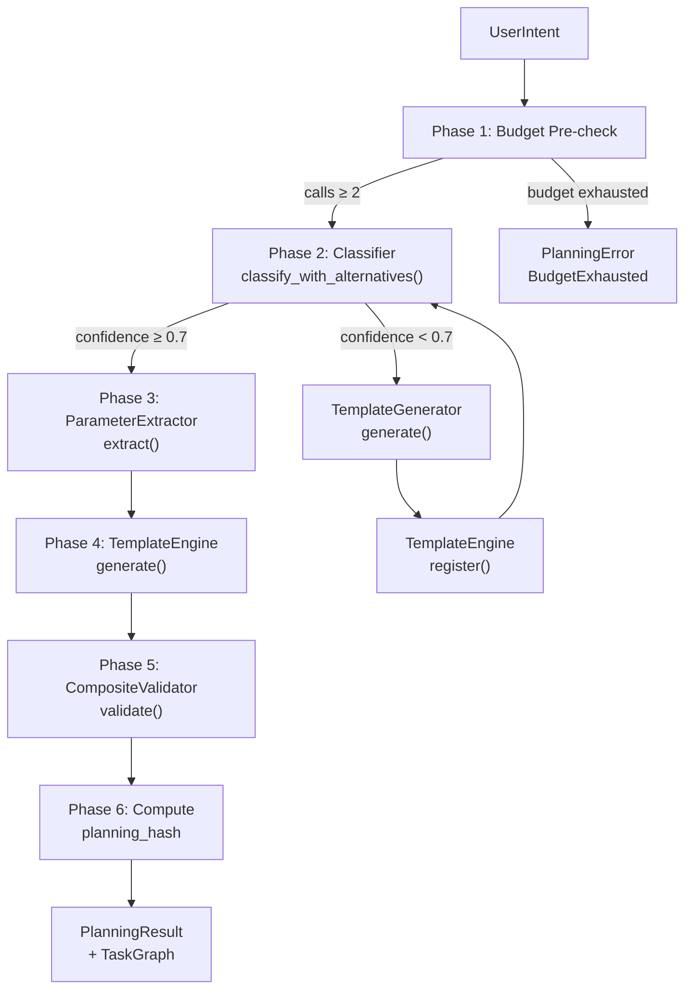

# Planning Pipeline Architecture

<!--
Canonical Reference: .pi/architecture/modules/planning-pipeline.md
Blueprint Source: Domain Exploration Session 63c25384
-->

## Overview

Orchestrates the LLM-based planning flow from user intent to validated plan. Phases: budget check → intent classification → parameter extraction → template generation fallback → TaskGraph generation → plan validation.

## Responsibilities

- Classify user intent against available templates via LLM
- Extract structured parameters from intent for matched template
- Route low-confidence intents to TemplateGenerator (fallback)
- Generate TaskGraph from template + parameters
- Validate plan via CompositeValidator before execution
- Compute deterministic planning_hash for replay auditing
- Track LLM call and token usage

## Components

| Component | File Path | Purpose | Canonical Section |
|-----------|-----------|---------|-------------------|
| PlanningPipeline | `rigorix/src/planning/mod.rs` | Orchestrator: phases 1-6 coordination | #pipeline |
| Classifier (trait) | `rigorix/src/planning/classifier.rs` | LLM-based intent classification | #classifier |
| ClaudeClassifier | `rigorix/src/planning/classifier.rs` | Anthropic Messages API implementation | #claude |
| OpenaiClassifier | `rigorix/src/planning/openai.rs` | OpenAI-compatible API implementation | #openai |
| ParameterExtractor (trait) | `rigorix/src/planning/extractor.rs` | LLM-based parameter extraction | #extractor |
| PlanningResult | `rigorix/src/planning/result.rs` | Deterministic contract from planning phase | #result |
| UserIntent | `rigorix/src/planning/result.rs` | Raw intent with clarification history | #intent |
| MockClassifier | `rigorix/src/planning/classifier.rs` | Test double for offline/CI mode | #mock |

---

## Component Details

### PlanningPipeline

**Purpose:** Orchestrate the 6-phase planning flow

**Implementation File:** `rigorix/src/planning/mod.rs`

**Dependencies:**
- Classifier trait
- ParameterExtractor trait
- TemplateGenerator (optional)
- TemplateEngine
- CompositeValidator
- LlmBudget

**Interface:**

```rust
pub struct PlanningPipeline { /* classifier, extractor, generator, engine, validator */ }

impl PlanningPipeline {
    pub fn new(classifier, extractor, templates) -> Self;
    pub fn with_generator(self, generator: Box<dyn TemplateGenerator>) -> Self;
    pub async fn plan(&self, intent, budget, symbols) -> Result<PlanningResult, PlanningError>;
    pub async fn plan_with_graph(&self, intent, budget, symbols) -> Result<PlanOutput, PlanningError>;
    pub fn available_templates(&self) -> Vec<Template>;
}
```

### Classifier Trait

**Purpose:** Abstract LLM-based intent classification

**Implementation File:** `rigorix/src/planning/classifier.rs`

**Interface:**

```rust
#[async_trait]
pub trait Classifier: Send + Sync {
    async fn classify_with_alternatives(
        &self, intent: &UserIntent, budget: &LlmBudget
    ) -> Result<ClassificationResult, PlanningError>;
}
```

---

## Data Flow



**Flow Description:**
1. Phase 1: Budget pre-check ensures at least 2 LLM calls remain
2. Phase 2: Classifier matches intent to template; if confidence < 0.7, falls back to TemplateGenerator
3. Phase 3-5: Parameter extraction, graph generation, and validation
4. Phase 6: Deterministic planning_hash computed for audit replay
```

---

## Dependencies

### Depends On
- **Template System**: TemplateEngine for graph generation
- **Template Generation**: Optional generator fallback
- **DAG Engine**: TaskGraph validation
- **Budget Tracking**: LlmBudget for cost control
- **Repo Engine**: Symbol context for planning

### Used By
- **Execution Engine**: Consumes PlanningResult for execution

---

## Security Considerations

| Concern | Mitigation | Validator |
|---------|------------|-----------|
| LLM prompt injection | Structured prompts with strict output constraints; no raw intent in system prompts | security-validator |
| Budget exhaustion | Phase 1 pre-check; RAII reservation on LlmBudget | operations-validator |

---

## Testing Requirements

| Test Type | Coverage Target | Files |
|-----------|-----------------|-------|
| Unit | 90% | `rigorix/src/planning/mod.rs` (inline tests) |
| Integration | 85% | `rigorix/tests/e2e_full_pipeline.rs` |

**Key Test Scenarios:**
- Happy path: classify → extract → validate → PlanningResult
- Low confidence without generator → requires_clarification=true
- Low confidence with generator → generates and re-runs
- Budget exhaustion → PlanningError::BudgetExhausted
- Missing parameter → MissingParameter error with description

---

*Last updated: 2026-06-13*
*Module version: 1.0.0*
