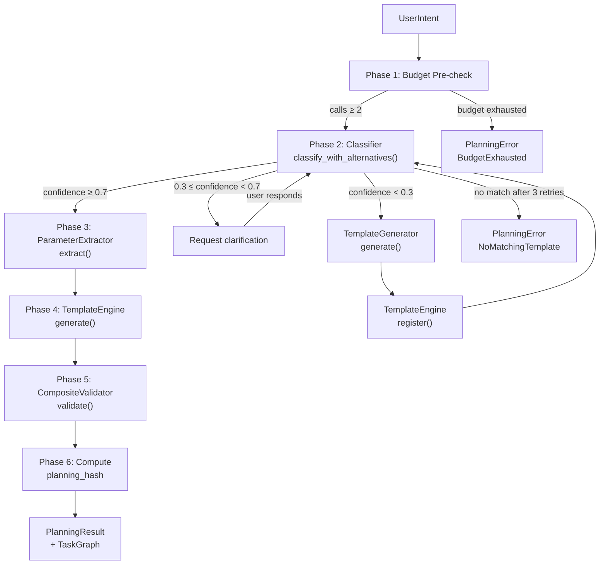

# Planning Pipeline Architecture

<!--
Canonical Reference: .pi/architecture/modules/planning-pipeline.md
Blueprint Source: Domain Exploration Session 63c25384
-->

## Overview

Orchestrates the LLM-based planning flow from user intent to validated plan. Phases: budget check → intent classification → parameter extraction → template generation fallback → TaskGraph generation → plan validation.

## Responsibilities

- Classify user intent against available templates via LLM
- Extract structured parameters from intent for matched template
- Route low-confidence intents to TemplateGenerator (fallback)
- Generate TaskGraph from template + parameters
- Validate plan via CompositeValidator before execution
- Compute deterministic planning_hash for replay auditing
- Track LLM call and token usage

## Components

| Component | File Path | Purpose | Canonical Section |
|-----------|-----------|---------|-------------------|
| PlanningPipelineService (trait) | `application/service.rs` | Orchestrator service interface | #pipeline |
| PlanningPipelineImpl | `application/pipeline_impl.rs` | Concrete 6-phase orchestrator | #pipeline |
| PlanningPipelineFactory (trait) | `application/factory.rs` | Pipeline construction interface | #factory |
| PlanningPipelineFactoryImpl | `application/pipeline_factory_impl.rs` | Pipeline construction implementation | #factory |
| CompositeValidator (trait) | `application/factory.rs` | Optional plan validation | #validator |
| Classifier (trait) | `domain/classification.rs` | LLM-based intent classification | #classifier |
| ClaudeClassifier | `infrastructure/claude_classifier.rs` | Anthropic Messages API implementation | #claude |
| OpenaiClassifier | `infrastructure/openai_classifier.rs` | OpenAI-compatible API implementation | #openai |
| MockClassifier | `infrastructure/mock_classifier.rs` | Test double for offline/CI mode | #mock |
| ParameterExtractor (trait) | `domain/extractor.rs` | LLM-based parameter extraction | #extractor |
| MockParameterExtractor | `infrastructure/mock_extractor.rs` | Test double for parameter extraction | #extractor |
| TemplateGenerator (trait) | `../template_generation/domain/generator.rs` | Fallback template generation | #generator |
| PlanningResult | `domain/result.rs` | Deterministic contract from planning phase | #result |
| PlanOutput | `domain/result.rs` | Extended result with TaskGraph | #result |
| PlanningHash | `domain/result.rs` | SHA-256 deterministic replay identifier | #result |
| UserIntent | `domain/intent.rs` | Raw intent with clarification history | #intent |
| PlanningError | `domain/error.rs` | Typed error enum (11 variants) | #errors |
| PlanningEvent | `domain/event/mod.rs` | Event payload schemas (12 types) | #events |
| PlanningResultRepository (trait) | `infrastructure/repository/mod.rs` | Planning result persistence | #repository |

---

## Component Details

### PlanningPipeline

**Purpose:** Orchestrate the 6-phase planning flow

**Implementation File:** `engine/src/planning/application/pipeline_impl.rs`

**Dependencies:**
- Classifier trait
- ParameterExtractor trait
- TemplateGenerator (optional)
- TemplateEngine
- CompositeValidator (optional)
- LlmBudget

**Interface:**

```rust
#[async_trait]
pub trait PlanningPipelineService: Send + Sync {
    async fn plan(&self, input: PlanInput) -> Result<PlanOutput, PlanningError>;
    async fn plan_with_graph(&self, input: PlanWithGraphInput) -> Result<PlanWithGraphOutput, PlanningError>;
    async fn check_budget(&self, input: CheckBudgetInput) -> Result<CheckBudgetOutput, PlanningError>;
    async fn classify_intent(&self, intent: UserIntent) -> Result<ClassificationResult, PlanningError>;
    async fn extract_parameters(&self, input: ExtractParametersInput) -> Result<ExtractParametersOutput, PlanningError>;
    async fn generate_graph(&self, input: GenerateGraphInput) -> Result<GenerateGraphOutput, PlanningError>;
    async fn validate_plan(&self, input: ValidatePlanInput) -> Result<ValidatePlanOutput, PlanningError>;
    async fn request_clarification(&self, input: RequestClarificationInput) -> Result<RequestClarificationOutput, PlanningError>;
    async fn available_templates(&self) -> Result<AvailableTemplatesOutput, PlanningError>;
    fn execution_id(&self) -> Uuid;
}
```

### Classifier Trait

**Purpose:** Abstract LLM-based intent classification

**Implementation File:** `engine/src/planning/domain/classification.rs`

**Interface:**

```rust
#[async_trait]
pub trait Classifier: Send + Sync {
    async fn classify_with_alternatives(
        &self, intent: &UserIntent, budget: &LlmBudget, available_templates: &[String]
    ) -> Result<ClassificationResult, PlanningError>;

    async fn classify(
        &self, intent: &UserIntent, budget: &LlmBudget, available_templates: &[String]
    ) -> Result<ClassifiedTemplate, PlanningError>;
}
```

### ClaudeClassifier

**Implementation File:** `engine/src/planning/infrastructure/claude_classifier.rs`

- Uses Anthropic Messages API via `reqwest`
- Default model: `claude-sonnet-4-20250514`
- Configurable endpoint, timeout (default 30s), temperature (default 0.1)
- Structured system prompt listing all available templates
- JSON response parsing (handles markdown code fences)
- Confidence values clamped to [0.0, 1.0]

### OpenaiClassifier

**Implementation File:** `engine/src/planning/infrastructure/openai_classifier.rs`

- Uses OpenAI Chat Completions API via `reqwest`
- Default model: `gpt-4o`
- Bearer token authentication
- Token usage tracking from API response `usage` field
- Same response format as ClaudeClassifier

---

## Data Flow



**Flow Description:**
1. Phase 1: Budget pre-check ensures at least 2 LLM calls remain
2. Phase 2: Classifier matches intent to template; confidence thresholds:
   - ≥ 0.7 → Auto-select, proceed to extraction
   - 0.3 – 0.7 → Request clarification from user
   - < 0.3 → Trigger generator fallback (up to 3 retries)
3. Phase 3-5: Parameter extraction, graph generation, and validation
4. Phase 6: Deterministic planning_hash computed for audit replay (SHA-256)

---

## Dependencies

### Depends On
- **Template System**: TemplateEngine for graph generation
- **Template Generation**: Optional generator fallback
- **DAG Engine**: TaskGraph for plan output
- **Budget Tracking**: LlmBudget for cost control
- **Repo Engine**: Symbol context for planning

### Used By
- **Execution Engine**: Consumes PlanningResult for execution

---

## Security Considerations

| Concern | Mitigation | Validator |
|---------|------------|-----------|
| LLM prompt injection | Structured prompts with strict output constraints; no raw intent in system prompts | security-validator |
| Budget exhaustion | Phase 1 pre-check; generator retry limit (3 max) | operations-validator |
| API key leakage | Keys provided at construction, not hardcoded | security-validator |
| Infinite loop | MAX_GENERATOR_ATTEMPTS = 3 prevents unbounded retries | operations-validator |

---

## CI Enforcement

| Stage | Script | Purpose |
|-------|--------|---------|
| 23 | `stage_planning-pipeline_proofing.sh` | Contract + coverage verification |
| — | `check_planning-pipeline_contracts.sh` | Validates all 30+ contract points |
| — | `check_planning-pipeline_coverage.sh` | Enforces ≥ 80% coverage |

## Testing Requirements

| Test Type | Count | Coverage Target | Files |
|-----------|-------|-----------------|-------|
| Unit | 57 | ≥ 90% | `engine/src/planning/tests.rs` |
| Integration | — | TBD | `engine/tests/e2e_full_pipeline.rs` |

**Key Test Scenarios:**
- Happy path: classify → extract → validate → PlanningResult
- Low confidence without generator → ClassificationError
- Low confidence with generator → generates and re-runs
- Budget exhaustion → PlanningError::BudgetExhausted
- Missing parameter → MissingParameter error with description
- Claude response parsing (JSON, markdown fences, empty, invalid)
- OpenAI response parsing (JSON, markdown fences, token tracking)

---

Last updated: 2026-06-15
*Module version: 1.0.0*

---

**Status:** Implemented  
**Last verified:** 2026-06-15  
**Module version:** 1.0.0
