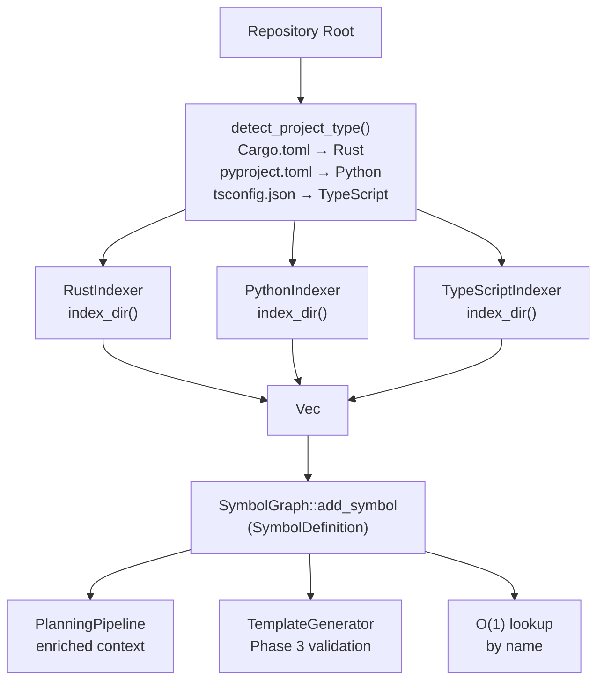

# Repo Engine Architecture

<!--
Canonical Reference: .pi/architecture/modules/repo-engine.md
Implementation: Complete (Epic: #137)
-->

> **Status:** ✅ Implemented — all contracts frozen, services implemented, 46 tests passing.
> See `docs/runbook-repo-engine.md` for operations, `docs/dr-plan-repo-engine.md` for DR.

## Overview

Multi-language code indexing and symbol graph management. Indexes Rust (tree-sitter-rust), Python (tree-sitter-python), and TypeScript (tree-sitter-typescript) source files. Maintains an in-memory symbol graph with O(1) definition lookups and reference traversal.

## Responsibilities

- Index source code into typed symbol definitions (functions, structs, enums, traits, etc.)
- Support Rust, Python, and TypeScript via tree-sitter parsers
- Maintain shared SymbolGraph with thread-safe access (Arc<RwLock<>>)
- Provide O(1) lookups by symbol name
- Expose definition text, file location, and documentation for planning context
- Support multi-language symbols coexisting in one graph

## Components

| Component | File Path | Purpose | Canonical Section |
|-----------|-----------|---------|-------------------|
| SymbolGraph | `engine/src/repo_engine/domain/symbol_graph.rs` | In-memory symbol graph with O(1) lookups | #graph |
| SymbolDefinition | `engine/src/repo_engine/domain/symbol_graph.rs` | Symbol with name, kind, location, signature | #definition |
| SharedSymbolGraph | `engine/src/repo_engine/domain/symbol_graph.rs` | Arc<RwLock<SymbolGraph>> wrapper | #shared |
| SymbolWorkspaceIntent | `engine/src/repo_engine/domain/symbol_workspace.rs` | Task graph interaction intent (4 variants) | #workspace-intent |
| RepoEngineError | `engine/src/repo_engine/domain/error.rs` | 11 structured error variants | #errors |
| RepoEngineEvent | `engine/src/repo_engine/domain/event/mod.rs` | 11 event payload schemas | #events |
| SymbolGraphServiceImpl | `engine/src/repo_engine/application/symbol_graph_service_impl.rs` | RwLock-backed graph service (46 tests) | #graph-impl |
| WorkspaceValidationServiceImpl | `engine/src/repo_engine/application/workspace_validation_service_impl.rs` | Phase 3 pre-execution validation | #validation |
| RustIndexer | `rigorix/src/repo_engine/indexer.rs` | Index Rust files via tree-sitter-rust | #rust |
| PythonIndexer | `rigorix/src/repo_engine/python_indexer.rs` | Index Python files via tree-sitter-python | #python |
| TypeScriptIndexer | `rigorix/src/repo_engine/typescript_indexer.rs` | Index TypeScript files via tree-sitter-typescript | #typescript |

---

## Component Details

### SymbolGraph

**Purpose:** Thread-safe in-memory graph of code symbols with O(1) lookup

**Implementation File:** `rigorix/src/repo_engine/symbol_graph.rs`

```rust
pub struct SymbolGraph { /* definitions: HashMap<String, SymbolDefinition>, adjacency */ }

impl SymbolGraph {
    pub fn new() -> Self;
    pub fn add_symbol(&mut self, def: SymbolDefinition);
    pub fn lookup(&self, name: &str) -> Option<&SymbolDefinition>;
    pub fn lookup_by_file(&self, file: &Path) -> Vec<&SymbolDefinition>;
    pub fn search(&self, pattern: &str) -> Vec<&SymbolDefinition>;
    pub fn into_shared(self) -> SharedSymbolGraph; // Arc<RwLock<Self>>
}
```

### SymbolDefinition

```rust
pub struct SymbolDefinition {
    pub id: Uuid,
    pub name: String,
    pub kind: SymbolKind,       // Function, Struct, Enum, Trait, Constant, Type, Module, Impl
    pub location: Location,     // { file: PathBuf, line: usize, column: usize }
    pub signature: String,      // Full signature text
    pub documentation: Option<String>,
    pub source_files: HashSet<PathBuf>,
    pub definition_text: String, // Full source text of the definition
}
```

### SymbolWorkspaceIntent

Each TaskNode carries a `SymbolWorkspaceIntent` that describes how it interacts with the symbol graph. Used for pre-execution validation (Phase 3).

```rust
pub enum SymbolWorkspaceIntent {
    ReadOnly,       // Only reads symbols (file_read, lsp_query)
    ReadWrite,      // Reads and may add new symbols (file_write new file)
    Modification,   // Modifies existing symbols (file_patch, file_write overwrite)
    Deletion,       // Removes symbols (file_write empty, git_commit delete)
}
```

---

## Data Flow



**Flow Description:**
1. Project type is detected from manifest files (Cargo.toml, pyproject.toml, tsconfig.json)
2. Language-specific indexers parse source files using tree-sitter grammars
3. Raw Symbol vectors are converted to SymbolDefinition and added to SymbolGraph
4. SymbolGraph provides O(1) lookups for planning context and template validation
```

---

## Dependencies

### Depends On
- tree-sitter (core parser framework)
- tree-sitter-rust, tree-sitter-python, tree-sitter-typescript (language grammars)

### Used By
- **Planning Pipeline**: Enriched symbol context for classification
- **Template Generation**: Phase 3 symbol validation
- **Orchestrator**: Indexes repo at execution start

---

## Security Considerations

| Concern | Mitigation | Validator |
|---------|------------|-----------|
| Large repos causing OOM | Indexing is bounded by file count; files beyond limit skipped | operations-validator |
| Binary files parsed as code | Indexer only processes `.rs`, `.py`, `.ts`, `.tsx` extensions | security-validator |

---

## Testing Requirements

| Test Type | Coverage Target | Files |
|-----------|-----------------|-------|
| Unit | 90% | `rigorix/src/repo_engine/symbol_graph.rs` |
| Benchmark | — | `rigorix/benches/symbol_graph_bench.rs` |

**Key Test Scenarios:**
- Add symbol → lookup by name returns definition
- Multi-language index → symbols from Rust+Python coexist
- O(1) lookup performance benchmark

---

## Performance Considerations

| Metric | Target | Monitoring |
|--------|--------|------------|
| Symbol lookup | O(1) | Benchmark: `symbol_graph_bench.rs` |
| Rust file indexing | < 50ms per file | Tracing spans |

---

*Last updated: 2026-06-14*
*Module version: 2.0.0 — Implementation Complete*
*Tests: 46 unit tests across all layers*
*CI: Stage 22 (repo-engine_proofing) in hardening pipeline with 28 contract checks*
