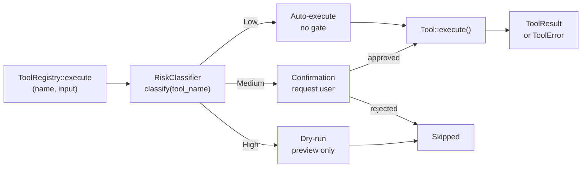

# Risk Gating Architecture

<!--
Canonical Reference: .pi/architecture/modules/risk-gating.md
Blueprint Source: Domain Exploration Session 63c25384
-->

## Overview

Classifies tools/tasks by risk level (Low, Medium, High) and enforces gating policies. Every tool invocation passes through the risk gate before execution.

## Responsibilities

- Classify tool by name and parameters into RiskLevel
- Enforce gating policies: Low=auto-execute, Medium=user confirm, High=dry-run
- Provide configurable RiskConfig for policy overrides
- Support per-tool risk overrides via configuration
- Emit events for risk gate activations

## Components

| Component | File Path | Purpose | Canonical Section |
|-----------|-----------|---------|-------------------|
| RiskClassifier | — | Maps tool name → RiskLevel | #classifier |
| RiskLevel | `rigorix/src/core.rs` | Enum: Low, Medium, High | #level |
| RiskConfig | `rigorix/src/config.rs` | Configurable risk policies | #config |

---

## Component Details

### RiskClassifier

**Purpose:** Determines risk level of a tool based on its name and parameters

**Classification Rules:**
| Tool Pattern | Risk Level | Rationale |
|-------------|------------|-----------|
| `file_read`, `lsp_query`, `git_read` | Low | Read-only, no side effects |
| `file_write`, `file_append`, `file_patch`, `git_stage` | Medium | Modifies local state, requires confirmation |
| `run_command`, `git_commit` | High | External execution, irreversible changes |

### RiskLevel

**Definition:** `rigorix/src/core.rs`

```rust
#[derive(Debug, Clone, Copy, PartialEq, Eq, Serialize, Deserialize)]
#[serde(rename_all = "lowercase")]
pub enum RiskLevel {
    Low,    // auto-executed (FileRead, LSPQuery)
    Medium, // requires confirmation (FileWrite, GitDiff)
    High,   // dry-run by default (ShellExec, GitCommit)
}
```

### RiskConfig

**Definition:** `rigorix/src/config.rs`

```toml
[tools.risk]
# Override default risk levels for specific tools
tool_overrides = { "run_command" = "high" }
# Gate behavior
auto_confirm_low = true
require_review_medium = true
dry_run_high = true
```

---

## Data Flow



**Flow Description:**
1. RiskClassifier maps tool name to RiskLevel (Low/Medium/High)
2. RiskConfig provides configurable overrides per tool
3. Low: auto-execute without user interaction
4. Medium: emit confirmation request, wait for user approval
5. High: dry-run by default (preview, no side effects)
```

---

## Dependencies

### Depends On
- **Configuration**: RiskConfig from Config

### Used By
- **Execution Engine**: ParallelExecutor checks risk before each tool call
- **Tool System**: execute_with_risk_gate helper
- **Event System**: Emits ToolExecuted event with risk_level

---

## Security Considerations

| Concern | Mitigation | Validator |
|---------|------------|-----------|
| Unintended file modification | Medium risk requires confirmation | security-validator |
| Dangerous command execution | High risk defaults to dry-run | security-validator |
| Risk classification bypass | Risk is computed from tool name, not tool output | security-validator |

---

## Testing Requirements

| Test Type | Coverage Target | Files |
|-----------|-----------------|-------|
| Unit | 100% | Core tests in `rigorix/src/core.rs` |

**Key Test Scenarios:**
- RiskClassifier: file_read → Low, file_write → Medium, run_command → High
- RiskLevel serialization round-trip
- RiskConfig overrides take effect

---

*Last updated: 2026-06-13*
*Module version: 1.0.0*
