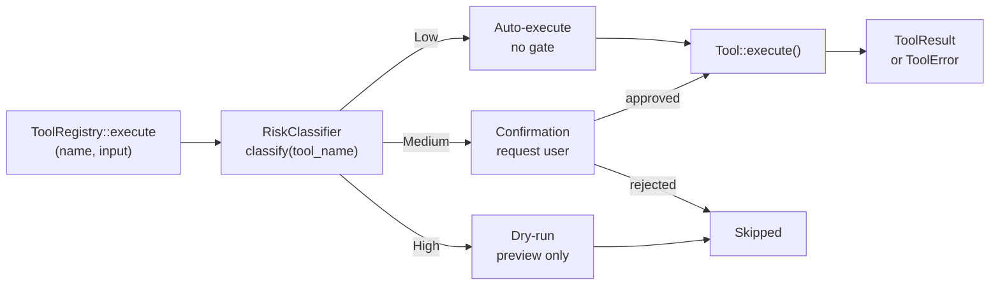

# Risk Gating Architecture

<!--
Canonical Reference: .pi/architecture/modules/risk-gating.md
Blueprint Source: Domain Exploration Session 63c25384
-->

## Overview

Classifies tools/tasks by risk level (Low, Medium, High) and enforces gating policies. Every tool invocation passes through the risk gate before execution.

## Responsibilities

- Classify tool by name and parameters into RiskLevel
- Enforce gating policies: Low=auto-execute, Medium=user confirm, High=dry-run
- Provide configurable RiskConfig for policy overrides
- Support per-tool risk overrides via configuration
- Emit events for risk gate activations

## Components

| Component | File Path | Purpose | Canonical Section |
|-----------|-----------|---------|-------------------|
| RiskClassifier | `src/risk_gating/domain/risk_classifier.rs` | Trait: maps tool name → RiskLevel | #classifier |
| DefaultClassifier | `src/risk_gating/domain/default_classifier.rs` | Concrete impl with 20+ built-in rules | #classifier |
| RiskLevel | `src/risk_gating/domain/risk_level.rs` | Enum: Low, Medium, High | #level |
| RiskConfig | `src/risk_gating/domain/risk_config.rs` | Configurable risk policies and overrides | #config |
| RiskGateService | `src/risk_gating/application/service.rs` | Service trait: evaluate, classify, resolve, override | #service |
| RiskGateServiceImpl | `src/risk_gating/application/gate_service_impl.rs` | Full service implementation | #service |
| RiskGateFactory | `src/risk_gating/application/factory.rs` | Factory trait for service construction | #factory |
| RiskGateFactoryImpl | `src/risk_gating/application/gate_factory_impl.rs` | Concrete factory implementation | #factory |
| GateStateRegistry | `src/risk_gating/domain/gate_state.rs` | Thread-safe pending gate tracking | #state |
| RiskConfigRepository | `src/risk_gating/infrastructure/repository/mod.rs` | Repository trait for config persistence | #repository |
| InMemoryConfigRepository | `src/risk_gating/infrastructure/default_config_repository.rs` | In-memory config store per execution | #repository |
| RiskGatingError | `src/risk_gating/domain/error.rs` | Typed error enum (5 variants) | #errors |
| RiskGateEvent | `src/risk_gating/domain/event/mod.rs` | Event payload schemas (5 event types) | #events |

---

## Component Details

### RiskClassifier

**Purpose:** Determines risk level of a tool based on its name and parameters

**Implementation:** `DefaultClassifier` in `src/risk_gating/domain/default_classifier.rs`

**Full Classification Rules:**
| Tool Pattern | Risk Level | Rationale |
|-------------|------------|-----------|
| `file_read`, `read`, `lsp_query`, `git_read`, `git_diff`, `git_log`, `git_status`, `glob`, `grep`, `list_files`, `search_files` | Low | Read-only, no side effects |
| `file_write`, `write`, `file_append`, `file_patch`, `edit`, `git_stage`, `git_add`, `create_file` | Medium | Modifies local state, requires confirmation |
| `run_command`, `bash`, `git_commit`, `git_push`, `git_reset`, `delete_file`, `remove` | High | External execution, irreversible changes |
| Unknown tools | Medium (safe default) | Default to requiring confirmation |

**Override Precedence:**
1. Configured overrides in `RiskConfig.tool_overrides` (highest priority)
2. Built-in default rules (pattern-matched, case-insensitive)
3. Safe default: Medium for unknown tools

### RiskLevel

**Definition:** `src/risk_gating/domain/risk_level.rs`

```rust
#[derive(Debug, Clone, Copy, PartialEq, Eq, Hash, PartialOrd, Ord, Serialize, Deserialize)]
#[serde(rename_all = "lowercase")]
pub enum RiskLevel {
    Low,    // auto-executed (FileRead, LSPQuery)
    Medium, // requires confirmation (FileWrite, GitDiff)
    High,   // dry-run by default (ShellExec, GitCommit)
}
```

### GatingAction

```rust
#[derive(Debug, Clone, Copy, PartialEq, Eq, Serialize, Deserialize)]
#[serde(rename_all = "snake_case")]
pub enum GatingAction {
    AutoExecute,
    RequireConfirmation,
    DryRun,
}
```

### RiskConfig

**Definition:** `src/risk_gating/domain/risk_config.rs`

```rust
pub struct RiskConfig {
    pub tool_overrides: HashMap<String, RiskLevel>,
    pub auto_confirm_low: bool,      // default: true
    pub require_review_medium: bool,  // default: true
    pub dry_run_high: bool,          // default: true
}
```

**Builder Methods:**
- `RiskConfig::default()` — all gates enabled, no overrides
- `RiskConfig::strict()` — all gates enabled (explicit)
- `RiskConfig::permissive()` — all gates disabled
- `RiskConfig::custom(overrides, auto, review, dry_run)` — full control

**Example TOML:**
```toml
[risk_gating]
tool_overrides = { "run_command" = "high", "git_push" = "high" }
auto_confirm_low = true
require_review_medium = true
dry_run_high = true
```

---

## Architecture

```text
risk_gating/
├── domain/
│   ├── risk_level.rs              # RiskLevel enum + GatingAction
│   ├── risk_classifier.rs         # RiskClassifier trait + ClassificationResult
│   ├── default_classifier.rs      # DefaultClassifier impl (20+ rules)
│   ├── risk_config.rs             # RiskConfig struct + builders
│   ├── gate_state.rs              # GateStateRegistry
│   ├── error.rs                   # RiskGatingError (5 variants)
│   └── event/mod.rs               # RiskGateEvent (5 event types)
├── application/
│   ├── service.rs                 # RiskGateService trait (7 methods)
│   ├── gate_service_impl.rs       # RiskGateServiceImpl
│   ├── factory.rs                 # RiskGateFactory trait (4 methods)
│   ├── gate_factory_impl.rs       # RiskGateFactoryImpl
│   └── dto/mod.rs                 # Input/output DTOs (12+ types)
├── infrastructure/
│   ├── repository/mod.rs          # RiskConfigRepository trait
│   └── default_config_repository.rs # InMemoryConfigRepository
└── interfaces/
    └── http/mod.rs                # REST API contracts (7 endpoints)
```

## Data Flow



**Detailed Flow:**
1. Tool call arrives at `RiskGateService::evaluate_gate()`
2. `DefaultClassifier::classify()` maps tool name → RiskLevel (checking overrides first)
3. Gating policy evaluated: `auto_confirm_low`, `require_review_medium`, `dry_run_high`
4. For Medium/High, a gate is registered in `GateStateRegistry` with a unique gate_id
5. User resolves gate via `RiskGateService::resolve_gate()`
6. If approved, tool executes; if rejected, tool is skipped

---

## API Endpoints

| Method | Path | Purpose |
|--------|------|---------|
| POST | `/api/v1/risk-gating/evaluate` | Evaluate risk gate for a tool call |
| POST | `/api/v1/risk-gating/classify` | Classify tool without gate evaluation |
| POST | `/api/v1/risk-gating/resolve` | Resolve a pending gate |
| GET | `/api/v1/risk-gating/{id}/status` | Get gate status for an execution |
| POST | `/api/v1/risk-gating/override` | Override risk level for a tool |
| POST | `/api/v1/risk-gating/config/reload` | Reload risk configuration |

Error responses follow a unified `ApiErrorResponse` format with standardized codes:
`UNKNOWN_TOOL`, `GATE_NOT_FOUND`, `GATE_ALREADY_RESOLVED`, `INVALID_OVERRIDE`, `INVALID_GATE_STATE`.

---

## Dependencies

### Depends On
- **Configuration**: RiskConfig from Config
- **serde**: DTO/config serialization
- **async-trait**: Trait object safety for RiskGateService
- **chrono**: Gate timestamps (ISO 8601 UTC)
- **tokio**: Async runtime

### Used By
- **Execution Engine**: ParallelExecutor checks risk before each tool call
- **Tool System**: execute_with_risk_gate helper
- **Event System**: Emits RiskGateEvent with classification details

---

## Security Considerations

| Concern | Mitigation | Validator |
|---------|------------|-----------|
| Unintended file modification | Medium risk requires confirmation | security-validator |
| Dangerous command execution | High risk defaults to dry-run | security-validator |
| Risk classification bypass | Risk is computed from tool name, not tool output | security-validator |
| Override misuse | Overrides are logged and auditable via events | security-validator |

---

## Testing Requirements

| Test Type | Coverage Target | Files |
|-----------|-----------------|-------|
| Unit | ≥ 90% | `src/risk_gating/**/*.rs` |
| Contract | 21 checks | `.pi/scripts/ci/check_risk-gating_contracts.sh` |

**Test Coverage (89 unit tests total):**
- DefaultClassifier: 15 tests (all rules, overrides, determinism, prefix matching)
- RiskLevel: 21 tests (variants, gating mapping, serialization, ordering, debug)
- RiskConfig: 26 tests (constructors, overrides, merge, serialization, edge cases)
- GateStateRegistry: 5 tests (register, resolve, cleanup, cross-execution)
- RiskGateServiceImpl: 13 tests (evaluate, classify, resolve, override, config)
- RiskGateFactoryImpl: 4 tests (create variants)
- InMemoryConfigRepository: 7 tests (CRUD, isolation)

**CI Validators:**
- `.pi/scripts/ci/check_risk-gating_contracts.sh` — 21 contract checks
- `.pi/scripts/ci/check_risk-gating_coverage.sh` — 80% coverage threshold
- Stage 19 in `run_hardening_stages.sh`

---

*Last updated: 2026-06-14*
*Module version: 2.0.0*
