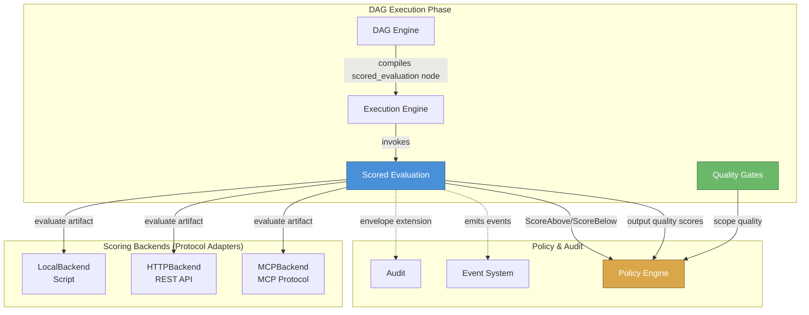
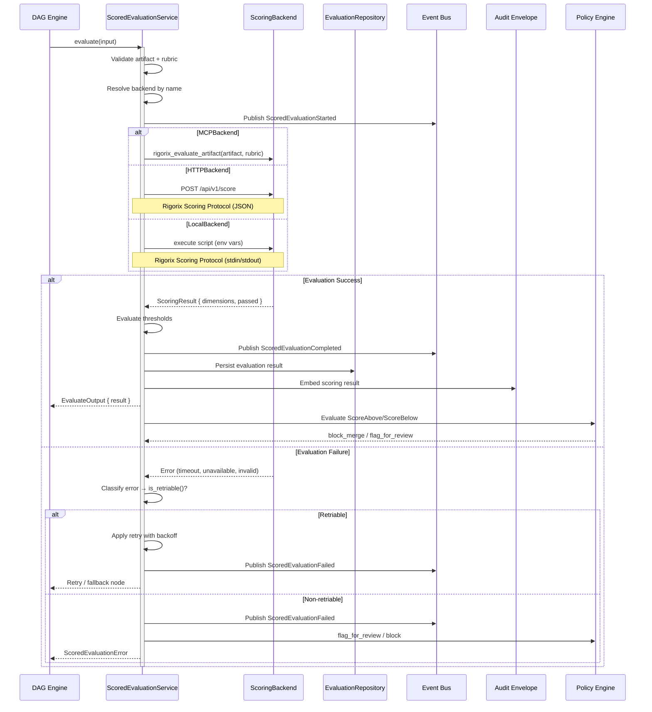
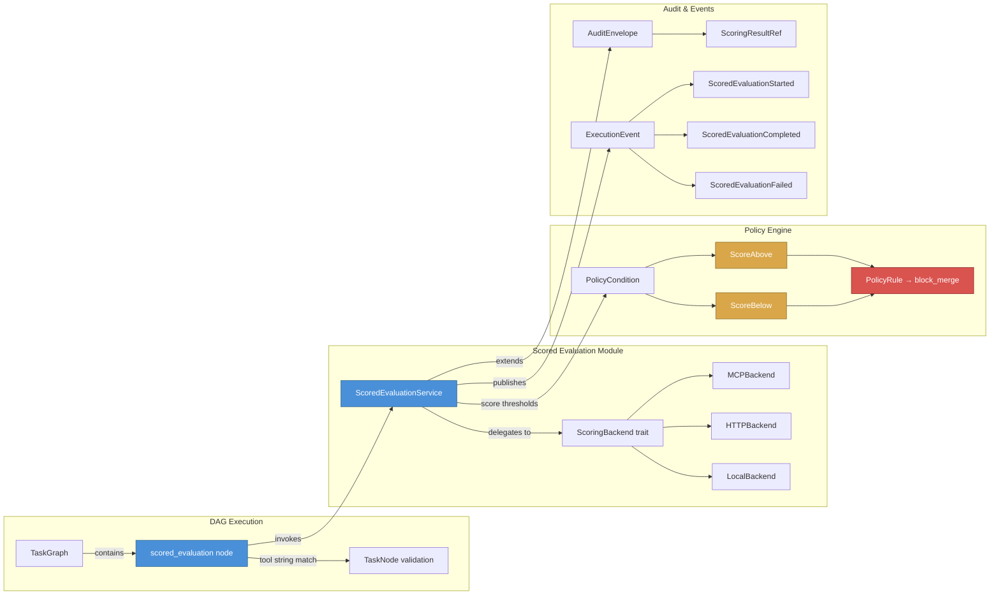

# Scored Evaluation Architecture

<!--
Canonical Reference: .pi/architecture/modules/scored-evaluation.md
Rationale: Multidimensional quality scoring of AI-generated artifacts via pluggable backends — orthogonal to test-scope quality gates
-->

## Overview

The Scored Evaluation system adds a scored quality evaluation primitive to the Rigorix DAG. A `scored_evaluation` node sends generated artifacts to a pluggable scoring backend and receives multidimensional scores back. Policy rules can gate merge on score thresholds.

This complements the Quality Gates system (GreenContract), which evaluates test scope (TargetedTests → MergeReady), by adding output quality scoring as an orthogonal dimension.

## System Context

The following diagram shows where Scored Evaluation fits within the Rigorix architecture — as an execution-phase DAG node type that feeds quality scores into the Policy Engine and audit trail.



## DDD Layers

This module follows Clean Architecture with 3 DDD layers. There is no `interfaces/` layer — the module exposes its API through the application service trait, matching the same pattern as `quality_gates`.

| Layer | Purpose | Tech |
|-------|---------|------|
| `domain/` | Pure business logic, types, errors, traits | Zero framework imports, `thiserror` |
| `application/` | Service orchestration, DTOs, use cases | Traits + async |
| `infrastructure/` | Backend adapters (MCP, HTTP, Local), repository | Reqwest, script execution |

**Dependency rule:** `domain → application → infrastructure` (inward)

## Components by Layer

### Domain Layer (`domain/`)
| Component | Description | Framework? |
|-----------|-------------|------------|
| ScoredEvaluationNode | DAG node value object with artifact + rubric + thresholds | ❌ No |
| Rubric | Evaluation rubric (inline or reference) | ❌ No |
| ScoringResult | Multidimensional score result with passed flag | ❌ No |
| ScoreDimension | Single dimension: score, max, label, passed | ❌ No |
| ScoringBackend | Trait for pluggable evaluation backends | ❌ No |
| ScoredEvaluationEvent | Domain events for scoring lifecycle | ❌ No |
| ScoredEvaluationError | Typed error enum (thiserror) | ❌ No |

### Application Layer (`application/`)
| Component | Description | Type |
|-----------|-------------|------|
| ScoredEvaluationService | Service trait for evaluation orchestration | Service |
| EvaluateInput | Input DTO: artifact + rubric + context | DTO |
| EvaluateOutput | Output DTO: ScoringResult + metadata | DTO |

### Infrastructure Layer (`infrastructure/`)
| Component | Description | Connects to |
|-----------|-------------|-------------|
| MCPBackend | MCP protocol adapter — sends evaluation requests per Rigorix scoring protocol | MCP SDK |
| HTTPBackend | HTTP-based scoring backend | External HTTP API |
| LocalBackend | Local script/file-based backend | Local filesystem |
| EvaluationRepository | Persist evaluation results | Local filesystem / DB |

## Component Details

### ScoredEvaluationNode

**Purpose:** DAG node value object holding artifact, rubric, backend config, and thresholds

**DDL Layer:** `domain/`

**Implementation File:** `engine/src/scored_evaluation/domain/node.rs`

**Canonical Reference:** `.pi/architecture/modules/scored-evaluation.md#component-details`

```rust
#[derive(Debug, Clone, Serialize, Deserialize)]
pub struct ScoredEvaluationNode {
    pub node_id: Uuid,
    pub artifact: serde_json::Value,
    pub rubric: Rubric,
    pub backend: String,
    pub thresholds: HashMap<String, f64>,
    pub policy: ExecutionPolicy,
}
```

**States:**
- **Loading:** Node is being deserialized from DAG template
- **Populated:** All fields set, ready for evaluation
- **Error:** Invalid artifact or rubric detected at construction time

**Dependencies:**
- Rubric value object
- ExecutionPolicy (shared across all DAG node types)

---

### Rubric

**Purpose:** Evaluation rubric — either inline JSON content or a reference to an external file/URL

**DDL Layer:** `domain/`

**Implementation File:** `engine/src/scored_evaluation/domain/rubric.rs`

**Canonical Reference:** `.pi/architecture/modules/scored-evaluation.md#component-details`

```rust
#[derive(Debug, Clone, Serialize, Deserialize)]
pub struct Rubric {
    pub source: RubricSource,
    pub scenario_id: Option<String>,
}

#[derive(Debug, Clone, Serialize, Deserialize)]
#[serde(tag = "type", rename_all = "snake_case")]
pub enum RubricSource {
    Inline { content: serde_json::Value },
    Reference { path_or_url: String },
}
```

**States:**
- **Populated:** Valid inline content or path/URL
- **Error:** Invalid JSON content or unresolvable reference

**Dependencies:** None

---

### ScoringResult

**Purpose:** Multidimensional scoring result returned by a scoring backend

**DDL Layer:** `domain/`

**Implementation File:** `engine/src/scored_evaluation/domain/result.rs`

**Canonical Reference:** `.pi/architecture/modules/scored-evaluation.md#component-details`

```rust
#[derive(Debug, Clone, Serialize, Deserialize)]
pub struct ScoringResult {
    pub passed: bool,
    pub dimensions: HashMap<String, ScoreDimension>,
    pub summary: String,
    pub backend: String,
    pub duration_ms: u64,
    pub raw: Option<serde_json::Value>,
}

#[derive(Debug, Clone, Serialize, Deserialize)]
pub struct ScoreDimension {
    pub score: f64,
    pub max: f64,
    pub label: String,
    pub passed: bool,
}
```

**States:**
- **Populated:** Result with one or more dimensions
- **Empty:** No dimensions but a summary

**Dependencies:** ScoreDimension

---

### ScoringBackend (Trait)

**Purpose:** Pluggable scoring backend interface — domain-level contract for any evaluation backend

**DDL Layer:** `domain/`

**Implementation File:** `engine/src/scored_evaluation/domain/backend.rs`

**Canonical Reference:** `.pi/architecture/modules/scored-evaluation.md#component-details`

```rust
#[async_trait]
pub trait ScoringBackend: Send + Sync {
    async fn evaluate(&self, artifact: &serde_json::Value, rubric: &Rubric) -> Result<ScoringResult, ScoredEvaluationError>;
    fn backend_name(&self) -> &'static str;
    async fn health_check(&self) -> Result<bool, ScoredEvaluationError>;
}
```

**Dependencies:** ScoringResult, Rubric, ScoredEvaluationError

---

### ScoredEvaluationEvent

**Purpose:** Domain events for the evaluation lifecycle — started, completed, failed

**DDL Layer:** `domain/`

**Implementation File:** `engine/src/scored_evaluation/domain/event.rs`

**Canonical Reference:** `.pi/architecture/modules/scored-evaluation.md#component-details`

Uses `node_id: String` to match the existing `ExecutionEvent` pattern (see `engine/src/event_system/domain/event.rs` where all node-related variants use `node_id: String` rather than `uuid::Uuid`).

```rust
#[derive(Debug, Clone, Serialize, Deserialize)]
#[serde(tag = "type", rename_all = "snake_case")]
pub enum ScoredEvaluationEvent {
    ScoredEvaluationStarted {
        node_id: String,
        execution_id: Uuid,
        backend: String,
        timestamp: DateTime<Utc>,
    },
    ScoredEvaluationCompleted {
        node_id: String,
        execution_id: Uuid,
        result: ScoringResult,
        timestamp: DateTime<Utc>,
    },
    ScoredEvaluationFailed {
        node_id: String,
        execution_id: Uuid,
        error: String,
        timestamp: DateTime<Utc>,
    },
}
```

**Dependencies:** ScoringResult

---

### ScoredEvaluationError

**Purpose:** Typed error enum for all scored evaluation failure modes

**DDL Layer:** `domain/`

**Implementation File:** `engine/src/scored_evaluation/domain/error.rs`

**Canonical Reference:** `.pi/architecture/modules/scored-evaluation.md#component-details`

Follows the same pattern as `QualityGateError` (`engine/src/quality_gates/domain/error.rs`): `use thiserror::Error;` import + `#[derive(Debug, Error)]` derive, with an `is_retriable()` method for execution policy integration.

```rust
use thiserror::Error;

#[derive(Debug, Error)]
pub enum ScoredEvaluationError {
    #[error("Backend not found: {0}")]
    BackendNotFound(String),
    #[error("Backend error: {0}")]
    BackendError(String),
    #[error("Invalid rubric: {0}")]
    InvalidRubric(String),
    #[error("Invalid artifact: {0}")]
    InvalidArtifact(String),
    #[error("Backend health check failed: {0}")]
    BackendUnavailable(String),
    #[error("Timeout: backend did not respond within {0}ms")]
    Timeout(u64),
    #[error("Internal error: {0}")]
    Internal(String),
}

impl ScoredEvaluationError {
    /// Returns `true` if this error represents a transient condition
    /// that might succeed on retry.
    pub fn is_retriable(&self) -> bool {
        matches!(
            self,
            ScoredEvaluationError::BackendError(_)
                | ScoredEvaluationError::BackendUnavailable(_)
                | ScoredEvaluationError::Timeout(_)
        )
    }
}
```

**Dependencies:** None

---

### ScoredEvaluationService

**Purpose:** Service trait orchestrating the evaluation lifecycle — validate input, delegate to backend, capture result, emit events

**DDL Layer:** `application/`

**Implementation File:** `engine/src/scored_evaluation/application/service.rs`

**Canonical Reference:** `.pi/architecture/modules/scored-evaluation.md#component-details`

```rust
#[async_trait]
pub trait ScoredEvaluationService: Send + Sync {
    async fn evaluate(&self, input: EvaluateInput) -> Result<EvaluateOutput, ScoredEvaluationError>;
    async fn get_evaluation(&self, execution_id: Uuid, node_id: Uuid) -> Result<Option<EvaluateOutput>, ScoredEvaluationError>;
    async fn list_evaluations(&self, execution_id: Uuid) -> Result<Vec<EvaluateOutput>, ScoredEvaluationError>;
}
```

**Dependencies:** EvaluateInput, EvaluateOutput, ScoredEvaluationError

---

### EvaluateInput / EvaluateOutput

**Purpose:** Typed DTOs for the evaluation service boundary

**DDL Layer:** `application/`

**Implementation File:** `engine/src/scored_evaluation/application/dto/mod.rs`

**Canonical Reference:** `.pi/architecture/modules/scored-evaluation.md#component-details`

```rust
#[derive(Debug, Clone, Serialize, Deserialize)]
pub struct EvaluateInput {
    pub artifact: serde_json::Value,
    pub rubric: Rubric,
    pub context: EvaluationContext,
}

#[derive(Debug, Clone, Serialize, Deserialize)]
pub struct EvaluationContext {
    pub execution_id: Uuid,
    pub node_id: Uuid,
    pub node_name: String,
}

#[derive(Debug, Clone, Serialize, Deserialize)]
pub struct EvaluateOutput {
    pub result: ScoringResult,
    pub execution_id: Uuid,
    pub node_id: Uuid,
    pub node_name: String,
    pub timestamp: DateTime<Utc>,
}
```

**Dependencies:** Rubric, ScoringResult

---

### MCPBackend

**Purpose:** MCP protocol adapter — sends evaluation requests over MCP to any server implementing the Rigorix scoring protocol

**DDL Layer:** `infrastructure/`

**Implementation File:** `engine/src/scored_evaluation/infrastructure/backends/mcp_backend.rs`

**Canonical Reference:** `.pi/architecture/modules/scored-evaluation.md#component-details`

**Key behavior:**
- Sends artifact + rubric to the MCP server via the Rigorix `rigorix_evaluate_artifact` MCP request
- Parses the MCP response into `ScoringResult`
- Optionally pre-flights cost via the Rigorix `rigorix_estimate_evaluation_cost` request
- Falls back to auto-generated rubric dimensions if no explicit rubric dimensions provided
- Implements health check via `rigorix_ping` with a known test input

> **Protocol Ownership:** Rigorix defines the scoring protocol (`rigorix_evaluate_artifact`, `rigorix_*` MCP operations). External scoring systems like RuntimeAI adopt this protocol by implementing the server side. The initial protocol design is informed by RuntimeAI's conceptual model (checkrides, scenarios, rubrics) since they are the first planned backend adopter.

**Dependencies:** ScoringBackend trait, MCP client

---

### HTTPBackend

**Purpose:** Generic HTTP-based scoring backend for custom evaluation services

**DDL Layer:** `infrastructure/`

**Implementation File:** `engine/src/scored_evaluation/infrastructure/backends/http_backend.rs`

**Canonical Reference:** `.pi/architecture/modules/scored-evaluation.md#component-details`

**Key behavior:**
- POSTs artifact + rubric to configurable URL
- Expects `ScoringResult`-compatible JSON response
- Configurable timeout, headers, and auth
- Implements health check via HEAD or GET to health endpoint

**Dependencies:** ScoringBackend trait, reqwest

---

### LocalBackend

**Purpose:** Local script/file-based backend for development and testing

**DDL Layer:** `infrastructure/`

**Implementation File:** `engine/src/scored_evaluation/infrastructure/backends/local_backend.rs`

**Canonical Reference:** `.pi/architecture/modules/scored-evaluation.md#component-details`

**Key behavior:**
- Executes a local script with artifact + rubric as environment variables
- Reads scoring result from stdout (JSON)
- Configurable script path and timeout
- Implements health check by checking script file existence

**Dependencies:** ScoringBackend trait, subprocess execution

---

## Data Flow



**Flow Description:**
1. DAG execution reaches a `scored_evaluation` node; the orchestrator calls `ScoredEvaluationService::evaluate()`
2. Input is validated and the appropriate `ScoringBackend` is resolved by name
3. A `ScoredEvaluationStarted` event is emitted for audit tracing
4. The backend evaluates the artifact against the rubric:
   - **MCPBackend**: sends a `rigorix_evaluate_artifact` MCP request to any server implementing the Rigorix scoring protocol (RuntimeAI will be the first adopter)
   - **HTTPBackend**: POSTs to a configurable endpoint following the Rigorix scoring protocol
   - **LocalBackend**: executes a local script with artifact + rubric per the protocol
5. On success, the `ScoringResult` is parsed, thresholds are evaluated against each dimension, domain events are emitted, and the result is persisted
6. On failure, retry/fallback policy is applied and errors are propagated
7. The audit envelope is extended with scoring results for compliance provenance
8. The policy engine evaluates `ScoreAbove`/`ScoreBelow` conditions for merge gating

---

## User Intents

| Intent | Triggered By | Handled By | Domain Event |
|--------|-------------|------------|--------------|
| ArtifactReadyForScoring | DAG execution reaches `scored_evaluation` node | ScoredEvaluationService | ScoredEvaluationStarted |
| ScoringResultReceived | ScoringBackend responds successfully | ScoredEvaluationService | ScoredEvaluationCompleted |
| ScoringFailed | Backend error or timeout | ScoredEvaluationService (retry/fallback) | ScoredEvaluationFailed |

> Note: Scored Evaluation is a backend module with no direct user interaction. Intents are triggered by DAG execution, not by UI actions.

---

## Design Principles

- **Rigorix defines the protocol**: The scoring protocol (`rigorix_evaluate_artifact`, `rigorix_ping`, etc.) is owned by Rigorix. External systems (RuntimeAI, custom services) adopt it by implementing the server side. RuntimeAI's conceptual model influences the initial design since they are the first planned adopter.
- **Pluggable backends**: No vendor lock-in — MCP, HTTP, and local backends supported from day one
- **Domain purity**: `ScoringBackend` trait lives in the domain layer; all backend implementations live in infrastructure
- **Audit-native**: Every evaluation produces structured events for compliance provenance
- **Policy-integrated**: Score thresholds feed directly into policy conditions (`ScoreAbove`/`ScoreBelow`) for merge gating
- **Resilient**: Transient errors (backend down, timeout) are retriable; permanent errors (invalid rubric, misconfiguration) fail fast

---

## Degradation Strategy

| Feature | When Unavailable | User Sees |
|---------|-----------------|-----------|
| Evaluation (all backends) | No backend configured or all backends unhealthy | Execution error: `ScoredEvaluationError::BackendNotFound` or `BackendUnavailable` |
| Evaluation (MCPBackend) | MCP runtime is down | Falls back to configured alternative backend if available; otherwise `BackendUnavailable` |
| Evaluation (HTTPBackend) | Scoring service endpoint unreachable | Retry with exponential backoff; escalate to `flag_for_review` on exhaustion |
| Evaluation (LocalBackend) | Script not found or execution fails | `BackendNotFound` or `BackendError` — misconfiguration detected at startup |
| Health check | All backends unhealthy | Pre-flight validation blocks pipeline start |
| Persistence | EvaluationRepository unavailable | Results held in-memory; warning logged |

---

## Acceptance Criteria

| # | Component | Criterion | Verify In |
|---|-----------|-----------|-----------|
| 1 | ScoredEvaluationNode | Serde round-trip: serialize and deserialize preserves all fields | unit test |
| 2 | Rubric | Inline and Reference sources serialize correctly with tagged enum | unit test |
| 3 | ScoringResult | `passed` flag computed correctly from per-dimension `passed` | unit test |
| 4 | ScoreDimension | `passed` correctly calculated from score vs max | unit test |
| 5 | ScoringBackend | All three backend implementations pass same trait contract test suite | integration test |
| 6 | MCPBackend | Sends `rigorix_evaluate_artifact` and parses MCP response into ScoringResult | integration test |
| 7 | HTTPBackend | POSTs artifact + rubric to URL, parses JSON response | integration test |
| 8 | LocalBackend | Executes script with env vars, reads scoring result from stdout | integration test |
| 9 | ScoredEvaluationService | Orchestrates: validate → emit Started → backend → emit Completed/Failed → persist | integration test |
| 10 | ScoredEvaluationEvent | All three event variants serialize/deserialize correctly | unit test |
| 11 | ScoredEvaluationError | All 7 variants, `Display` impl, `is_retriable()` classification correct | unit test |
| 12 | ScoreAbove policy condition | Policy condition correctly gates merge when dimension(s) below threshold | integration test |
| 13 | ScoreBelow policy condition | Policy condition correctly blocks merge when any dimension below threshold | integration test |

---

## Dependencies

### Depends On
- **DAG Engine**: TaskNode receives `scored_evaluation` as a recognized tool/action string
- **Execution Engine**: Invokes `ScoredEvaluationService` during node execution
- **Policy Engine**: New `ScoreAbove` / `ScoreBelow` condition variants for score-based gating
- **Audit**: Envelope extended with `scoring_results` field for compliance
- **Event System**: `ScoredEvaluationEvent` variants published via EventBus
- **Configuration**: Backend URLs, thresholds, default policies

### Used By
- **Orchestrator**: Invokes scored evaluation during DAG node execution
- **Policy Engine**: Evaluates score-based gating conditions
- **Audit**: Embeds scoring results in audit envelope

---

## Integration with Existing Modules

The following diagram shows how Scored Evaluation integrates with the DAG Engine, Policy Engine, Audit, and Event System:



### DAG Engine — New Node Tool Type

`TaskNode.tool: String` currently uses raw string values (e.g., `"cargo build"`, `"npm test"`). Add `"scored_evaluation"` as a recognized tool string in `TaskNode` validation within `engine/src/dag_engine/domain/graph.rs`. No enum refactoring needed — the tool field is validated against a known set of strings at node construction time.

If a `NodeTool` enum is desired in a future refactor, the `scored_evaluation` variant would be:

```rust
#[derive(Debug, Clone, Serialize, Deserialize)]
#[serde(rename_all = "snake_case")]
pub enum NodeTool {
    // ... existing tools ...
    ScoredEvaluation,
}
```

Until then, validation checks `tool == "scored_evaluation"` as a string match.

Template YAML syntax:
```yaml
# Example: a scored_evaluation node using the "runtimeai" backend,
# which connects to a RuntimeAI server implementing the Rigorix scoring protocol
- id: score_output
  action: scored_evaluation
  depends_on: [generate_patch]
  params:
    artifact: "{{ generate_patch.output }}"
    rubric_source: inline
    rubric:
      correctness:
        description: "Does the code do what was intended?"
        threshold: 0.8
      completeness:
        description: "Are all requirements covered?"
        threshold: 0.8
    backend: runtimeai
  policy:
    on_failure: flag_for_review
```

### Policy Engine — New Condition Variants

`PolicyCondition` derives `PartialEq, Eq` (`engine/src/policy_engine/domain/condition.rs`). Since `f64` does not implement `Eq`, score thresholds use `u8` percentage (0–100), matching the existing `GreenAt { level: u8 }` convention.

Add to `engine/src/policy_engine/domain/condition.rs`:

```rust
#[derive(Debug, Clone, PartialEq, Eq, Serialize, Deserialize)]
// ... existing variants ...

/// Score gating — all dimensions above a threshold (percentage 0–100).
ScoreAbove {
    /// Optional: only check this specific dimension. None = all dimensions.
    dimension: Option<String>,
    /// Minimum score threshold as percentage (0–100). E.g., 80 = 80%.
    threshold: u8,
},

/// Score gating — any dimension below a threshold (percentage 0–100).
ScoreBelow {
    /// Optional: only check this specific dimension. None = any dimension.
    dimension: Option<String>,
    /// Minimum score threshold as percentage (0–100). E.g., 80 = 80%.
    threshold: u8,
},
```

TOML configuration:
```toml
# Example: block merge if any dimension below 80%
[[rules]]
name = "scored-evaluation-gate"
condition = { type = "score_below", dimension = null, threshold = 80 }
action = "block_merge"

# Example: block merge if correctness specifically below 90%
condition = { type = "score_below", dimension = "correctness", threshold = 90 }
```

**Conversion:** Backend scoring result dimensions contain `score: f64` (0.0–1.0). At evaluation time, the score is converted to u8 percentage (`(score * 100.0) as u8`) before comparing against the threshold field in `PolicyCondition`. This keeps the policy condition enum Eq-compatible while the raw f64 scores live in `ScoreDimension` in the domain layer.

### Audit — Envelope Extension

Add to `engine/src/audit/domain/envelope.rs`:

```rust
#[derive(Debug, Clone, Serialize, Deserialize)]
pub struct ScoringResultRef {
    pub passed: bool,
    pub backend: String,
    pub dimensions: HashMap<String, ScoreDimension>,
    pub duration_ms: u64,
}

pub struct AuditEnvelope {
    // ... existing fields ...
    /// Scoring results from scored_evaluation nodes, keyed by node_id.
    #[serde(default, skip_serializing_if = "HashMap::is_empty")]
    pub scoring_results: HashMap<String, ScoringResultRef>,
}
```

### Event System — Event Type Extension

Add to `engine/src/event_system/domain/event.rs`. Uses `node_id: String` to match the existing `ExecutionEvent` convention — all node-related variants (`NodeStarted`, `NodeCompleted`, `NodeFailed`, `NodeRetrying`, `ToolExecuted`) use `node_id: String`:

```rust
#[derive(Debug, Clone, Serialize, Deserialize)]
#[serde(tag = "type", rename_all = "snake_case")]
pub enum ExecutionEvent {
    // ... existing 11 variants ...

    /// Scored evaluation started
    ScoredEvaluationStarted {
        execution_id: uuid::Uuid,
        node_id: String,
        backend: String,
        timestamp: chrono::DateTime<chrono::Utc>,
    },

    /// Scored evaluation completed successfully
    ScoredEvaluationCompleted {
        execution_id: uuid::Uuid,
        node_id: String,
        node_name: String,
        passed: bool,
        dimensions_count: usize,
        timestamp: chrono::DateTime<chrono::Utc>,
    },

    /// Scored evaluation failed
    ScoredEvaluationFailed {
        execution_id: uuid::Uuid,
        node_id: String,
        error: String,
        timestamp: chrono::DateTime<chrono::Utc>,
    },
}
```

### Quality Gates — Cross-Reference (No Changes Needed)

Scored evaluation is orthogonal to GreenContract — it evaluates output quality, not test scope. They complement each other:
- **GreenContract**: "did we run broadly enough?" (scope)
- **ScoredEvaluation**: "did we generate correctly?" (quality)
Both feed into the policy engine independently.

---

## Configuration

```toml
# .rigorix/scored_evaluation.toml
[scored_evaluation]
# Default backend name (maps to a section under [scored_evaluation.backends])
default_backend = "runtimeai"

# Backend "runtimeai": connects to a RuntimeAI server implementing the Rigorix scoring protocol over MCP
[scored_evaluation.backends.runtimeai]
type = "mcp"
timeout_ms = 30_000

# Backend "custom_http": connects to a custom scoring service via REST
[scored_evaluation.backends.custom_http]
type = "http"
url = "https://evaluate.internal.example.com/api/v1/score"
timeout_ms = 60_000
auth_header = "Bearer ${SCORING_API_KEY}"

# Backend "local_dev": runs a local script for development
[scored_evaluation.backends.local_dev]
type = "local"
script_path = "./scripts/evaluate.sh"
timeout_ms = 10_000

[scored_evaluation.defaults]
# Default score threshold as percentage (0–100). Matches PolicyCondition's u8 threshold.
# Backend scores (0.0–1.0) are converted at evaluation time: (score * 100.0) as u8.
threshold = 80
on_failure = "flag_for_review"
```

---

## Security Considerations

| Concern | Mitigation | Validator |
|---------|------------|-----------|
| Remote backend tampering | HMAC-signed payloads for MCP/HTTP backends | security-validator |
| Sensitive data in rubric | Rubric content reviewed; no secrets in `RubricSource::Inline` | security-validator |
| Local script injection | `LocalBackend` validates script path against allowlist | security-validator |
| Backend credential leakage | Auth tokens read from environment, never logged | security-validator |
| Denial of service via long evaluations | Configurable `timeout_ms` per backend, default 30s | operations-validator |

---

## Testing Requirements

| Test Type | Coverage Target | Files |
|-----------|-----------------|-------|
| Unit | 90% | `engine/src/scored_evaluation/` — per-component test modules |
| Integration | 80% | `engine/src/scored_evaluation/tests/` |

**Key Test Scenarios:**
- Serde round-trip: `ScoringResult`, `Rubric`, `ScoreDimension`, `ScoredEvaluationNode`
- `ScoreDimension.passed` calculation against threshold
- `EvaluateInput` validation (missing artifact, invalid rubric)
- `ScoringBackend` trait contract enforcement (all backends pass same test suite)
- `MCPBackend` behavior with mock MCP server
- `HTTPBackend` behavior with mock HTTP server
- `LocalBackend` behavior with mock script
- `ScoredEvaluationService` orchestrates: validate → backend → event → persist
- `ScoredEvaluationEvent` serialization: all three variants
- `ScoreAbove` / `ScoreBelow` policy condition evaluation
- `AuditEnvelope` scoring_results serialization (empty, populated, round-trip)
- Error propagation: `BackendNotFound`, `BackendError`, `InvalidRubric`, `Timeout`
- Retry policy: `on_failure: retry` vs `flag_for_review` vs `block`
- Health check: all backends report `health_check()` correctly
- Threshold evaluation: all dimensions pass, one fails, multiple fail

**Mock Backend for Testing:**

```rust
// engine/src/scored_evaluation/tests/mock_backend.rs
pub struct MockBackend {
    pub result: ScoringResult,
    pub health: bool,
}

#[async_trait]
impl ScoringBackend for MockBackend {
    async fn evaluate(&self, _: &serde_json::Value, _: &Rubric) -> Result<ScoringResult, ScoredEvaluationError> {
        Ok(self.result.clone())
    }
    fn backend_name(&self) -> &'static str { "mock" }
    async fn health_check(&self) -> Result<bool, ScoredEvaluationError> { Ok(self.health) }
}
```

---

## Error Handling

```rust
use thiserror::Error;

#[derive(Debug, Error)]
pub enum ScoredEvaluationError {
    #[error("Backend not found: {0}")]
    BackendNotFound(String),
    #[error("Backend error: {0}")]
    BackendError(String),
    #[error("Invalid rubric: {0}")]
    InvalidRubric(String),
    #[error("Invalid artifact: {0}")]
    InvalidArtifact(String),
    #[error("Backend health check failed: {0}")]
    BackendUnavailable(String),
    #[error("Timeout: backend did not respond within {0}ms")]
    Timeout(u64),
    #[error("Internal error: {0}")]
    Internal(String),
}
```

**Recovery (matches `is_retriable()` classification):**
- `BackendNotFound`: Not retriable — misconfiguration; escalate to user
- `BackendError`: Retriable — retry up to `max_retries` with exponential backoff; flag for review on exhaustion
- `InvalidRubric` / `InvalidArtifact`: Not retriable — fail fast; user must fix template or input
- `BackendUnavailable`: Retriable — circuit breaker pattern (see Audit module); queue and retry later
- `Timeout`: Retriable — retry with increased timeout (capped at `max_timeout_ms`); escalate if persistent
- `Internal`: Not retriable — unexpected; escalate

---

## Performance Considerations

| Metric | Target | Strategy |
|--------|--------|----------|
| Evaluation latency (MCP) | < 5s (includes backend round-trip) | Configurable timeout, concurrent execution |
| Evaluation latency (HTTP) | < 10s (includes network + backend) | Configurable timeout, concurrent execution |
| Evaluation latency (Local) | < 2s (subprocess overhead) | Configurable timeout |
| Memory per evaluation | < 1MB (artifact + rubric + result) | Streaming for large artifacts |
| Backend resolution | O(1) | HashMap-backed registry |

## Module Structure

```
engine/src/scored_evaluation/
├── mod.rs                          # Module root: re-exports, contract freeze header
├── domain/
│   ├── mod.rs                      # Re-exports + module-level documentation
│   ├── node.rs                     # ScoredEvaluationNode value object
│   ├── rubric.rs                   # Rubric value object + RubricSource enum
│   ├── result.rs                   # ScoringResult + ScoreDimension value objects
│   ├── backend.rs                  # ScoringBackend trait (domain interface)
│   ├── event.rs                    # ScoredEvaluationEvent domain events
│   └── error.rs                    # ScoredEvaluationError (thiserror)
├── application/
│   ├── mod.rs
│   ├── service.rs                  # ScoredEvaluationService trait
│   └── dto/
│       └── mod.rs                  # EvaluateInput, EvaluateOutput, EvaluationContext DTOs
└── infrastructure/
    ├── mod.rs
    ├── repository/
    │   ├── mod.rs
    │   └── evaluation_repository.rs    # Persist evaluation results
    └── backends/
        ├── mod.rs
        ├── mcp_backend.rs              # MCP protocol adapter (Rigorix scoring protocol)
        ├── http_backend.rs             # HTTP-based backend
        └── local_backend.rs            # Local script/file-based backend
```

**Note:** No `interfaces/` directory initially — the module exposes its API through the application service trait. HTTP/MCP interfaces for direct invocation live in the MCP crate. This follows the same pattern as `quality_gates` which has no interfaces layer.

## Guardian Build Checklist

- [ ] Module follows Clean Architecture: domain → application → infrastructure
- [ ] All domain types derive `Debug, Clone, Serialize, Deserialize`
- [ ] `ScoredEvaluationError` uses `thiserror`
- [ ] `ScoringBackend` trait is in domain, implementations in infrastructure
- [ ] Every `mod.rs` has canonical reference header
- [ ] Module spec written to `engine/.pi/architecture/modules/scored-evaluation.md`
- [ ] Contract freeze annotations on all public types
- [ ] Serde round-trip tests for `ScoringResult`, `Rubric`, `ScoreDimension`
- [ ] Contract tests for `ScoringBackend` trait implementations
- [ ] Proofing scripts: `check_scored_evaluation_contracts.sh` + `check_scored_evaluation_coverage.sh`
- [ ] Integration tests for policy condition `ScoreAbove`/`ScoreBelow`
- [ ] `cargo test --workspace` passes
- [ ] `cargo clippy --workspace` zero warnings

---

*Last updated: 2026-07-15*
*Module version: 1.0.0 (Planned)*

---

**Status:** Planned
**Implementation priority:** P1 — quality evaluation primitive
