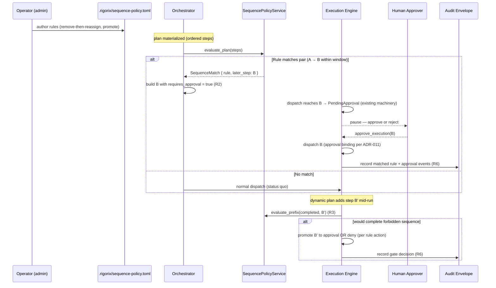

# Sequence Policy Architecture

<!--
Canonical Reference: .pi/architecture/modules/sequence-policy.md
Rationale: Detect composed abuse — actions individually permitted but collectively outside intent (the "remove-then-reassign" class) — deterministically, without LLM judgment in the path
Blueprint Source: Requirements v1 — 2026-09-04 (Proposed — NOT YET BUILT)
-->

## Overview

Rigorix's built-in gates are **per-action**: permission deny/allow lists match tool names, risk classification scores one `(tool, parameters)` call, enforcement budgets count calls, and Mode A policy matches file paths. None is stateful across steps. A sequence like *remove attendee X, then register me in the freed slot* passes every individual gate even when the combined outcome is clearly outside the operator's intent.

The Sequence Policy module adds the missing class of control: **declarative rules over ordered step sequences** with deterministic matching — no LLM judgment in the enforcement path. It evaluates at two points:

1. **Plan-time (primary)** — the ordered step list is materialized before execution (`build_graph_from_steps` produces a sequential chain with explicit order). A matched sequence **promotes the later step to `requires_approval = true`**, reusing the existing, freshly-hardened approval pause/resume machinery. Nothing executes until a human decides.
2. **Run-time (fallback)** — for plans whose steps are not all pre-materialized (dynamic/LLM-composed runs), a stateful gate evaluates the **completed prefix** of the DAG in the dispatch loop before a step that would complete a forbidden sequence.

This directly answers the "conference registration" composition case raised in industry review (Jeff Jenkins, 2026-09-03): neither *remove registration* nor *add registration* belongs on a deny list; the *pair* does. It also answers the same question Portotify's ALLOW stress-test and ADR-011 raised for approvals — *what does a permission actually authorize, over a sequence?*

**Honest boundary (unchanged, documented):** the engine governs steps it dispatches. A composition performed inside one opaque `run_command`, or entirely with agent-native tools outside Rigorix, is not reachable by this module — those are covered by PreToolUse hooks (custom logic, P0 vertical slice) and by post-hoc audit reconstruction, never by this engine module's rules.

## The Enforcement Property

> **A forbidden sequence never executes silently.** If an ordered plan contains steps `A → B` matching a rule, then `B` requires human approval before dispatch (promote), or is denied outright (deny mode). The decision is deterministic, derived from the same ordered step list the executor will run, and recorded into the signed envelope.

> **R7 extends the property across runs:** a rule with a `history` predicate additionally consults the **signed prior-execution trail** — *"remove X" in run 1, "add Jeff" in run 2, minutes apart* — each run passes its own within-run gate, but the second is refused at plan time because the same principal acted within the window. Policy input == signed evidence: tampering with the trail to evade a rule breaks the envelope HMAC.

## Requirements (R1–R7)

### R7 — Cross-Run Conflicting-Action Rules (audit trail as policy input)

A rule may carry an optional `history` predicate inside its `[[rules]]` table:

```toml
[[rules]]
id = "no-cross-run-remove-reassign"
action = "deny"
steps = [{ tool = "registration_add", params = [{ pointer = "/event_id", kind = "exact", value = "conf-2026" }] }]
history = { prior_node = "registration_remove", same_principal = true, window_secs = 900 }
```

Semantics (frozen):
- The rule fires only when the **current run's** `steps[]` match **AND** the signed prior-execution history shows an action glob-matching `prior_node` — by the **same principal** when `same_principal = true`, completed within `window_secs` — before this run.
- `same_principal = true` with an unknown current-run principal **never** matches (no false denial).
- History is read once per evaluation over the widest required window; a missing history store is empty (status quo), a read failure is fail-closed.
- A single-step current-run predicate is legal **only** when `history` is present (cross-run is a per-action gate; the within-run matcher still requires an ordered pair).
- Principal = the run's `author` (falls back to attested `identity.subject` on the envelope). The runtime prefix gate (R3) has no per-run principal and passes `None` — same-principal history rules therefore evaluate at plan time (R2).
- **History source**: the composition roots persist every built envelope to `<repo_root>/.rigorix/audit` (`AuditServiceImpl::with_local_repository`); `EnvelopeHistoryAdapter` reads it through the audit module's repository interface. Policy never writes the trail.

| Cap | Default |
|-----|---------|
| `max_history_window_secs` | 604 800 (7 days) |
| `history.prior_node` | non-empty |

### R1 — Declarative Sequence Rules

A rule describes an **ordered pair (or windowed chain)** of step predicates. Predicates match on `tool` (exact or glob) and optionally on parameter values (JSON pointer + exact/glob/regex value predicate). Rules carry an `action`:

| Action | Semantics |
|--------|-----------|
| `promote` (default) | Later matched step becomes `requires_approval = true` — human decides |
| `deny` | Later matched step is denied before dispatch (structured `SequencePolicyDenied` node failure) |

No rule may reference LLM output, model intent, or conversation content — matching is over the execution plan/prefix only.

### R2 — Plan-Time Evaluation (primary, pre-side-effect)

Evaluation runs against the **ordered step list** after it is materialized and before any step executes (at graph build / plan validation). On match with `promote`, the later step's node is built with `requires_approval = true` — the existing `PendingApproval` pause, `approve_execution` resume, and approval-record evidence apply unchanged. Nothing new executes; the whole approval chain from the Approval module (ADR-011) composes as-is.

Where plan-time applies (code-verified):
- Template/runbook runs (`orchestrator.run_from_template` → `build_graph_from_steps`, sequential dependency chain) — **full coverage**, the ordered list is the runbook.
- Compiled plans from intent (`orchestrator.run`) when the planner materializes an ordered step list before dispatch — evaluated on the same ordered list.
- MCP `rigorix_execute` / `rigorix_validate_plan` — the agent-supplied `PlanTemplate` steps are the ordered list; findings surface to the agent pre-run.

### R3 — Run-Time Prefix Gate (fallback, dynamic plans)

Where steps are added while the run is live (dynamic planning), the dispatch loop evaluates the **completed prefix** of the DAG before dispatching the next ready node: if the prefix plus the next node would complete a forbidden sequence, the node is **promoted to approval** (paused, same machinery) or **denied**. This is the same single choke point ADR-011 uses for intent verification — one insertion covers `execute_graph` and `resume_execution`.

### R4 — Determinism & No-Judgment Path

Matching is deterministic over serialized step data. No LLM call, no classifier upgrade, no model in the loop. This preserves the OSS enforcement claim — *Rigorix doesn't ask, it refuses (or gates for a human)* — and keeps the module provable (rule + plan → outcome, property-tested).

### R5 — Rule Authorship Is Admin-Controlled

Rules are declared in repository/org configuration (`.rigorix/sequence-policy.toml`, same trust surface as `policy.toml` / `permissions.toml`), authored by platform/security operators — **not** by the executing agent. Two consequences are in scope for this epic:
- The engine's own permission defaults must deny agent writes to `.rigorix/**` (see F-20260904-06a — otherwise a `workspace_write` agent edits the rules it is judged by).
- Enterprise-managed rules arrive via the signed policy-bundle seam (P3, gated on F-20260904-04), never as agent-supplied policy.

### R6 — Evidence into the Envelope

Every match is a first-class event: plan-time findings and runtime gate decisions (promoted/denied) are recorded in the audit stream and summarized into the HMAC-signed envelope (same pattern as `ApprovalRecorded`). "Why did the run stop / why was this approved" is reconstructable from the signed record — the conference scenario's *why* is the matched rule + the step pair.

## DDD Layers

This module follows Clean Architecture with 3 DDD layers (no `interfaces/` — API is exposed through the application service trait and consumed by `orchestrator`/`execution_engine`), matching `approval`, `quality_gates`, and `scored_evaluation`.

| Layer | Purpose | Tech |
|-------|---------|------|
| `domain/` | Pure business logic: rules, predicates, matcher, findings, errors | Zero framework imports, `thiserror` |
| `application/` | Service orchestration: plan evaluation, prefix gate, DTOs | Traits + async |
| `infrastructure/` | Rule config loading from `.rigorix/sequence-policy.toml` | Filesystem |

**Dependency rule:** `domain → application → infrastructure` (inward)

## Components by Layer

#### Domain Layer (`domain/`)
| Component | Description | Framework? |
|-----------|-------------|------------|
| SequenceRule | Aggregate: id, name, ordered step predicates `[A, B, …]`, window, action (`promote`/`deny`) | ❌ No |
| StepPredicate | Matcher: tool name (exact/glob) + optional parameter predicates (JSON pointer → exact/glob/regex) | ❌ No |
| RuleAction | Enum: `Promote`, `Deny` | ❌ No |
| SequenceMatch | A matched window within a plan/prefix: rule id, matched step indices, later step id | ❌ No |
| SequencePolicyConfig | Loaded rule set with safety caps (max rules, max window size, regex count) | ❌ No |
| SequencePolicyError | Typed error enum (thiserror), `is_retriable()` | ❌ No |

#### Application Layer (`application/`)
| Component | Description | Type |
|-----------|-------------|------|
| SequencePolicyService | `evaluate_plan(ordered_steps)` and `evaluate_prefix(prefix, next_node)` → `Vec<SequenceMatch>` | Service (trait + impl) |
| SequencePolicyRepository | Load/persist rule config | Repository |

#### Infrastructure Layer (`infrastructure/`)
| Component | Description | Connects to |
|-----------|-------------|-------------|
| TomlSequencePolicyRepository | Parse `.rigorix/sequence-policy.toml` → `SequencePolicyConfig` | Filesystem |

---

## Component Details

### SequenceRule

**Purpose:** One declarative rule over an ordered sequence.

**DDL Layer:** `domain/`

**Implementation File:** `engine/src/sequence_policy/domain/rule.rs`

**Canonical Reference:** `.pi/architecture/modules/sequence-policy.md#r1--declarative-sequence-rules`

**State/Serialization sketch (Rust):**

```rust
#[derive(Debug, Clone, Serialize, Deserialize)]
pub struct SequenceRule {
    pub id: String,               // stable identifier, e.g. "registration-remove-then-reassign"
    pub name: String,
    pub description: String,
    pub steps: Vec<StepPredicate>,// ordered — match requires steps[i] before steps[i+1]
    pub window: Option<u32>,      // max index gap between matched steps (default: adjacent)
    pub action: RuleAction,       // promote (default) | deny
}

#[derive(Debug, Clone, Serialize, Deserialize)]
pub struct StepPredicate {
    pub tool: String,             // exact or glob, e.g. "registration_remove", "registration_*"
    pub params: Vec<ParamPredicate>, // optional; JSON pointer + match kind + value
}

#[derive(Debug, Clone, Serialize, Deserialize)]
pub struct ParamPredicate {
    pub pointer: String,          // e.g. "/attendee_id"
    pub kind: ParamMatchKind,     // Exact | Glob | Regex
    pub value: String,
}
```

**Example rule (the conference case):**

```toml
[[rules]]
id = "registration-remove-then-reassign"
name = "No remove-then-reassign of a full event seat"
description = "Removing an attendee to free a seat, then registering the requester, is never autonomous"
steps = [
  { tool = "registration_remove", params = [{ pointer = "/event_id", kind = "exact", value = "conf-2026" }] },
  { tool = "registration_add",    params = [{ pointer = "/event_id", kind = "exact", value = "conf-2026" }] },
]
window = 3
action = "promote"   # the add step pauses for a human
```

### SequencePolicyService

**Purpose:** Evaluate an ordered plan (or a dispatch prefix) against the rule set.

**DDL Layer:** `application/`

**Implementation File:** `engine/src/sequence_policy/application/service_impl.rs`

**Canonical Reference:** `.pi/architecture/modules/sequence-policy.md#r2--plan-time-evaluation-primary-pre-side-effect`

**Contract sketch (Rust):**

```rust
#[async_trait]
pub trait SequencePolicyService: Send + Sync {
    /// Evaluate a fully-materialized ordered step list (plan-time, R2).
    async fn evaluate_plan(&self, steps: &[PlannedStep])
        -> Result<Vec<SequenceMatch>, SequencePolicyError>;

    /// Evaluate a dispatch prefix + next node (run-time, R3).
    async fn evaluate_prefix(&self, prefix: &[DispatchedStep], next: &PlannedStep)
        -> Result<Vec<SequenceMatch>, SequencePolicyError>;
}
```

### SequencePolicyError

```rust
#[derive(Debug, Error)]
pub enum SequencePolicyError {
    #[error("Rule config invalid: {0}")]
    InvalidConfig(String),
    #[error("Rule '{0}' exceeds safety caps: {1}")]
    RuleExceedsCaps { rule: String, detail: String },
    #[error("Rule not found: {0}")]
    NotFound(String),
    #[error("Invalid state: {0}")]
    InvalidState(String),
    #[error("Internal error: {0}")]
    Internal(String),
}

impl SequencePolicyError {
    pub fn is_retriable(&self) -> bool {
        matches!(self, SequencePolicyError::Internal(_))
    }
}
```

**Recovery:**
- `InvalidConfig` / `RuleExceedsCaps`: not retriable — operator fixes the rule file
- `NotFound`: not retriable — rule was removed mid-run; match decisions already made stand
- `Internal`: retriable
- **Evaluation failure policy:** config parse/load failures **fail closed at plan time** (no plan runs under an unparseable rule set — mirrors ADR-011 fail-closed verification); a missing optional config file is **not an error** (no rules → no matches → status quo)

---

## Data Flow



**Flow Description:**
1. Rules are authored by operators in repo/org config — never by the executing agent (R5)
2. Every materialized plan is evaluated **before side effects**; a matched pair promotes the later step to `requires_approval`
3. The existing approval pause/resume/evidence chain (Approval module, ADR-011) applies unchanged
4. Dynamic plans are covered by the prefix gate at the dispatch choke point
5. Every match and gate decision is recorded into the signed envelope

## Durability

| Tier | Artifact | Guarantee |
|------|----------|-----------|
| **Rule config** | `.rigorix/sequence-policy.toml` (repo) + org config (enterprise bundle, P3) | Versioned with the repo; tamper-evident via Mode A base-branch loading + `.rigorix/**` write-denial (R5) |
| **Decisions (evidence)** | Matches and promotions are **content of the signed envelope** (event list + summary) | Tamper-evident when envelope signing is on |
| **Operational (mid-run)** | Promotions are ordinary `requires_approval` nodes — durable via existing `ExecutionState` + Approval records | Survives cross-process resume (same as Approval module) |

## Migration Rule

No persisted artifacts exist before this module — **no migration**. When rules are later removed or changed, prior decisions stand (recorded evidence); new runs evaluate against the current config. Config edits between runs are picked up at the next plan evaluation (config is read per-run from disk, same pattern as hooks/permissions).

## User Intents

| Intent | Triggered By | Handled By | Domain Event |
|--------|-------------|------------|--------------|
| OperatorAuthorsRule | Editing `.rigorix/sequence-policy.toml` (admin) | SequencePolicyRepository | — (config load at run start) |
| PlanMayContainForbiddenSequence | Plan materialized (runbook/intent/MCP plan) | SequencePolicyService → `evaluate_plan` | SequenceRuleMatched |
| StepWouldCompleteForbiddenSequence | Dynamic dispatch prefix | Execution Engine → `evaluate_prefix` | SequenceRuleMatched |
| LaterStepRequiresHumanDecision | Matched `promote` rule | Execution Engine (existing approval machinery) | NodeAwaitingApproval / ApprovalRecorded |
| ForbiddenSequenceDenied | Matched `deny` rule | Execution Engine | NodeFailed (SequencePolicyDenied) |

## Design Principles

- **Sequence, not sentence**: rules match ordered steps with parameter predicates — never conversation, intent, or LLM output (R4)
- **Promote by default, deny explicitly**: the safe default for a *possible* composition is human decision, not silent refusal (mirrors approval philosophy)
- **Reuse the approval chain**: matched steps are ordinary `requires_approval` nodes — no parallel gate machinery, one choke point per concern (approval binding: dispatch verification; sequence policy: promotion)
- **Plan-time first, run-time second**: catch it before any side effect when the plan is known; catch it at the dispatch boundary only when it isn't
- **Fail closed on bad config, open on no config**: an unparseable rule set blocks plan execution; a missing file is the status quo
- **Rule authorship is outside the agent's reach** (R5): same trust surface as Mode A policy — this is a security-validator pass/fail item

## Degradation Strategy

| Feature | When Unavailable | Behavior |
|---------|-----------------|----------|
| Rule config load/parse | File corrupt or exceeds safety caps | **Fail closed** at plan time — run refused with `InvalidConfig`/`RuleExceedsCaps`; operator action required |
| Rule config absent | No `.rigorix/sequence-policy.toml` | Status quo — no sequence gating (documented, not an error) |
| Plan-time evaluation | Materialized plan unavailable (fully dynamic run) | Run-time prefix gate still applies (R3) |
| Prefix evaluation | Policy service error mid-run | **Fail closed** — node is not dispatched; run halts with `SequencePolicyError` (mirrors ADR-011 fail-closed) |
| Envelope signing | Signing disabled | Gate decisions remain operational evidence; documented non-tamper-evident state (same as Approval module) |

## Acceptance Criteria

| # | Component | Criterion | Verify In |
|---|-----------|-----------|-----------|
| 1 | SequenceRule | TOML parse → rule with ordered predicates + action; serde round-trip preserves all fields | unit test |
| 2 | StepPredicate | Tool glob + param exact/glob/regex match correctly; non-matching params do not match | unit test |
| 3 | Matcher | Adjacent pair match; windowed match (gap ≤ window); out-of-window does not match | unit test |
| 4 | Matcher | Determinism property test: same ordered plan + rules → same match set | unit test (property) |
| 5 | SequencePolicyService | `evaluate_plan` finds remove-then-add pair in a runbook; returns later step id | unit test |
| 6 | Orchestrator (R2) | Runbook containing remove-then-add: later step is built `requires_approval=true`; run pauses; approve → executes; reject → skipped | integration test |
| 7 | Orchestrator (R2) | `deny` rule: later step fails with `SequencePolicyDenied`, tool never called (spy tool asserts) | integration test |
| 8 | MCP surface | `rigorix_validate_plan` on a plan with a matched sequence returns a structured finding before run | integration test |
| 9 | Execution Engine (R3) | Dynamic plan completes step A, then proposes B (would complete) → B promoted/denied per rule | integration test |
| 10 | Fail-closed | Corrupt rule config → plan refused, no steps execute | integration test |
| 11 | Fail-open-absent | No config file → run executes unchanged | integration test |
| 12 | Audit (R6) | Matched rule + promotion recorded in envelope events; decision summaries redact parameter values by default (SpanPrivacy pattern) | integration test |
| 13 | Permission (R5) | `workspace_write` agent file-write to `.rigorix/**` denied by default permission config | integration test |
| 14 | SequencePolicyError | All variants, `Display`, `is_retriable()` | unit test |

## Dependencies

### Depends On
- **DAG Engine / Orchestrator**: ordered step materialization (`build_graph_from_steps`), `requires_approval` node flag
- **Approval (ADR-011)**: promote semantics reuse the pause/resume/evidence chain — no new gate machinery
- **Execution Engine**: dispatch choke point (`run_dispatch_loop`) for the R3 prefix gate
- **Audit**: sequence-match events + envelope summaries
- **Event System**: `SequenceRuleMatched` (+ deny/error variants), publish-failure observability (GAP-M-14 pattern — no silent swallow)
- **Configuration / Permission (R5)**: deny `.rigorix/**` writes to executing agents
- **Plan Validation / MCP Execution Tools**: surface plan-time findings via `validate_plan`

### Used By
- **Orchestrator**: plan-time evaluation before graph build/seal
- **Execution Engine**: run-time prefix gate at dispatch
- **MCP Execution Tools**: plan-time findings surfaced to the agent
- **Enterprise (P3, gated)**: `sequence_policy` rule type + signed-bundle handoff (F-20260904-04)

## Integration with Existing Modules

### Orchestrator — Graph Build (R2 insertion point)

Evaluation happens on the ordered step list **before** `build_graph_from_steps` seals the graph; matched later steps are promoted at the same call site that already applies `step.requires_approval`:

```rust
// in run_from_template, before build_graph_from_steps:
let matches = sequence_policy.evaluate_plan(&input.steps).await?; // fail-closed
let promoted: HashSet<String> = matches.iter().filter(promote).map(later_step).collect();
// ... steps whose name ∈ promoted are built with requires_approval = true
```

### Execution Engine — Dispatch Choke Point (R3 insertion point)

The prefix gate sits beside approval verification inside `run_dispatch_loop` (the single loop used by `execute_graph` and `resume_execution`). Promotion routes into the existing `AwaitingApproval` pause; deny returns a structured node failure:

```rust
// in run_dispatch_loop, after pop_dispatchable / approval verification:
match sequence_policy.evaluate_prefix(completed_prefix, next_node).await {
    Ok(matches) if matches.iter().any(deny) => /* node fails: SequencePolicyDenied, no dispatch */
    Ok(matches) if matches.iter().any(promote) => /* node → AwaitingApproval (existing path) */
    Ok(_) => /* dispatch */
    Err(e) => /* fail closed — halt with SequencePolicyError */
}
```

### Audit — Envelope Extension

New envelope field: `sequence_policy_findings[]` — each entry carries rule id, matched step indices, action taken, and a **redacted summary** (full param values opt-in, following the `planning_prompt` privacy pattern). Additive, serde-defaulted — backward compatible.

### Event System — Event Type Extension

`SequenceRuleMatched { rule_id, action, later_step }`, `SequencePolicyDenied { rule_id, later_step, reason }`, `SequencePolicyConfigError { detail }`. Publish failures are warn-logged with an explicit marker (GAP-M-14 pattern) — never silent.

### Permission Enforcer — Orthogonal, Composes at Dispatch

| Gate | Question | Blocks |
|------|----------|--------|
| Permission mode | "May this *tool class* run under the active mode?" | Immediate, policy-based |
| Sequence policy | "Does this step *complete a forbidden sequence*?" | Promotes to human approval, or denies |
| Approval binding | "Was this *exact payload* approved by a human?" | Until human re-approval |

A promoted step still requires mode permission; a mode-allowed step still pauses if it completes a sequence.

### Hooks — the agent-native boundary (P0 vertical slice)

For tools Rigorix does not dispatch (agent-native tools), composition detection lives in a **stateful PreToolUse/PostToolUse hook** (hooks receive `tool_name`, `tool_input`, `session_id` and are arbitrary code). The P0 slice builds the conference-rule demo as a hook to validate semantics before the engine module lands; the engine module's rules are the declarative, auditable form of the same idea for dispatched steps.

### Enterprise Policy Engine — Future Rule Type (P3, gated)

Enterprise `Policy::evaluate` already anticipates "(future) planned DAGs" (`policy-engine.md`). A `sequence_policy` rule type evaluating ordered execution records is P3 — **gated on** F-20260904-02 (pre-store payload evaluation, otherwise it is post-hoc reporting) and F-20260904-04 (signed-bundle handoff, otherwise rules never reach OSS). See ADR-013 §implementation.

## Configuration

```toml
# .rigorix/sequence-policy.toml
# Authored by platform/security operators. Never agent-writable (R5).
[sequence_policy]
# Fail closed on config errors at plan time.
fail_closed = true

[[rules]]
id = "registration-remove-then-reassign"
name = "No remove-then-reassign of a full event seat"
description = "Removing an attendee to free a seat, then registering the requester, is never autonomous"
steps = [
  { tool = "registration_remove", params = [{ pointer = "/event_id", kind = "exact", value = "conf-2026" }] },
  { tool = "registration_add",    params = [{ pointer = "/event_id", kind = "exact", value = "conf-2026" }] },
]
window = 3
action = "promote"
```

Safety caps (mirrors `EnforcementConfig::validate`): max rules per file, max predicates per rule, max `window`, max regex predicates (regex count is a denial-of-service surface).

## Security Considerations

| Concern | Mitigation | Validator |
|---------|------------|-----------|
| Agent edits the rules it is judged by | `.rigorix/**` writes denied to executing agents (R5, default permission config) | security-validator |
| Rule authorship by non-admins | Repo config via Mode A base-branch trust; enterprise rules via admin-gated CRUD (`WritePolicies`, F-20260904-01) | security-validator |
| Regex ReDoS in parameter predicates | Safety caps on regex predicates; exact/glob preferred; regex compiled once per load | security-validator |
| Match bypass via step reordering | Rules match ordered windows; promotion happens at the single graph-build / dispatch points | operations-validator |
| Config parse failure silently ignored | Fail-closed at plan time (`InvalidConfig` / `RuleExceedsCaps`); absent file ≠ error | operations-validator |
| Event publish failure loses evidence | GAP-M-14 pattern: warn-log + explicit marker, never silent | operations-validator |
| Parameter values leak into summaries | Default redaction (SpanPrivacy pattern); full payload opt-in | security-validator |
| Opaque `run_command` or agent-native composition | Out of scope for this module — hooks (P0) + audit reconstruction; documented boundary | security-validator |

## Testing Requirements

| Test Type | Coverage Target | Files |
|-----------|-----------------|-------|
| Unit | 90% | `engine/src/sequence_policy/` — per-component test modules |
| Integration | 80% | `engine/src/sequence_policy/tests/` + orchestrator/execution-engine integration tests |

**Key Test Scenarios:** see Acceptance Criteria table (14 scenarios) — conference pair promotion, deny path, window semantics, determinism property, dynamic-prefix gate, fail-closed config, redaction, `.rigorix/**` write denial.

## Error Handling

Error enum and recovery in [SequencePolicyError](#sequencepolicyerror) above. Core rules: config errors are operator-facing and non-retriable; evaluation errors fail closed; `Internal` is the only retriable variant.

## Module Structure

```
engine/src/sequence_policy/
├── mod.rs                          # Module root: re-exports, contract freeze header
├── domain/
│   ├── mod.rs
│   ├── rule.rs                     # SequenceRule, StepPredicate, ParamPredicate, RuleAction
│   ├── match.rs                    # SequenceMatch (rule + matched window + later step)
│   ├── config.rs                   # SequencePolicyConfig + SafetyCaps + validate()
│   └── error.rs                    # SequencePolicyError (thiserror)
├── application/
│   ├── mod.rs
│   ├── service.rs                  # SequencePolicyService trait
│   ├── service_impl.rs             # evaluate_plan / evaluate_prefix over compiled rules
│   ├── factory.rs                  # SequencePolicyFactory
│   └── dto/
│       └── mod.rs                  # PlannedStep, DispatchedStep, EvaluatePlanInput/Output
└── infrastructure/
    ├── mod.rs
    └── repository/
        ├── mod.rs
        └── toml_repository.rs      # .rigorix/sequence-policy.toml → SequencePolicyConfig
```

**Note:** No `interfaces/` directory initially — the module exposes its API through the application service trait, consumed by `orchestrator` (plan-time) and `execution_engine` (dispatch prefix). MCP/HTTP surfacing lives in the MCP crate (execution-tools), following the `execution-tools.md` layer-mapping convention.

## Guardian Build Checklist

- [ ] Module follows Clean Architecture: domain → application → infrastructure
- [ ] All domain types derive `Debug, Clone, Serialize, Deserialize`
- [ ] `SequencePolicyError` uses `thiserror` with `is_retriable()`
- [ ] Matching is deterministic — property test over rule + plan → stable match set
- [ ] Plan-time evaluation wired before `build_graph_from_steps` seals the graph
- [ ] Run-time prefix gate wired at the single dispatch choke point (proofing asserts no alternate dispatch entry for promote/deny)
- [ ] Every `mod.rs` has canonical reference header
- [ ] Module spec written to `engine/.pi/architecture/modules/sequence-policy.md`
- [ ] Contract freeze annotations on all public types
- [ ] `.rigorix/**` write denial lands in default permission config (R5) in the same epic
- [ ] Serde round-trip + safety-cap validation tests
- [ ] `cargo test --workspace` passes
- [ ] `cargo clippy --workspace` zero warnings

---

*Last updated: 2026-09-05*
*Module version: 1.0.0 (implemented)*

---

**Status:** Implemented — plan-time gate (R2), run-time prefix gate (R3),
fail-closed/absent config handling, permission hardening (R5), audit evidence
(R6), and proofing are all in `src/sequence_policy/` + the orchestrator /
execution-engine choke points. See the epic tracking issue (#837) and the
14-row Acceptance Criteria table below for per-criterion tests.
**Remaining (P3, gated):** enterprise-managed rules via the signed policy
bundle seam (F-20260904-04); hooks P0 demo parity (agent-native boundary);
ADR-011 remains separate.
