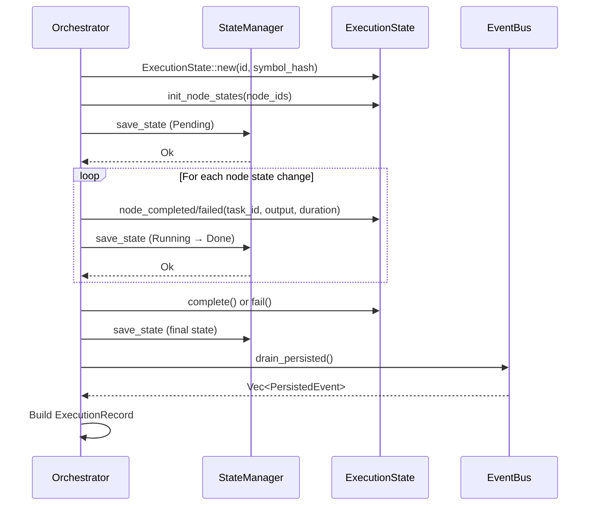

# State Persistence Architecture

<!--
Canonical Reference: .pi/architecture/modules/state-persistence.md
Blueprint Source: Domain Exploration Session 63c25384
-->

## Overview

Persists execution state to disk using atomic write-rename for crash safety. Tracks overall execution status (Pending, Running, Completed, Failed, Cancelled) and per-node state (Pending, InProgress, Completed, Failed, Skipped). Supports TUI graph persistence for viewing past executions.

## Responsibilities

- Persist ExecutionState to disk via atomic write-rename (`{id}.json.tmp` → `{id}.json`)
- Track per-node state transitions (Pending → InProgress → Completed/Failed)
- Record node output, errors, retries, and duration
- Hash symbol graph state at execution start for replay determinism
- Persist ExecutionGraph for TUI "view past execution" mode
- Support cross-process locking via fd-lock

## Components

| Component | File Path | Purpose | Canonical Section |
|-----------|-----------|---------|-------------------|
| ExecutionState | `rigorix/src/state/persistence.rs` | Serializable execution snapshot | #state |
| NodeState | `rigorix/src/state/persistence.rs` | Per-node state with status, output, retries | #node-state |
| StateManager | `rigorix/src/state/persistence.rs` | Atomic persistence with file locking | #manager |
| ExecutionGraph | `rigorix/src/state/graph.rs` | Graph structure for TUI history view | #graph |
| GraphManager | `rigorix/src/state/graph.rs` | Persistence for ExecutionGraph records | #graph-mgr |
| ExecutionRecord | `rigorix/src/state/context.rs` | Complete execution record (events + context) | #record |

---

## Component Details

### ExecutionState

**Purpose:** Serializable snapshot of an entire execution

**Implementation File:** `rigorix/src/state/persistence.rs`

```rust
pub struct ExecutionState {
    pub execution_id: Uuid,
    pub status: ExecutionStatus,       // Pending, Running, Completed, Failed, Cancelled
    pub started_at: DateTime<Utc>,
    pub completed_at: Option<DateTime<Utc>>,
    pub node_states: IndexMap<Uuid, NodeState>,  // Ordered map for deterministic serialization
    pub symbol_graph_hash: String,
}

pub enum NodeStatus { Pending, InProgress, Completed, Failed, Skipped }

pub struct NodeState {
    pub node_id: Uuid,
    pub status: NodeStatus,
    pub output: Option<String>,
    pub error: Option<String>,
    pub retries: u8,
    pub duration_ms: Option<u64>,
}
```

### StateManager

**Purpose:** Atomic persistence with cross-process locking

```rust
pub struct StateManager { /* state_dir: PathBuf, mutex: tokio::sync::Mutex */ }

impl StateManager {
    pub async fn new(state_dir: PathBuf) -> Result<Self, StateError>;
    pub async fn save_state(&self, state: &ExecutionState) -> Result<(), StateError>;
    pub async fn load_state(&self, execution_id: Uuid) -> Result<ExecutionState, StateError>;
}
```

**Persistence pattern:** Write to `{execution_id}.json.tmp` → `fs::rename` to `{execution_id}.json`. On POSIX, `rename(2)` is atomic — a power failure during write leaves the original file intact.

---

## Data Flow



**Write-Rename Pattern:**
```rust
// Atomic write-rename (crash-safe)
fs::write("{id}.json.tmp", &json)?;   // Write to temp
fs::rename("{id}.json.tmp", "{id}.json")?;  // Atomic rename
```

**Flow Description:**
1. ExecutionState created with symbol_graph_hash for replay determinism
2. State saved at each phase: Pending → Running → Completed/Failed
3. NodeState tracks individual node status (Pending→InProgress→Completed/Failed/Skipped)
4. At execution end, EventBus drains all persisted events into ExecutionRecord
```

---

## Dependencies

### Depends On
- **Event System**: ExecutionRecord collects drained events
- **DAG Engine**: ExecutionGraph from TaskGraph

### Used By
- **Orchestrator**: Orchestrator::run() saves state at each phase

---

## Testing Requirements

| Test Type | Coverage Target | Files |
|-----------|-----------------|-------|
| Unit | 90% | `rigorix/src/state/persistence.rs`, `rigorix/src/state/graph.rs` |

**Key Test Scenarios:**
- Save state → file exists at expected path
- Load state → returns saved ExecutionState
- Atomic write: .tmp file removed after successful write
- Node state transitions: Pending → InProgress → Completed
- Parallel saves don't corrupt state

---

## Performance Considerations

| Metric | Target | Monitoring |
|--------|--------|------------|
| State write | < 10ms per save | Tracing spans |
| State load | < 5ms | Tracing spans |

---

*Last updated: 2026-06-13*
*Module version: 1.0.0*
