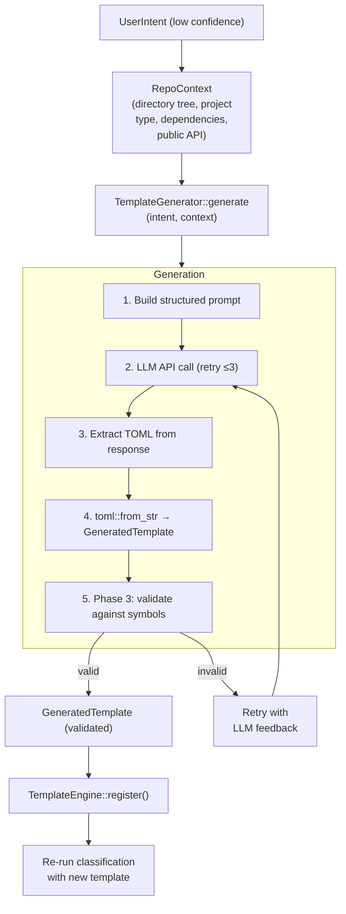

# Template Generation Architecture

<!--
Canonical Reference: .pi/architecture/modules/template-generation.md
Blueprint Source: Domain Exploration Session 63c25384, TEMPLATE_GENERATOR_SPEC.md
-->

## Overview

Generates new TOML workflow templates from natural language user intent when no matching template exists. Plugs into PlanningPipeline as a fallback between classifier and template engine. This is the feature that makes Rigorix self-extending.

## Responsibilities

- Build RepoContext from repository structure (directory tree, dependencies, public API, key files)
- Send structured prompt to LLM with template schema, existing templates, and repo context
- Parse LLM response as valid TOML and validate against schema
- Validate generated template against indexed symbols (Phase 3: catch hallucinated types/fields)
- Register generated template into TemplateEngine for immediate use
- Support retry with LLM feedback on parse/validation failures (up to 3 attempts)
- Enforce LLM budget reservation before generation

## Components

| Component | File Path | Purpose | Canonical Section |
|-----------|-----------|---------|-------------------|
| TemplateGenerator (trait) | `engine/src/planning/domain/generator.rs` | Async trait for template generation | #trait |
| ClaudeTemplateGenerator | `engine/src/planning/domain/generator.rs` | Anthropic Messages API implementation | #claude |
| MockGenerator | `engine/src/planning/tests.rs` | Test double returning fixed template | #mock |
| RepoContext | `engine/src/planning/domain/generator.rs` | Repository snapshot for generation context | #context |
| GeneratedTemplate | `engine/src/planning/domain/generator.rs` | Output DTO for generated template | #generated-template |
| GeneratorError | `engine/src/planning/domain/generator.rs` | Typed error enum for generation failures | #errors |
| InvalidSymbolReference | `engine/src/planning/domain/generator.rs` | Phase 3 validation failure detail | #symbol-ref |
| SymbolValidationServiceImpl | `engine/src/planning/application/symbol_validation_impl.rs` | Phase 3 service: validates generated template against indexed symbols | #symbol-validation |

---

## Component Details

### TemplateGenerator Trait

**Purpose:** Abstract interface for LLM-based template generation

**Implementation File:** `engine/src/planning/domain/generator.rs`

**Interface:**

```rust
#[async_trait]
pub trait TemplateGenerator: Send + Sync {
    /// Generate a template definition from user intent.
    async fn generate(&self, input: GenerateInput) -> Result<GeneratedTemplate, GeneratorError>;

    /// Called by the planning pipeline after generation to register
    /// the generated template into the TemplateEngine.
    async fn register_template(&self, template: &GeneratedTemplate) -> Result<(), GeneratorError>;
}
```

### ClaudeTemplateGenerator

**Purpose:** Production generator using Anthropic Messages API with structured prompt engineering

**Implementation File:** `engine/src/planning/domain/generator.rs`

**Key behaviors:**
- Builds prompt with template schema, valid action types, retry strategies, existing templates, repo context
- Includes PUBLIC API SURFACE and EXISTING DEPENDENCIES constraints to prevent hallucinated references
- Up to 3 retry attempts on TOML parse/validation errors, feeding error back to LLM
- Strips markdown code fences from LLM response
- Rate limit handling with Retry-After header support
- Configurable via `ClaudeGeneratorConfig` (api_key, model, max_retries, timeout)

### MockGenerator

**Purpose:** Deterministic test double for unit and integration tests

**Implementation File:** `engine/src/planning/tests.rs`

**Behaviors:**
- Returns a fixed, pre-defined template for any intent
- Used in tests where deterministic output is required
- No LLM calls — zero cost test fixture

### Phase 3: Symbol Validation

Validates generated template against indexed symbol graph before registration:
- Detects `any` type usage (LLM escape hatch)
- Checks field access patterns (`var.field`) against actual type definitions
- Validates type references exist in the codebase
- Returns `GeneratorError::SymbolValidation` on mismatch

**Implementation File:** `engine/src/planning/application/symbol_validation_impl.rs`

---

## Data Flow



**Flow Description:**
1. Build RepoContext from working directory: scan file tree, detect project type, read dependencies
2. Generate template via LLM with up to 3 retry attempts on parse/validation failures
3. Phase 3 validates generated template against indexed symbol graph (catches hallucinated types)
4. Validated template is registered into TemplateEngine and classification is re-run

---

## Key Data Types

### GeneratedTemplate

```rust
pub struct GeneratedTemplate {
    pub name: String,
    pub description: String,
    pub toml_content: String,
    pub parameters: Vec<GeneratedParameter>,
}
```

### RepoContext

```rust
pub struct RepoContext {
    pub root_dir: PathBuf,
    pub project_type: String,
    pub directory_tree: Vec<String>,
    pub dependencies: Vec<String>,
    pub public_api: Vec<String>,
    pub key_files: Vec<String>,
}
```

### GeneratorError

| Variant | Description |
|---------|-------------|
| LlmError | LLM API call failed (network, auth, rate limit) |
| ParseError | LLM response could not be parsed as valid TOML |
| ValidationError | Generated template failed schema validation |
| SymbolValidation | Generated template references non-existent symbols |
| BudgetExhausted | LLM budget fully consumed before generation |
| InternalError | Unexpected internal failure |

---

## Dependencies

### Depends On
- **Planning Pipeline**: Triggered on low confidence, registers result back
- **Template System**: Uses Template, validate_template(), TemplateEngine
- **Repo Engine**: Symbol validation (Phase 3)
- **Budget Tracking**: LlmBudget reservation

### Used By
- **Planning Pipeline**: Fallback path when classification < 0.7

---

## Security Considerations

| Concern | Mitigation | Validator |
|---------|------------|-----------|
| LLM hallucinates types/fields | Phase 3 symbol validation against actual symbol graph | security-validator |
| LLM invents dependencies | Prompt constrains to EXISTING DEPENDENCIES only | security-validator |
| RunCommand without allowlist | Template validator rejects unapproved commands | security-validator |
| Budget exhaustion | Budget reservation before API call | operations-validator |

---

## Testing Requirements

| Test Type | Coverage Target | Files |
|-----------|-----------------|-------|
| Unit | 90% | `engine/src/planning/domain/generator.rs` (inline tests in tests.rs) |
| Integration | 85% | `engine/src/planning/tests.rs` |

**Key Test Scenarios:**
- MockGenerator returns fixed template → registration succeeds
- Generator with retry on invalid TOML → retries up to 3 times
- Phase 3 catches hallucinated field reference → SymbolValidation error
- Budget exhausted during reservation → GeneratorError::BudgetExhausted

---

*Last updated: 2026-06-15*
*Module version: 1.0.1* — Fixed file paths to match actual codebase layout
