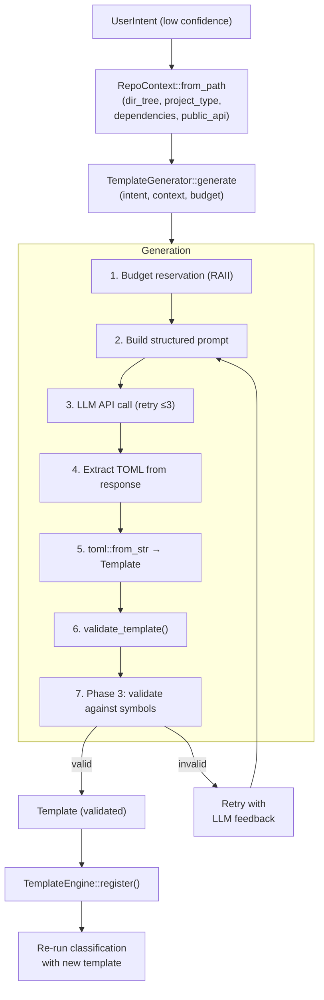

# Template Generation Architecture

<!--
Canonical Reference: .pi/architecture/modules/template-generation.md
Blueprint Source: Domain Exploration Session 63c25384, TEMPLATE_GENERATOR_SPEC.md
-->

## Overview

Generates new TOML workflow templates from natural language user intent when no matching template exists. Plugs into PlanningPipeline as a fallback between classifier and template engine. This is the feature that makes Rigorix self-extending.

## Responsibilities

- Build RepoContext from repository structure (directory tree, dependencies, public API, key files)
- Send structured prompt to LLM with template schema, existing templates, and repo context
- Parse LLM response as valid TOML and validate against schema
- Validate generated template against indexed symbols (Phase 3: catch hallucinated types/fields)
- Register generated template into TemplateEngine for immediate use
- Support retry with LLM feedback on parse/validation failures (up to 3 attempts)
- Enforce LLM budget reservation before generation

## Components

| Component | File Path | Purpose | Canonical Section |
|-----------|-----------|---------|-------------------|
| TemplateGenerator (trait) | `rigorix/src/planning/generator.rs` | Async trait for template generation | #trait |
| ClaudeTemplateGenerator | `rigorix/src/planning/generator.rs` | Anthropic Messages API implementation | #claude |
| OpenaiTemplateGenerator | `rigorix/src/planning/openai.rs` | OpenAI-compatible API implementation | #openai |
| MockGenerator | `rigorix/src/planning/generator.rs` | Test double returning fixed template | #mock |
| RepoContext | `rigorix/src/planning/generator.rs` | Repository snapshot for generation context | #context |
| GeneratorError | `rigorix/src/planning/generator.rs` | Typed error enum for generation failures | #errors |

---

## Component Details

### TemplateGenerator Trait

**Purpose:** Abstract interface for LLM-based template generation

**Implementation File:** `rigorix/src/planning/generator.rs`

**Interface:**

```rust
#[async_trait]
pub trait TemplateGenerator: Send + Sync {
    async fn generate(
        &self, intent: &UserIntent, repo_context: &RepoContext, budget: &LlmBudget
    ) -> Result<Template, GeneratorError>;
}
```

### ClaudeTemplateGenerator

**Purpose:** Production generator using Anthropic Messages API with structured prompt engineering

**Implementation File:** `rigorix/src/planning/generator.rs`

**Key behaviors:**
- Builds prompt with template schema, valid action types, retry strategies, existing templates, repo context
- Includes PUBLIC API SURFACE and EXISTING DEPENDENCIES constraints to prevent hallucinated references
- Up to 3 retry attempts on TOML parse/validation errors, feeding error back to LLM
- Strips markdown code fences from LLM response
- Rate limit handling with Retry-After header support

### Phase 3: Symbol Validation

Validates generated template against indexed symbol graph before registration:
- Detects `any` type usage (LLM escape hatch)
- Checks field access patterns (`var.field`) against actual type definitions
- Validates type references exist in the codebase
- Returns `GeneratorError::SymbolValidation` on mismatch

---

## Data Flow



**Flow Description:**
1. Build RepoContext from working directory: scan file tree, detect project type, read dependencies
2. Generate template via LLM with up to 3 retry attempts on parse/validation failures
3. Phase 3 validates generated template against indexed symbol graph (catches hallucinated types)
4. Validated template is registered into TemplateEngine and classification is re-run
```

---

## Dependencies

### Depends On
- **Planning Pipeline**: Triggered on low confidence, registers result back
- **Template System**: Uses Template, validate_template(), TemplateEngine
- **Repo Engine**: Symbol validation (Phase 3)
- **Budget Tracking**: LlmBudget reservation

### Used By
- **Planning Pipeline**: Fallback path when classification < 0.7

---

## Security Considerations

| Concern | Mitigation | Validator |
|---------|------------|-----------|
| LLM hallucinates types/fields | Phase 3 symbol validation against actual symbol graph | security-validator |
| LLM invents dependencies | Prompt constrains to EXISTING DEPENDENCIES only | security-validator |
| RunCommand without allowlist | Template validator rejects unapproved commands | security-validator |
| Budget exhaustion | RAII budget reservation before API call | operations-validator |

---

## Testing Requirements

| Test Type | Coverage Target | Files |
|-----------|-----------------|-------|
| Unit | 90% | `rigorix/src/planning/generator.rs` (inline tests) |
| Integration | 85% | `rigorix/tests/e2e_full_pipeline.rs` |

**Key Test Scenarios:**
- MockGenerator returns fixed template → registration succeeds
- Generator with retry on invalid TOML → retries up to 3 times
- Phase 3 catches hallucinated field reference → SymbolValidation error
- Budget exhausted during reservation → GeneratorError::BudgetExhausted

---

*Last updated: 2026-06-13*
*Module version: 1.0.0*
