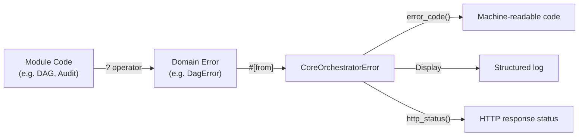

# Disaster Recovery Plan: error-handling Module

<!--
Canonical Reference: .pi/architecture/modules/error-handling.md
Last Updated: 2026-06-14
-->

## Scope

This DR plan covers the `error-handling` module — structured error types for the
entire orchestrator. Error types are zero-cost abstractions (plain enums) with no
runtime state, persistent storage, or external dependencies. Recovery focuses on
ensuring error propagation integrity after incidents.

## RTO/RPO Targets

| Metric | Target | Rationale |
|--------|--------|-----------|
| RTO (Recovery Time Objective) | Instant | Error types are compile-time constructs — no runtime recovery needed |
| RPO (Recovery Point Objective) | N/A | No persistent state — nothing to lose |

## Backup Strategy

**No backups required.** Error enums are compiled into the binary. They carry no
runtime state that persists across restarts.

| Data | Backup Strategy | Frequency | Retention |
|------|----------------|-----------|-----------|
| Error enum definitions | Source control (Git) | Per commit | Full history |
| Error documentation | Source control (Git) | Per commit | Full history |
| Error conversion impls | Source control (Git) | Per commit | Full history |

## Restore Procedure

### After Source Code Corruption

1. **Restore from Git:**
   ```bash
   git checkout src/error.rs
   git checkout src/execution/domain/error.rs
   git checkout .pi/architecture/modules/error-handling.md
   ```

2. **Verify restored contracts:**
   ```bash
   bash engine/.pi/scripts/ci/check_error-handling_contracts.sh
   ```

3. **Verify compilation:**
   ```bash
   cd engine && cargo check
   ```

4. **Run error-handling tests:**
   ```bash
   cd engine && cargo test --lib error
   ```

### After Accidental Enum Change

If a variant was removed or modified:

1. **Identify the change:**
   ```bash
   git diff src/error.rs
   ```

2. **Revert the change:**
   ```bash
   git checkout -- src/error.rs
   ```

3. **Run contract validation:**
   ```bash
   bash engine/.pi/scripts/ci/stage_error-handling_proofing.sh
   ```

## Failover Plan

### Module Failure Scenarios

| Scenario | Impact | Failover Action |
|----------|--------|----------------|
| Compilation error in CoreOrchestratorError | Cascading — all modules fail to compile | Revert change to src/error.rs |
| Missing `#[from]` conversion | Build error on specific module | Add missing `#[from]` variant |
| Wrong error variant used | Incorrect error classification | Fix error variant in module code |

### Error Propagation Chain



### Recovery Validation

After any recovery action, run the full validation suite:

```bash
# Validate all error contracts
bash engine/.pi/scripts/ci/stage_error-handling_proofing.sh

# Validate compilation
cd engine && cargo check

# Validate all tests
cd engine && cargo test --lib 2>&1 | grep "error::"

# Validate architecture
bash engine/.agents/scripts/validate-architecture.sh

# Validate canonical references
bash engine/.agents/scripts/validate-canonical.sh
```

## Monitoring

### Key Metrics

| Metric | Source | Alert Threshold | Description |
|--------|--------|----------------|-------------|
| `rigorix_errors_total` | Instrumented code | P99 spike > 3σ | Total errors by error_code |
| `rigorix_errors_by_module` | Instrumented code | Sudden increase > 5× | Errors grouped by module |
| `rigorix_errors_retriable` | Instrumented code | > 10 per minute | Retriable error rate |

### Key Log Events

| Log Pattern | Severity | Meaning |
|-------------|----------|---------|
| `error_code=CANCELLED` | INFO | Operation cancelled (expected) |
| `error_code=IO_ERROR` | WARN | I/O failure (may be transient) |
| `error_code=DAG_ERROR` | ERROR | Graph construction failure |
| `error_code=HTTP_ERROR` | WARN/ERROR | External service failure |
| `error_code=ENFORCEMENT_ERROR` | WARN | Limit reached (expected at boundaries) |

## Testing

### Error-Specific Tests

Run error-handling tests regularly:
```bash
cd engine && cargo test --lib error -- --nocapture
```

Expected output:
```
test error::tests::test_error_code_mapping ... ok
test error::tests::test_http_status_mapping ... ok
test error::tests::test_is_retriable_http_4xx ... ok
test error::tests::test_is_retriable_http_5xx ... ok
test error::tests::test_is_retriable_io_error ... ok
test error::tests::test_all_variants_have_error_code ... ok
```

### Contract Validation

Run proofing stage to verify all contracts are intact:
```bash
bash engine/.pi/scripts/ci/stage_error-handling_proofing.sh
```

Expected: All checks pass (48 contract checks + coverage).

## Related Documentation

| Document | Description |
|----------|-------------|
| `.pi/architecture/modules/error-handling.md` | Architecture module doc |
| `src/error.rs` | CoreOrchestratorError source |
| `src/execution/domain/error.rs` | ExecutionError source |
| `docs/runbook-error-handling.md` | Operations runbook |
| `.pi/scripts/ci/check_error-handling_contracts.sh` | Contract validation script |
