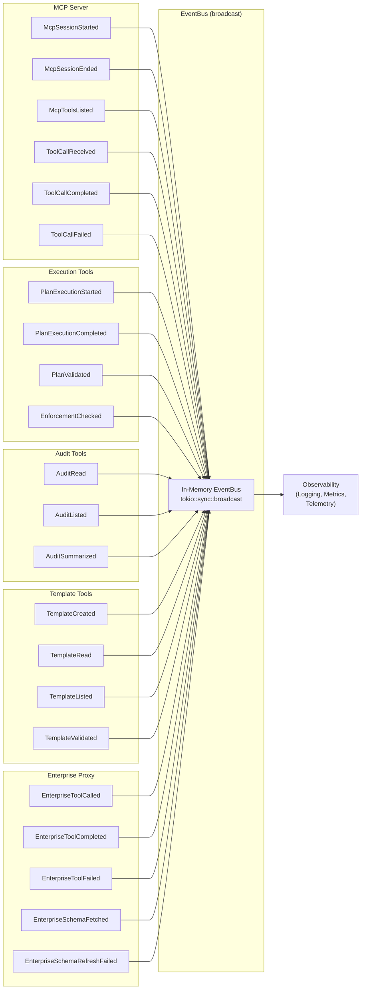

# Event Flow Diagram

## Overview

Domain events flowing between bounded contexts in the Rigorix MCP Gateway. Events are published to an in-process EventBus (tokio::sync::broadcast) for observability — logging, metrics, and telemetry. Events never carry operational logic.

## Event Flow Map

## Event Catalog

### MCP Server Events

| Event | Description | Payload | Consumers |
|-------|-------------|---------|-----------|
| **McpSessionStarted** | New MCP client session initialized | `{ session_id, client_info, capabilities, started_at }` | Logger, Metrics |
| **McpSessionEnded** | MCP client session closed | `{ session_id, reason (disconnect/timeout/error), duration_ms }` | Logger, Metrics |
| **McpToolsListed** | Client listed available tools | `{ session_id, tool_count, has_enterprise_tools }` | Logger |
| **ToolCallReceived** | Tool call request received | `{ session_id, tool_name, call_id, params_size }` | Logger, Metrics |
| **ToolCallCompleted** | Tool call succeeded | `{ session_id, tool_name, call_id, duration_ms }` | Logger, Metrics |
| **ToolCallFailed** | Tool call failed | `{ session_id, tool_name, call_id, error_code, error_message }` | Logger, Metrics, Alerts |

### Execution Tools Events

| Event | Description | Payload | Consumers |
|-------|-------------|---------|-----------|
| **PlanExecutionStarted** | Plan execution initiated | `{ execution_id, template_name, step_count, started_at }` | Logger, Metrics |
| **PlanExecutionCompleted** | Plan execution finished | `{ execution_id, status (success/failure/partial), duration_ms, token_count }` | Logger, Metrics, Audit |
| **PlanValidated** | Plan validation performed | `{ execution_id, is_valid, warning_count, error_count, estimated_cost }` | Logger |
| **EnforcementChecked** | Enforcement status queried | `{ session_id, preset, budget_remaining, circuit_breaker_count }` | Logger |

### Audit Tools Events

| Event | Description | Payload | Consumers |
|-------|-------------|---------|-----------|
| **AuditRead** | Audit record retrieved | `{ session_id, execution_id, format (text/json) }` | Logger |
| **AuditListed** | Audit records listed | `{ session_id, filter_criteria, result_count }` | Logger |
| **AuditSummarized** | Audit summary generated | `{ session_id, time_range, total_executions, success_rate }` | Logger |

### Template Tools Events

| Event | Description | Payload | Consumers |
|-------|-------------|---------|-----------|
| **TemplateCreated** | New template saved | `{ template_name, step_count, overwrite }` | Logger |
| **TemplateRead** | Template read | `{ template_name, format (json/toml) }` | Logger |
| **TemplateListed** | Templates listed | `{ filter_criteria, result_count }` | Logger |
| **TemplateValidated** | Template validated | `{ template_name, is_valid, errors }` | Logger |

### Enterprise Proxy Events

| Event | Description | Payload | Consumers |
|-------|-------------|---------|-----------|
| **EnterpriseToolCalled** | Enterprise tool call forwarded | `{ method, call_id, proxy_duration_ms }` | Logger, Metrics |
| **EnterpriseToolCompleted** | Enterprise tool call succeeded | `{ method, call_id, api_duration_ms, response_size }` | Logger, Metrics |
| **EnterpriseToolFailed** | Enterprise tool call failed | `{ method, call_id, error_type (api/network/timeout), error_message }` | Logger, Metrics, Alerts |
| **EnterpriseSchemaFetched** | Enterprise schemas cached | `{ tool_count, version, cached_at }` | Logger |
| **EnterpriseSchemaRefreshFailed** | Schema fetch failed | `{ error_message, retry_count }` | Logger, Alerts |

---

*Generated from session: d19b7a21-8f4c-4b3e-9a1d-5e6f7c8b9a0d*
*Updated: 2026-07-12*
