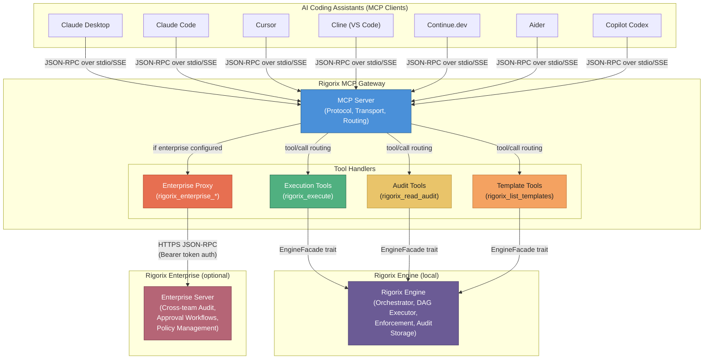

# System Context Diagram

## Overview

The Rigorix MCP Gateway bridges AI coding assistants to the Rigorix execution engine via the Model Context Protocol (MCP). It operates as a modular monolith with five bounded contexts.

## Bounded Contexts Flow

## Context Boundaries

| Boundary | Includes | Communication |
|----------|----------|---------------|
| **AI Tools** | MCP clients (7+ different tools) | JSON-RPC 2.0 over stdio or SSE |
| **MCP Gateway** | 5 bounded contexts in a Rust crate workspace | In-process trait calls + EventBus |
| **Rigorix Engine** | Orchestrator, DAG executor, enforcement, audit | Local engine API calls via EngineFacade trait |
| **Rigorix Enterprise** | Multi-team audit, approvals, policies | HTTPS JSON-RPC with Bearer token auth |

---

*Generated from session: d19b7a21-8f4c-4b3e-9a1d-5e6f7c8b9a0d*
*Updated: 2026-07-12*
