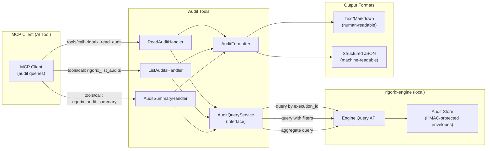
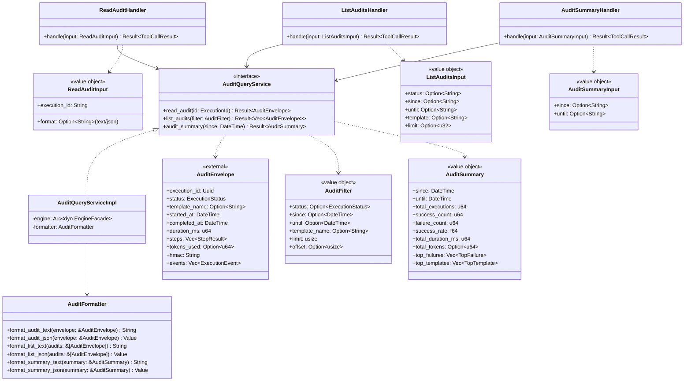
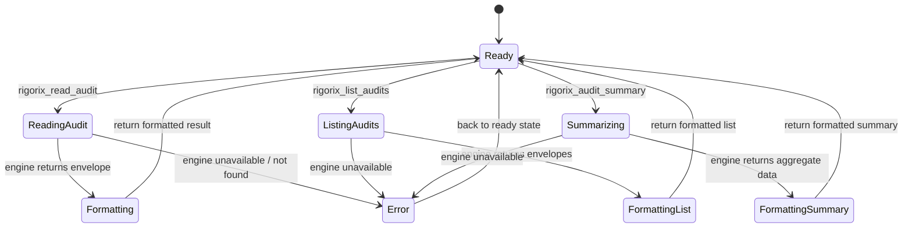
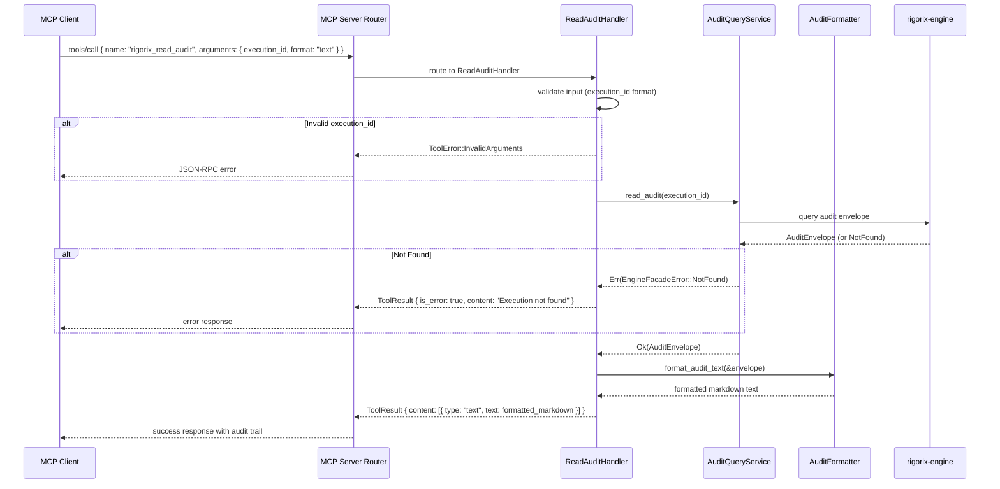

# Audit Tools

## Module Status

**Status:** Planned
**Last reviewed:** 2026-07-12
**Source session:** d19b7a21-8f4c-4b3e-9a1d-5e6f7c8b9a0d

## Description

Bridges MCP tool calls to rigorix-engine audit subsystem: read audit by ID (`rigorix_read_audit`), list recent audits (`rigorix_list_audits`), generate aggregate summaries (`rigorix_audit_summary`). All audit operations are **read-only** — the gateway never creates or modifies audit data.

## Architecture

This module follows **Domain-Driven Design** with Clean Architecture layers:

| Layer | Responsibility | Path |
|-------|---------------|------|
| **Domain** | AuditQueryService trait, AuditFilter, AuditSummary, audit formatting contracts | `src/audit-tools/domain/` |
| **Application** | Use cases for read audit, list audits, audit summary | `src/audit-tools/application/` |
| **Infrastructure** | Audit query implementation via EngineFacade, format serialization | `src/audit-tools/infrastructure/` |
| **Interfaces** | MCP tool handlers exposing rigorix_read_audit, rigorix_list_audits, rigorix_audit_summary | `src/audit-tools/interfaces/` |

## Related ADRs

| ADR | Relevance |
|-----|-----------|
| [ADR-001](./decisions/ADR-001-architecture-pattern.md) | Audit Tools is one of the 5 bounded contexts in the modular monolith |
| [ADR-003](./decisions/ADR-003-cross-context-communication.md) | Defines EngineFacade trait — Audit Tools uses EngineFacade for all audit queries |
| [ADR-006](./decisions/ADR-006-cost-tracking-usage-metering.md) | Defines cost tracking delegation — AuditSummaryHandler computes aggregates from engine data |
| [ADR-007](./decisions/ADR-007-compliance-engine-architecture.md) | Defines read-only audit bridge principle — directly governs all audit tool implementations |

## Diagrams

### Data Flow



### Entity Relationship



### Aggregate State



### Key Use Case Sequence: Read and Format Audit



## Components

### AuditQueryService (Aggregate Root)

Service that queries audit records from rigorix-engine and formats them for MCP.

**Invariants:**
- Read-only — never creates, modifies, or deletes audit data
- Always queries rigorix-engine directly (no local cache)
- Returns NotFound error for unknown execution IDs (not a panic)
- AuditEnvelope HMAC integrity is validated by rigorix-engine, not the gateway

**Key Methods:**
```rust
#[async_trait]
pub trait AuditQueryService: Send + Sync {
    async fn read_audit(&self, execution_id: &ExecutionId) -> Result<AuditEnvelope, AuditError>;
    async fn list_audits(&self, filter: AuditFilter) -> Result<Vec<AuditEnvelope>, AuditError>;
    async fn audit_summary(&self, since: DateTime, until: DateTime) -> Result<AuditSummary, AuditError>;
}

pub struct AuditQueryServiceImpl {
    engine: Arc<dyn EngineFacade>,
    formatter: AuditFormatter,
}

impl AuditQueryServiceImpl {
    pub fn new(engine: Arc<dyn EngineFacade>) -> Self;
}
```

### ReadAuditHandler (Domain Service)

Handles `rigorix_read_audit` tool calls: retrieves audit by execution ID.

```rust
pub struct ReadAuditHandler {
    query_service: Arc<dyn AuditQueryService>,
}

impl ReadAuditHandler {
    pub fn new(query_service: Arc<dyn AuditQueryService>) -> Self;

    pub async fn handle(&self, input: ReadAuditInput) -> Result<ToolCallResult, HandlerError> {
        let execution_id = ExecutionId::from_str(&input.execution_id)
            .map_err(|_| HandlerError::InvalidArgument("execution_id"))?;

        let envelope = self.query_service.read_audit(&execution_id).await?;

        let formatted = match input.format.as_deref() {
            Some("json") => AuditFormatter::format_audit_json(&envelope),
            _ => AuditFormatter::format_audit_text(&envelope),
        };

        Ok(ToolCallResult::success(formatted))
    }
}
```

### ListAuditsHandler (Domain Service)

Handles `rigorix_list_audits` tool calls: lists recent executions with filtering.

```rust
pub struct ListAuditsHandler {
    query_service: Arc<dyn AuditQueryService>,
}

impl ListAuditsHandler {
    pub fn new(query_service: Arc<dyn AuditQueryService>) -> Self;

    pub async fn handle(&self, input: ListAuditsInput) -> Result<ToolCallResult, HandlerError> {
        let filter = AuditFilter::from_input(input)?;
        let envelopes = self.query_service.list_audits(filter).await?;
        Ok(ToolCallResult::success(AuditFormatter::format_list_text(&envelopes)))
    }
}
```

### AuditSummaryHandler (Domain Service)

Handles `rigorix_audit_summary` tool calls: generates aggregate statistics.

```rust
pub struct AuditSummaryHandler {
    query_service: Arc<dyn AuditQueryService>,
}

impl AuditSummaryHandler {
    pub fn new(query_service: Arc<dyn AuditQueryService>) -> Self;

    pub async fn handle(&self, input: AuditSummaryInput) -> Result<ToolCallResult, HandlerError> {
        let since = input.since
            .map(|s| DateTime::from_str(&s))
            .unwrap_or_else(|| DateTime::now() - Duration::days(7))?;
        let until = input.until
            .map(|s| DateTime::from_str(&s))
            .unwrap_or_else(|| DateTime::now())?;

        let summary = self.query_service.audit_summary(since, until).await?;
        Ok(ToolCallResult::success(AuditFormatter::format_summary_text(&summary)))
    }
}
```

### AuditFormatter (Domain Service)

Formats audit data for MCP consumption: human-readable markdown or structured JSON.

```rust
pub struct AuditFormatter;

impl AuditFormatter {
    pub fn format_audit_text(envelope: &AuditEnvelope) -> String;
    pub fn format_audit_json(envelope: &AuditEnvelope) -> Value;
    pub fn format_list_text(audits: &[AuditEnvelope]) -> String;
    pub fn format_list_json(audits: &[AuditEnvelope]) -> Value;
    pub fn format_summary_text(summary: &AuditSummary) -> String;
    pub fn format_summary_json(summary: &AuditSummary) -> Value;
}
```

## Domain Events

| Event | Description | Trigger | Payload | Published By |
|-------|-------------|---------|---------|-------------|
| AuditRead | An audit record was read via `rigorix_read_audit` | ReadAuditHandler | `{ session_id, execution_id, format }` | ReadAuditHandler |
| AuditListed | Audit records were listed via `rigorix_list_audits` | ListAuditsHandler | `{ session_id, filter_criteria, result_count }` | ListAuditsHandler |
| AuditSummarized | An audit summary was generated via `rigorix_audit_summary` | AuditSummaryHandler | `{ session_id, time_range, total_executions, success_rate }` | AuditSummaryHandler |

## API Endpoints (MCP Tool Schemas)

| Method | Path (tool name) | Handler | Input | Output | Auth |
|--------|-----------------|---------|-------|--------|------|
| `rigorix_read_audit` | `tools/call` | ReadAuditHandler | `{ execution_id: string, format?: "text" \| "json" }` | `{ execution_id, status, template_name, started_at, completed_at, duration_ms, steps, tokens_used?, audit_uri }` | Session-bound |
| `rigorix_list_audits` | `tools/call` | ListAuditsHandler | `{ status?: string, since?: string, until?: string, template?: string, limit?: number }` | `{ total_count, audits: [{ execution_id, status, template_name, started_at, duration_ms, audit_uri }] }` | Session-bound |
| `rigorix_audit_summary` | `tools/call` | AuditSummaryHandler | `{ since?: string, until?: string }` | `{ since, until, total_executions, success_count, failure_count, success_rate, total_duration_ms, total_tokens?, top_failures: [...], top_templates: [...] }` | Session-bound |

## Ubiquitous Language

Terms specific to this context from `.pi/domain/ubiquitous-language.md`:

| Term | Definition |
|------|-----------|
| **AuditQueryService** | Aggregate root providing read-only access to execution audit records from rigorix-engine |
| **ReadAuditHandler** | Domain service that handles `rigorix_read_audit` tool calls: retrieves audit by execution ID |
| **ListAuditsHandler** | Domain service that handles `rigorix_list_audits` tool calls: lists recent executions with filters |
| **AuditSummaryHandler** | Domain service that handles `rigorix_audit_summary` tool calls: generates aggregate statistics |
| **AuditFormatter** | Domain service that formats audit data for MCP consumption as human-readable markdown or structured JSON |
| **AuditFilter** | Value object with criteria for listing audit records: status, time range, template name, limit |
| **AuditSummary** | Value object with aggregate audit statistics over a time range: total executions, success rate, top failures, top templates |

## Dependencies

### Depends On
- **MCP Server**: Receives tool calls routed from RequestRouter; registers tool schemas via ToolRegistry
- **Execution Tools**: Shares EngineFacade trait for audit queries — reads audit data from rigorix-engine through the same facade interface

### Used By
- **None directly**: Audit Tools is a leaf handler — other modules don't call it

## Implementation Sequence

1. **Phase 1.1 — AuditQueryService Contract**: Define `AuditQueryService` trait, `AuditFilter`, `AuditSummary` value objects, `AuditEnvelope` types
2. **Phase 1.2 — AuditFormatter**: Implement markdown and JSON formatting for audit envelopes, lists, and summaries
3. **Phase 1.3 — ReadAuditHandler**: Implement `rigorix_read_audit` with execution ID validation and format selection
4. **Phase 1.4 — ListAuditsHandler**: Implement `rigorix_list_audits` with filter parsing and result pagination
5. **Phase 1.5 — AuditSummaryHandler**: Implement `rigorix_audit_summary` with time-range parsing
6. **Phase 1.6 — MCP Schema Registration**: Register all three audit tool schemas in ToolRegistry

**depends:** MCP Server (Phase 0), Execution Tools (Phase 1 — for EngineFacade trait)
