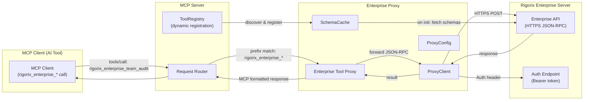
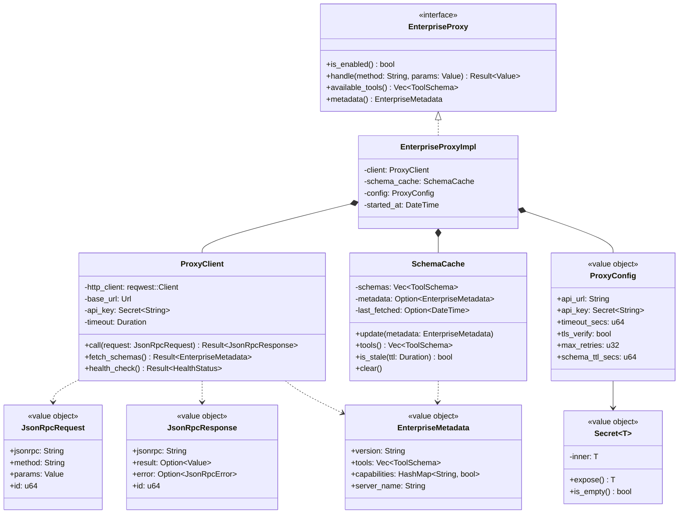
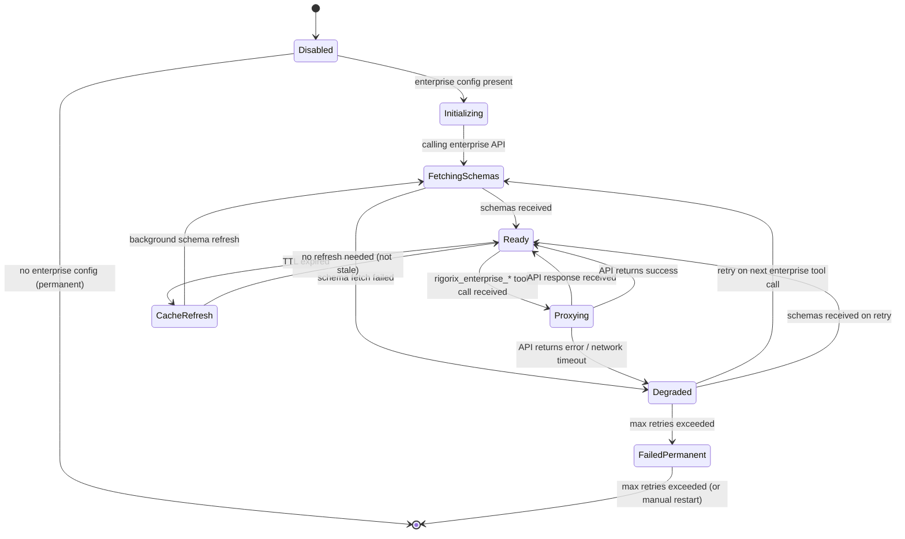
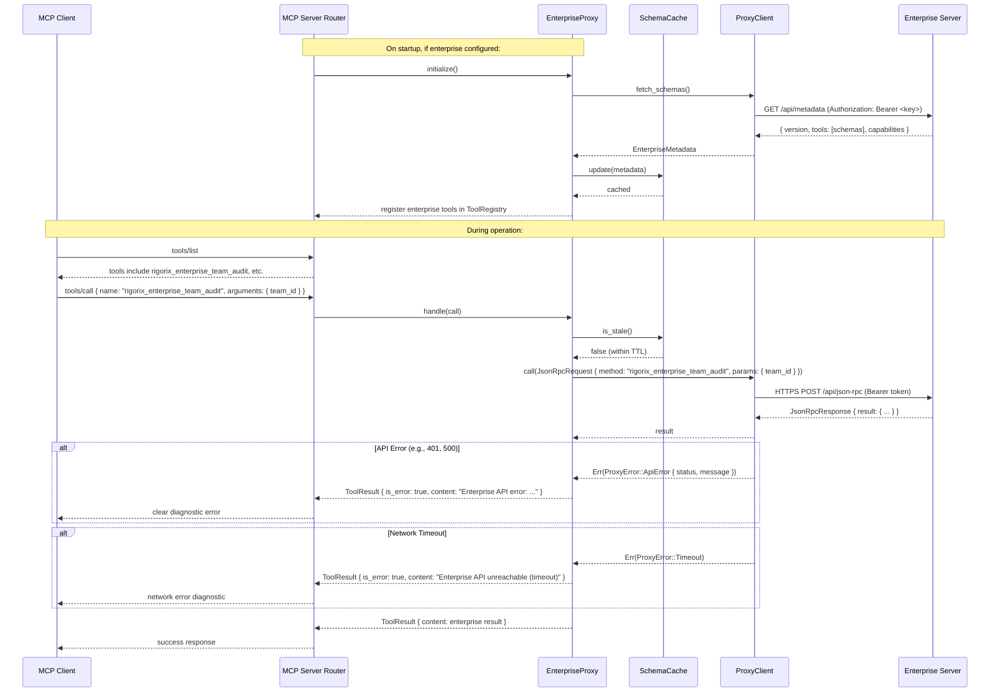

# Enterprise Proxy

## Module Status

**Status:** Planned
**Last reviewed:** 2026-07-12
**Source session:** d19b7a21-8f4c-4b3e-9a1d-5e6f7c8b9a0d

## Description

Forwards `rigorix_enterprise_*` tool calls to the Rigorix Enterprise API via HTTP JSON-RPC; discovers available enterprise tools dynamically during initialization. This is a **conditional module** — when no enterprise configuration is present, zero enterprise code is loaded, and no `rigorix_enterprise_*` tools appear in the MCP tool list.

## Architecture

This module follows **Domain-Driven Design** with Clean Architecture layers:

| Layer | Responsibility | Path |
|-------|---------------|------|
| **Domain** | EnterpriseProxy trait, ProxyConfig, EnterpriseMetadata, JsonRpcRequest/Response | `src/enterprise-proxy/domain/` |
| **Application** | Proxy initialization, tool call routing, schema caching | `src/enterprise-proxy/application/` |
| **Infrastructure** | Reqwest HTTP client, Bearer token auth, TLS verification | `src/enterprise-proxy/infrastructure/` |
| **Interfaces** | MCP tool handler that accepts all `rigorix_enterprise_*` calls and proxies them | `src/enterprise-proxy/interfaces/` |

## Related ADRs

| ADR | Relevance |
|-----|-----------|
| [ADR-001](./decisions/ADR-001-architecture-pattern.md) | Enterprise Proxy is a feature-gated crate that conditionally compiles; zero enterprise code in OSS binary without feature flag |
| [ADR-003](./decisions/ADR-003-cross-context-communication.md) | Defines conditional composition at binary level — EnterpriseProxy is `Option<Arc<dyn EnterpriseProxy>>` injected at startup |
| [ADR-004](./decisions/ADR-004-mcp-protocol-design.md) | Defines rigorous tool naming convention (`rigorix_enterprise_*`) that Enterprise Proxy depends on for routing |
| [ADR-005](./decisions/ADR-005-authentication-and-authorization.md) | Defines Bearer token auth and HTTPS enforcement — directly governs ProxyClient implementation |

## Diagrams

### Data Flow



### Entity Relationship



### Aggregate State



### Key Use Case Sequence: Enterprise Tool Call Proxy



## Components

### EnterpriseProxy (Aggregate Root)

Proxies `rigorix_enterprise_*` tool calls to the enterprise API.

**Invariants:**
- Zero enterprise code loaded when `enterprise.api_url` is not configured
- Enterprise API key is stored as `Secret` type — never logged, always redacted
- Failures never cascade to OSS tools — clear diagnostic errors returned
- Tool schemas are cached for server lifetime (with optional TTL-based refresh)
- Proxy is forward-compatible — new enterprise tools require no OSS changes

**Key Methods:**
```rust
#[async_trait]
pub trait EnterpriseProxy: Send + Sync {
    fn is_enabled(&self) -> bool;
    fn available_tools(&self) -> Vec<ToolSchema>;
    fn metadata(&self) -> Option<EnterpriseMetadata>;
    async fn handle(&self, method: &str, params: Value) -> Result<Value, ProxyError>;
    async fn initialize(&self) -> Result<(), ProxyError>;
}

pub struct EnterpriseProxyImpl {
    client: ProxyClient,
    schema_cache: SchemaCache,
    config: ProxyConfig,
}

impl EnterpriseProxyImpl {
    pub fn new(config: ProxyConfig) -> Self;

    pub async fn initialize(&self) -> Result<(), ProxyError> {
        let metadata = self.client.fetch_schemas().await?;
        self.schema_cache.update(metadata);
        Ok(())
    }
}
```

### ProxyClient (Domain Service)

HTTP client for JSON-RPC communication with enterprise API.

```rust
pub struct ProxyClient {
    http_client: reqwest::Client,
    base_url: Url,
    api_key: Secret<String>,
    timeout: Duration,
}

impl ProxyClient {
    pub fn new(config: &ProxyConfig) -> Result<Self, ProxyError> {
        let tls = if config.tls_verify {
            reqwest::Client::builder()
                .danger_accept_invalid_certs(false)
        } else {
            reqwest::Client::builder()
                .danger_accept_invalid_certs(true)
        };

        let http_client = tls
            .timeout(Duration::from_secs(config.timeout_secs))
            .build()
            .map_err(|e| ProxyError::Configuration(format!("HTTP client: {}", e)))?;

        Ok(Self {
            http_client,
            base_url: Url::parse(&config.api_url)
                .map_err(|e| ProxyError::Configuration(format!("Invalid URL: {}", e)))?,
            api_key: config.api_key.clone(),
            timeout: Duration::from_secs(config.timeout_secs),
        })
    }

    pub async fn call(&self, request: JsonRpcRequest) -> Result<JsonRpcResponse, ProxyError> {
        let url = self.base_url.join("/api/json-rpc")
            .map_err(|e| ProxyError::Configuration(e.to_string()))?;

        let response = self.http_client
            .post(url)
            .header("Authorization", format!("Bearer {}", self.api_key.expose()))
            .header("Content-Type", "application/json")
            .json(&request)
            .send()
            .await
            .map_err(|e| ProxyError::Transport(e.to_string()))?;

        if !response.status().is_success() {
            let status = response.status();
            let body = response.text().await.unwrap_or_default();
            return Err(ProxyError::ApiError {
                status: status.as_u16(),
                message: body,
            });
        }

        response.json::<JsonRpcResponse>()
            .await
            .map_err(|e| ProxyError::Deserialization(e.to_string()))
    }

    pub async fn fetch_schemas(&self) -> Result<EnterpriseMetadata, ProxyError> {
        let url = self.base_url.join("/api/metadata")
            .map_err(|e| ProxyError::Configuration(e.to_string()))?;

        let response = self.http_client
            .get(url)
            .header("Authorization", format!("Bearer {}", self.api_key.expose()))
            .send()
            .await
            .map_err(|e| ProxyError::Transport(e.to_string()))?;

        let metadata = response.json::<EnterpriseMetadata>().await
            .map_err(|e| ProxyError::Deserialization(e.to_string()))?;

        Ok(metadata)
    }
}
```

### SchemaCache (Domain Service)

Caches enterprise tool schemas for capability negotiation during MCP initialization.

```rust
pub struct SchemaCache {
    schemas: Vec<ToolSchema>,
    metadata: Option<EnterpriseMetadata>,
    last_fetched: Option<DateTime>,
}

impl SchemaCache {
    pub fn new() -> Self;

    pub fn update(&mut self, metadata: EnterpriseMetadata) {
        self.metadata = Some(metadata.clone());
        self.schemas = metadata.tools;
        self.last_fetched = Some(DateTime::now());
    }

    pub fn tools(&self) -> &[ToolSchema] {
        &self.schemas
    }

    pub fn is_stale(&self, ttl: Duration) -> bool {
        match self.last_fetched {
            Some(t) => DateTime::now() - t > ttl,
            None => true,
        }
    }

    pub fn clear(&mut self) {
        self.schemas.clear();
        self.metadata = None;
        self.last_fetched = None;
    }
}
```

## Domain Events

| Event | Description | Trigger | Payload | Published By |
|-------|-------------|---------|---------|-------------|
| EnterpriseToolCalled | An enterprise-prefixed tool call was forwarded to the enterprise API | EnterpriseProxy.on tool call routing | `{ method, call_id, proxy_duration_ms }` | EnterpriseProxy |
| EnterpriseToolCompleted | An enterprise tool call completed successfully | EnterpriseProxy on successful response | `{ method, call_id, api_duration_ms, response_size }` | EnterpriseProxy |
| EnterpriseToolFailed | An enterprise tool call failed | EnterpriseProxy on error from enterprise API | `{ method, call_id, error_type, error_message }` | EnterpriseProxy |
| EnterpriseSchemaFetched | Enterprise tool schemas were fetched and cached | SchemaCache during proxy initialization | `{ tool_count, version, cached_at }` | SchemaCache |
| EnterpriseSchemaRefreshFailed | Enterprise tool schema fetch failed | SchemaCache on fetch error | `{ error_message, retry_count }` | SchemaCache |

## API Endpoints (MCP Tool Schemas)

The enterprise tools are **dynamically discovered** — they are not compiled into the OSS binary. The table below shows representative examples of what an enterprise server might expose:

| Method (example) | Path (tool name) | Handler | Input | Output | Auth |
|-------------------|-----------------|---------|-------|--------|------|
| `rigorix_enterprise_team_audit` | `tools/call` | EnterpriseProxy | `{ team_id, since?, until?, limit? }` | Proxied enterprise response | Enterprise API key (Bearer token) |
| `rigorix_enterprise_approve` | `tools/call` | EnterpriseProxy | `{ approval_id, decision }` | Proxied enterprise response | Enterprise API key |
| `rigorix_enterprise_policies` | `tools/call` | EnterpriseProxy | `{ action: "list" / "update", policy?: PolicyConfig }` | Proxied enterprise response | Enterprise API key |
| `rigorix_enterprise_usage_report` | `tools/call` | EnterpriseProxy | `{ team_id, since, until, group_by }` | Proxied enterprise response | Enterprise API key |

> **Note:** The actual tool set is defined by the enterprise server and discovered dynamically during initialization. The examples above are illustrative — the gateway is forward-compatible with any enterprise tools.

## Ubiquitous Language

Terms specific to this context from `.pi/domain/ubiquitous-language.md`:

| Term | Definition |
|------|-----------|
| **EnterpriseProxy** | Aggregate root that forwards `rigorix_enterprise_*` MCP tool calls to the Rigorix Enterprise API via HTTP JSON-RPC |
| **ProxyClient** | Domain service providing the HTTP client for JSON-RPC communication with the enterprise API |
| **SchemaCache** | Domain service that caches enterprise tool schemas for capability negotiation during MCP initialization |
| **EnterpriseMetadata** | Value object returned by enterprise API during initialization: API version, available tools, capabilities |
| **ProxyConfig** | Value object with enterprise connection settings: api_url, api_key (Secret), timeout, tls_verify, max_retries |

## Dependencies

### Depends On
- **MCP Server**: Receives tool calls routed from RequestRouter; registers enterprise tool schemas dynamically via ToolRegistry
- **reqwest (external)**: HTTP client for enterprise API communication

### Used By
- **None directly**: Enterprise Proxy is a standalone proxying module — other modules don't interact with it

## Implementation Sequence

1. **Phase 2.1 — ProxyConfig & Secret Type**: Define `ProxyConfig` value object, implement `Secret<T>` wrapper with redacted Debug/Display/Serialize
2. **Phase 2.2 — JSON-RPC Types**: Define `JsonRpcRequest`, `JsonRpcResponse` value objects with serde
3. **Phase 2.3 — ProxyClient**: Implement HTTP client with reqwest, Bearer token auth, TLS enforcement, timeout handling
4. **Phase 2.4 — SchemaCache**: Implement in-memory schema cache with TTL-based staleness check
5. **Phase 2.5 — EnterpriseProxyImpl**: Implement proxy handler with method forwarding, error mapping, event publishing
6. **Phase 2.6 — EnterpriseProxy Trait**: Define trait with `initialize()`, `handle()`, `available_tools()`, `is_enabled()`
7. **Phase 2.7 — Conditional Integration**: Wire into binary composition root with feature flag + config check
8. **Phase 2.8 — Error Diagnostics**: Implement clear diagnostic error messages for all failure modes (API error, network error, timeout, auth failure)

**depends:** MCP Server (Phase 0)
**feature-gated:** Cargo feature `enterprise` (default off)
