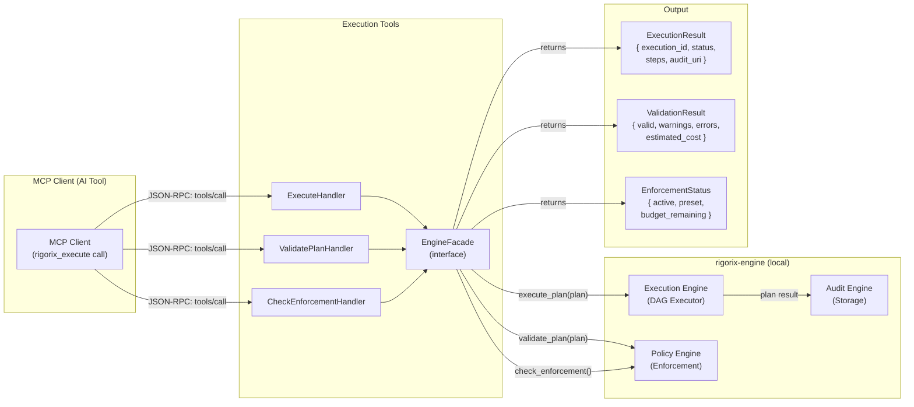
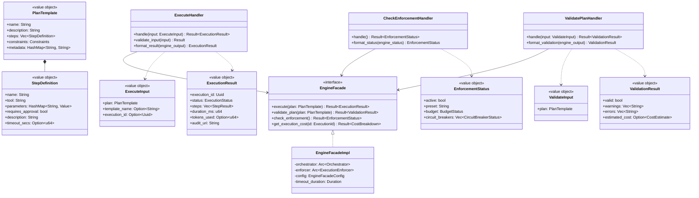
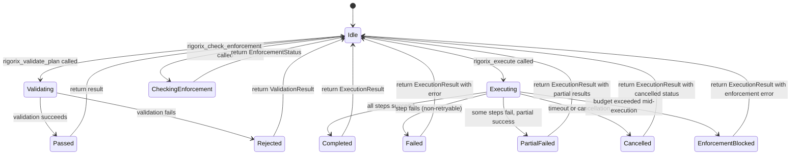
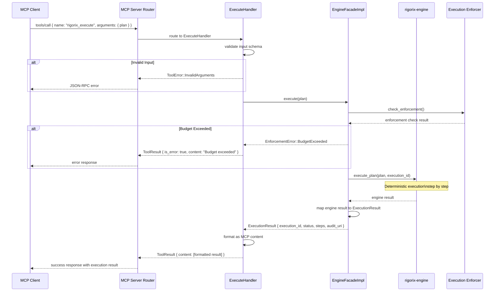

# Execution Tools

## Module Status

**Status:** Planned
**Last reviewed:** 2026-07-12
**Source session:** d19b7a21-8f4c-4b3e-9a1d-5e6f7c8b9a0d

## Description

Bridges MCP tool calls to rigorix-engine: plan execution (`rigorix_execute`), pre-flight validation (`rigorix_validate_plan`), and enforcement status checks (`rigorix_check_enforcement`). This is the **primary value-add** of the MCP Gateway — AI assistants get deterministic execution through Rigorix.

## Architecture

This module follows **Domain-Driven Design** with Clean Architecture layers:

| Layer | Responsibility | Path |
|-------|---------------|------|
| **Domain** | EngineFacade trait, PlanTemplate, StepDefinition, execution result types | `src/execution-tools/domain/` |
| **Application** | Use cases for execute, validate, check enforcement | `src/execution-tools/application/` |
| **Infrastructure** | EngineFacade implementation (rigorix-engine client), timeout enforcement | `src/execution-tools/infrastructure/` |
| **Interfaces** | MCP tool handlers exposing rigorix_execute, rigorix_validate_plan, rigorix_check_enforcement | `src/execution-tools/interfaces/` |

## Related ADRs

| ADR | Relevance |
|-----|-----------|
| [ADR-001](./decisions/ADR-001-architecture-pattern.md) | Execution Tools is one of the 5 bounded contexts in the modular monolith |
| [ADR-003](./decisions/ADR-003-cross-context-communication.md) | Defines EngineFacade trait pattern — execution tools implement the primary facade interface that all handler contexts use |
| [ADR-006](./decisions/ADR-006-cost-tracking-usage-metering.md) | Defines cost tracking delegation — execution tools query engine for enforcement status and costs |
| [ADR-007](./decisions/ADR-007-compliance-engine-architecture.md) | Defines compliance read-only principle — execution tools generate execution IDs but never modify audit state |

## Diagrams

### Data Flow



### Entity Relationship



### Aggregate State



### Key Use Case Sequence: Execute Plan



## Components

### EngineFacade (Aggregate Root)

Thin async facade over rigorix-engine that all execution/audit/template tools call through.

**Invariants:**
- All method calls are governed by configurable timeout
- Never panics — errors are wrapped in `EngineFacadeError`
- Enforcement status is always fresh (never cached — queries engine on each call)
- Execution IDs are generated by rigorix-engine, not the gateway

**Key Methods:**
```rust
#[async_trait]
pub trait EngineFacade: Send + Sync {
    async fn execute(&self, plan: PlanTemplate) -> Result<ExecutionResult, EngineFacadeError>;
    async fn validate_plan(&self, plan: PlanTemplate) -> Result<ValidationResult, EngineFacadeError>;
    async fn check_enforcement(&self) -> Result<EnforcementStatus, EngineFacadeError>;
    async fn get_execution_cost(&self, execution_id: &ExecutionId) -> Result<CostBreakdown, EngineFacadeError>;
}

pub struct EngineFacadeImpl {
    orchestrator: Arc<Orchestrator>,
    enforcer: Arc<ExecutionEnforcer>,
    audit_query: Arc<dyn AuditQuery>,
    config: EngineFacadeConfig,
}

impl EngineFacadeImpl {
    pub fn new(
        orchestrator: Arc<Orchestrator>,
        enforcer: Arc<ExecutionEnforcer>,
        audit_query: Arc<dyn AuditQuery>,
        config: EngineFacadeConfig,
    ) -> Self;
}
```

### ExecuteHandler (Domain Service)

Handles `rigorix_execute` tool calls: validates input, delegates to engine, formats result.

```rust
pub struct ExecuteHandler {
    engine: Arc<dyn EngineFacade>,
    timeout_duration: Duration,
}

impl ExecuteHandler {
    pub fn new(engine: Arc<dyn EngineFacade>, timeout_duration: Duration) -> Self;

    pub async fn handle(&self, input: ExecuteInput) -> Result<ToolCallResult, HandlerError> {
        // 1. Validate input schema
        let plan = PlanTemplate::from_json(input.plan)?;

        // 2. Execute with timeout
        let result = tokio::time::timeout(
            self.timeout_duration,
            self.engine.execute(plan),
        )
        .await
        .map_err(|_| HandlerError::Timeout)??;

        // 3. Format as MCP content
        Ok(self.format_execution_result(result))
    }
}
```

### ValidatePlanHandler (Domain Service)

Handles `rigorix_validate_plan` tool calls: checks plan against enforcement policies.

```rust
pub struct ValidatePlanHandler {
    engine: Arc<dyn EngineFacade>,
}

impl ValidatePlanHandler {
    pub fn new(engine: Arc<dyn EngineFacade>) -> Self;

    pub async fn handle(&self, input: ValidateInput) -> Result<ToolCallResult, HandlerError> {
        let plan = PlanTemplate::from_json(input.plan)?;
        let result = self.engine.validate_plan(plan).await?;
        Ok(self.format_validation_result(result))
    }
}
```

### CheckEnforcementHandler (Domain Service)

Handles `rigorix_check_enforcement` tool calls: queries engine for current budget/limits.

```rust
pub struct CheckEnforcementHandler {
    engine: Arc<dyn EngineFacade>,
}

impl CheckEnforcementHandler {
    pub fn new(engine: Arc<dyn EngineFacade>) -> Self;

    pub async fn handle(&self) -> Result<ToolCallResult, HandlerError> {
        let status = self.engine.check_enforcement().await?;
        Ok(self.format_enforcement_status(status))
    }
}
```

## Domain Events

| Event | Description | Trigger | Payload | Published By |
|-------|-------------|---------|---------|-------------|
| PlanExecutionStarted | A plan execution was initiated via `rigorix_execute` | ExecuteHandler on receiving valid plan | `{ execution_id, template_name, step_count, started_at }` | ExecuteHandler |
| PlanExecutionCompleted | A plan execution completed (success, failure, or partial) | ExecuteHandler after engine returns result | `{ execution_id, status, duration_ms, token_count }` | ExecuteHandler |
| PlanValidated | A plan was validated via `rigorix_validate_plan` | ValidatePlanHandler | `{ session_id, is_valid, warning_count, error_count, estimated_cost }` | ValidatePlanHandler |
| EnforcementChecked | Enforcement status was queried via `rigorix_check_enforcement` | CheckEnforcementHandler | `{ session_id, preset, budget_remaining, circuit_breaker_count }` | CheckEnforcementHandler |

## API Endpoints (MCP Tool Schemas)

| Method | Path (tool name) | Handler | Input | Output | Auth |
|--------|-----------------|---------|-------|--------|------|
| `rigorix_execute` | `tools/call` | ExecuteHandler | `{ plan: PlanTemplate, template_name?: string, execution_id?: string }` | `{ execution_id, status, steps, duration_ms, tokens_used?, audit_uri }` | Session-bound |
| `rigorix_validate_plan` | `tools/call` | ValidatePlanHandler | `{ plan: PlanTemplate }` | `{ valid, warnings, errors, estimated_cost? }` | Session-bound |
| `rigorix_check_enforcement` | `tools/call` | CheckEnforcementHandler | `{}` | `{ active, preset, budget: { tool_calls_total, tool_calls_remaining, tokens_total, tokens_remaining }, circuit_breakers }` | Session-bound |

## Ubiquitous Language

Terms specific to this context from `.pi/domain/ubiquitous-language.md`:

| Term | Definition |
|------|-----------|
| **EngineFacade** | Aggregate root providing a thin async facade over rigorix-engine public APIs for all MCP tool handlers |
| **ExecuteHandler** | Domain service that handles `rigorix_execute` tool calls: validates input, executes via engine, returns results |
| **ValidatePlanHandler** | Domain service that handles `rigorix_validate_plan` tool calls: checks plan against enforcement policies |
| **CheckEnforcementHandler** | Domain service that handles `rigorix_check_enforcement` tool calls: queries engine for current budget and limits |
| **PlanTemplate** | Value object shared between execution and template contexts: a structured plan with steps, constraints, and metadata |
| **StepDefinition** | Value object representing a single step in a plan: tool name, parameters, approval requirement, description |
| **ExecutionResult** | Value object returned by `rigorix_execute`: execution_id, status, per-step results, duration, tokens, audit_uri |
| **ValidationResult** | Value object returned by `rigorix_validate_plan`: valid flag, warnings, errors, estimated cost |
| **EnforcementStatus** | Value object returned by `rigorix_check_enforcement`: active, preset, remaining budget, circuit breaker states |

## Dependencies

### Depends On
- **MCP Server**: Receives tool calls routed from RequestRouter; registers tool schemas and handlers via ToolRegistry
- **rigorix-engine (external)**: All execution, validation, and enforcement queries delegated via EngineFacade trait

### Used By
- **Audit Tools**: Shares EngineFacade trait for audit queries (reads from rigorix-engine)
- **Template Tools**: Shares EngineFacade trait for template validation against enforcement policies
- **Binary Compose**: All three handler modules are wired together at the composition root

## Implementation Sequence

1. **Phase 1.1 — EngineFacade Contract**: Define `EngineFacade` trait, `PlanTemplate` value object, `StepDefinition`, execution result types
2. **Phase 1.2 — EngineFacade Implementation**: Implement `EngineFacadeImpl` wrapping rigorix-engine APIs
3. **Phase 1.3 — ExecuteHandler**: Implement `rigorix_execute` handler with input validation, timeout enforcement, result formatting
4. **Phase 1.4 — ValidatePlanHandler**: Implement `rigorix_validate_plan` handler delegating to engine validation
5. **Phase 1.5 — CheckEnforcementHandler**: Implement `rigorix_check_enforcement` handler for budget/status queries
6. **Phase 1.6 — MCP Schema Registration**: Register tool schemas in ToolRegistry, wire handlers via RequestRouter
7. **Phase 1.7 — SSE Progress Notifications**: Add streaming progress updates for long-running `rigorix_execute` calls (SSE only)

**depends:** MCP Server (Phase 0)
