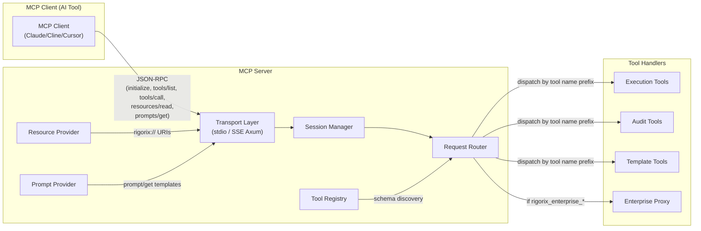
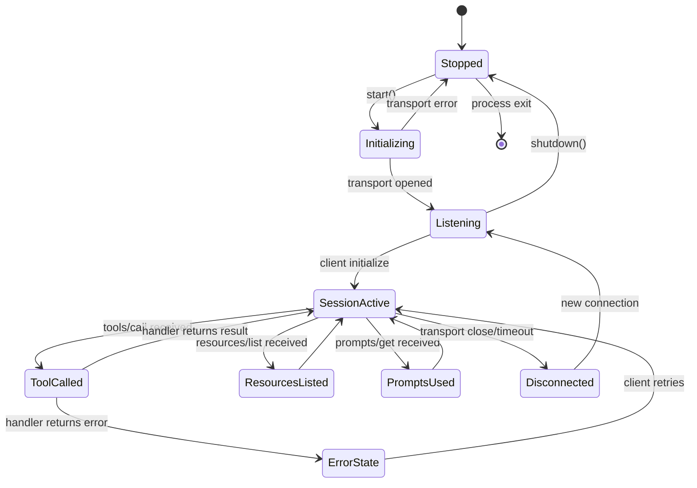
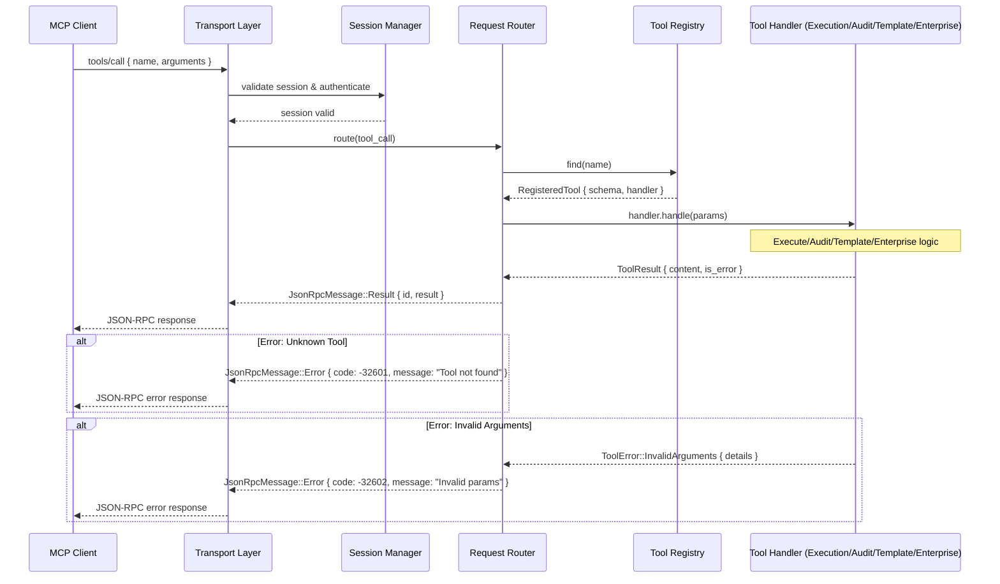

# MCP Server

## Module Status

**Status:** Planned
**Last reviewed:** 2026-07-12
**Source session:** d19b7a21-8f4c-4b3e-9a1d-5e6f7c8b9a0d

## Description

Core protocol implementation: transport management, session lifecycle, tool registration, request routing, resource exposure, prompt templates. This is the **entry point** for all MCP client connections — every tool call, resource read, and prompt request arrives here first.

## Architecture

This module follows **Domain-Driven Design** with Clean Architecture layers:

| Layer | Responsibility | Path |
|-------|---------------|------|
| **Domain** | Aggregates, entities, value objects, domain services, repository interfaces | `src/mcp-server/domain/` |
| **Application** | Use cases, DTOs, input validation, session management | `src/mcp-server/application/` |
| **Infrastructure** | Transport implementations (stdio, SSE-Axum), JSON-RPC serialization | `src/mcp-server/infrastructure/` |
| **Interfaces** | MCP protocol handlers, tool routing, resource/prompt providers | `src/mcp-server/interfaces/` |

## Related ADRs

| ADR | Relevance |
|-----|-----------|
| [ADR-001](./decisions/ADR-001-architecture-pattern.md) | Defines the modular monolith structure; MCP Server is the binary composition root entry point |
| [ADR-003](./decisions/ADR-003-cross-context-communication.md) | Defines trait-based DI at composition root; MCP Server owns the RequestRouter that dispatches to handlers |
| [ADR-004](./decisions/ADR-004-mcp-protocol-design.md) | Defines MCP protocol design — hand-rolled JSON-RPC, Axum for SSE, transport patterns — directly governs MCP Server implementation |
| [ADR-005](./decisions/ADR-005-authentication-and-authorization.md) | Defines transport-level security (stdio trust, localhost-only SSE) that MCP Server enforces |

## Diagrams

### Data Flow



### Entity Relationship

```mermaid
classDiagram
    class McpServer {
        +McpServerId id
        +McpTransport transport
        +SessionManager session_manager
        +ToolRegistry tool_registry
        +RequestRouter router
        +ResourceProvider resource_provider
        +PromptProvider prompt_provider
        +ServerConfig config
        +start() Result
        +shutdown() Result
    }

    class McpTransport {
        <<interface>>
        +listen() Result~TransportHandle~
        +send(message: JsonRpcMessage) Result
        +close() Result
    }

    class StdioTransport {
        +reader: BufReader~Stdin~
        +writer: BufWriter~Stdout~
    }

    class SseTransport {
        +axum_router: Router
        +bind_address: SocketAddr
        +connections: Arc~RwLock~HashMap~SseConnectionId, SseConnection~~~
    }

    class Session {
        +SessionId id
        +ClientInfo client_info
        +ClientCapabilities capabilities
        +ServerCapabilities negotiated
        +SessionStatus status
        +started_at: DateTime
        +SessionMetadata metadata
    }

    class SessionManager {
        +sessions: HashMap~SessionId, Session~
        +max_sessions: usize
        +create(client_info, capabilities) Result~Session~
        +destroy(session_id) Result
        +find_by_id(session_id) Option~Session~
        +evict_expired() usize
    }

    class ToolRegistry {
        +tools: HashMap~String, RegisteredTool~
        +register(name, schema, handler) Result
        +unregister(name) Result
        +list() Vec~ToolSchema~
        +find(name) Option~RegisteredTool~
        +merge_enterprise_tools(schemas) Result
    }

    class RegisteredTool {
        +name: String
        +schema: ToolSchema
        +handler: Arc~dyn ToolHandler~
        +is_enterprise: bool
    }

    class RequestRouter {
        +route(message: JsonRpcMessage) Result~JsonRpcMessage~
        +call_id: JsonRpcId
    }

    class ResourceProvider {
        +resources: HashMap~String, ResourceSchema~
        +read(uri: String) Result~ResourceContent~
        +list() Vec~ResourceSchema~
    }

    class PromptProvider {
        +prompts: HashMap~String, PromptSchema~
        +get(name: String) Result~PromptContent~
        +list() Vec~PromptSchema~
    }

    class JsonRpcMessage {
        <<value object>>
        +jsonrpc: String
        +id: Option~RequestId~
        +method: Option~String~
        +params: Option~Value~
        +result: Option~Value~
        +error: Option~JsonRpcError~
    }

    class ServerCapabilities {
        <<value object>>
        +protocol_versions: Vec~String~
        +tool_count: usize
        +resource_count: usize
        +prompt_count: usize
        +enterprise_enabled: bool
    }

    McpServer *-- McpTransport
    McpServer *-- SessionManager
    McpServer *-- ToolRegistry
    McpServer *-- RequestRouter
    McpServer *-- ResourceProvider
    McpServer *-- PromptProvider

    McpTransport <|.. StdioTransport
    McpTransport <|.. SseTransport

    SessionManager *-- Session
    ToolRegistry *-- RegisteredTool
```



### Aggregate State



### Key Use Case Sequence: Tool Call Invocation



## Aggregates

### McpServer

The core server orchestrating transport, session, tool registry, and routing.

**Invariants:**
- Only one transport mode active at a time (stdio XOR SSE)
- Transport MUST be open before accepting sessions
- Sessions are isolated — one session's failure doesn't affect others
- Graceful shutdown: drain active requests → close transport → drop sessions

**Repository Interface:**

```rust
pub trait McpServerRepository: Send + Sync {
    async fn find_by_id(&self, id: &McpServerId) -> Result<Option<McpServer>, DomainError>;
    async fn save(&self, mcp_server: &McpServer) -> Result<(), DomainError>;
    async fn delete(&self, id: &McpServerId) -> Result<(), DomainError>;
}
```

**Key Methods:**
```rust
impl McpServer {
    pub fn new(config: ServerConfig) -> Self;
    pub async fn start(&mut self) -> Result<(), McpServerError>;
    pub async fn shutdown(&mut self) -> Result<(), McpServerError>;
    pub async fn handle_message(&self, message: JsonRpcMessage) -> Result<JsonRpcMessage, McpServerError>;
    pub fn register_tool(&mut self, name: &str, schema: ToolSchema, handler: Arc<dyn ToolHandler>) -> Result<(), RegistrationError>;
    pub fn register_enterprise_tools(&mut self, schemas: Vec<ToolSchema>, handler: Arc<dyn ToolHandler>) -> Result<(), RegistrationError>;
}
```

### ToolRegistry

Central registry of all registered tools with their schemas and handlers.

**Invariants:**
- Tool names are unique (registration of duplicate returns error)
- Tool names must match `rigorix_` prefix for OSS, `rigorix_enterprise_` prefix for enterprise
- Enterprise tools are registered separately via `register_enterprise_tools` — never mixed
- Schemas are immutable after registration (no hot-reload in Phase 0)

**Repository Interface:**

```rust
pub trait ToolRegistryRepository: Send + Sync {
    async fn find_by_id(&self, id: &ToolRegistryId) -> Result<Option<ToolRegistry>, DomainError>;
    async fn save(&self, tool_registry: &ToolRegistry) -> Result<(), DomainError>;
    async fn delete(&self, id: &ToolRegistryId) -> Result<(), DomainError>;
}
```

**Key Methods:**
```rust
impl ToolRegistry {
    pub fn new() -> Self;
    pub fn register(&mut self, name: &str, schema: ToolSchema, handler: Arc<dyn ToolHandler>) -> Result<(), RegistrationError>;
    pub fn unregister(&mut self, name: &str) -> Result<(), RegistrationError>;
    pub fn list_schemas(&self) -> Vec<ToolSchema>;
    pub fn find_handler(&self, name: &str) -> Option<Arc<dyn ToolHandler>>;
    pub fn is_registered(&self, name: &str) -> bool;
    pub fn has_enterprise_tools(&self) -> bool;
}
```

## Domain Events

| Event | Description | Trigger | Payload | Published By |
|-------|-------------|---------|---------|-------------|
| McpSessionStarted | A new MCP client session has been initialized | SessionManager after successful initialize handshake | `{ session_id, client_info, capabilities, started_at }` | SessionManager |
| McpSessionEnded | An MCP client session has been closed | SessionManager on transport close or error | `{ session_id, reason, duration_ms }` | SessionManager |
| McpToolsListed | A client requested the list of available tools | ToolRegistry on `tools/list` | `{ session_id, tool_count, has_enterprise_tools }` | ToolRegistry |
| ToolCallReceived | A tool call request has been received | RequestRouter before routing to handler | `{ session_id, tool_name, call_id, params_size }` | RequestRouter |
| ToolCallCompleted | A tool call completed successfully | RequestRouter after handler returns result | `{ session_id, tool_name, call_id, duration_ms }` | RequestRouter |
| ToolCallFailed | A tool call failed with an error | RequestRouter when handler returns error | `{ session_id, tool_name, call_id, error_code, error_message }` | RequestRouter |

## API Endpoints (MCP Protocol Handlers)

| Method | Path | Handler | Input | Output | Auth |
|--------|------|---------|-------|--------|------|
| `initialize` | — | Transport → SessionManager | `{ protocol_version, client_info, capabilities }` | `{ protocol_version, server_capabilities, server_info }` | Transport-level (stdio trust / localhost SSE) |
| `initialized` | — | SessionManager | `{}` | `{}` | Session-bound |
| `tools/list` | — | ToolRegistry | `{}` | `{ tools: [ToolSchema] }` | Session-bound |
| `tools/call` | — | RequestRouter → ToolHandler | `{ name, arguments }` | `{ content: [ContentItem], is_error?: bool }` | Session-bound |
| `resources/list` | — | ResourceProvider | `{}` | `{ resources: [ResourceSchema] }` | Session-bound |
| `resources/read` | — | ResourceProvider | `{ uri }` | `{ contents: [ResourceContent] }` | Session-bound |
| `prompts/list` | — | PromptProvider | `{}` | `{ prompts: [PromptSchema] }` | Session-bound |
| `prompts/get` | — | PromptProvider | `{ name, arguments? }` | `{ description, messages: [PromptMessage] }` | Session-bound |
| `notifications/initialized` | — | SessionManager | — | — | Session-bound |
| `notifications/cancelled` | — | RequestRouter | `{ request_id }` | — | Session-bound |

## Ubiquitous Language

Terms specific to this context from `.pi/domain/ubiquitous-language.md`:

| Term | Definition |
|------|-----------|
| **McpServer** | Core aggregate root that manages MCP transport, sessions, tool registry, and request routing |
| **McpTransport** | Abstraction over MCP communication channel: stdio (stdin/stdout) or SSE (HTTP Server-Sent Events) |
| **Session** | An active MCP client connection with negotiated capabilities, client metadata, and lifecycle state |
| **ToolRegistry** | Aggregate root that holds all registered MCP tools with their JSON schemas and handler functions |
| **RequestRouter** | Domain service that routes incoming tool calls to the correct handler based on tool name prefix |
| **ResourceProvider** | Domain service that exposes `rigorix://` URIs for read-only access to engine data |
| **PromptProvider** | Domain service that provides pre-crafted prompt templates for AI assistants |
| **JsonRpcMessage** | Value object representing a JSON-RPC 2.0 message (request, response, notification, or error) |
| **ToolSchema** | Value object describing an MCP tool's name, description, input parameters, and output format |
| **ResourceSchema** | Value object describing a resource's URI pattern, name, description, and MIME type |
| **ServerCapabilities** | Value object representing negotiated capabilities advertised during MCP session initialization |

## Dependencies

### Depends On
- **rigorix-engine (external)**: No direct dependency — the MCP Server only knows about tool handler traits. Engine dependency is at the binary composition root level.

### Used By
- **Execution Tools**: Receives routed `rigorix_execute` / `rigorix_validate_plan` / `rigorix_check_enforcement` calls via RequestRouter
- **Audit Tools**: Receives routed `rigorix_read_audit` / `rigorix_list_audits` / `rigorix_audit_summary` calls via RequestRouter
- **Template Tools**: Receives routed `rigorix_list_templates` / `rigorix_get_template` / etc. calls via RequestRouter
- **Enterprise Proxy**: Conditional registration into ToolRegistry; receives `rigorix_enterprise_*` calls

## Implementation Sequence

1. **Phase 0.1 — Core Protocol Types**: Implement `JsonRpcMessage`, `ToolSchema`, `ResourceSchema`, `PromptSchema`, `ServerCapabilities` as value objects with serde Serialize/Deserialize
2. **Phase 0.2 — Transport Layer**: Implement `McpTransport` trait, `StdioTransport` (stdin/stdout), `SseTransport` (Axum-based SSE)
3. **Phase 0.3 — Session Management**: Implement `Session`, `SessionManager` with lifecycle management
4. **Phase 0.4 — Tool Registry & Routing**: Implement `ToolRegistry`, `RequestRouter` with prefix-based dispatch
5. **Phase 0.5 — Resource & Prompt Providers**: Implement `ResourceProvider` with `rigorix://` URI resolution, `PromptProvider` with built-in templates
6. **Phase 0.6 — Composition Root**: Wire McpServer with all handler modules at the binary crate level

**depends:** None (Foundation module)

## Implementation Notes

Implementation should follow Rust DDD + Clean Architecture patterns:

1. Domain layer: aggregates, entities, value objects, repository interfaces
2. Infrastructure: Transport implementations (stdio reader/writer, Axum SSE router)
3. Application: Session lifecycle use cases
4. Interfaces: MCP protocol message handlers

Each layer MUST NOT leak into adjacent layers.
