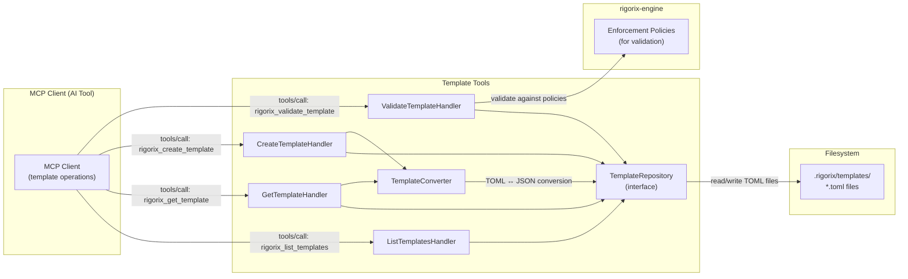
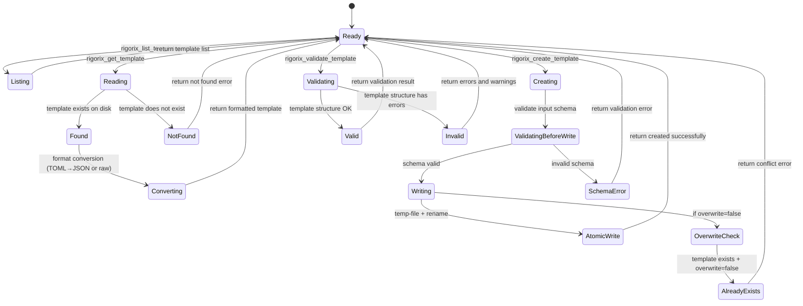
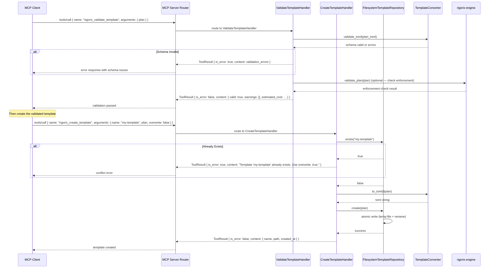

# Template Tools

## Module Status

**Status:** Planned
**Last reviewed:** 2026-07-12
**Source session:** d19b7a21-8f4c-4b3e-9a1d-5e6f7c8b9a0d

## Description

Bridges MCP tool calls to template filesystem: discover templates (`rigorix_list_templates`), read templates (`rigorix_get_template`), create templates (`rigorix_create_template`), and validate template structure (`rigorix_validate_template`). Templates are stored as TOML files in `.rigorix/templates/` directory, making them portable across AI tools.

## Architecture

This module follows **Domain-Driven Design** with Clean Architecture layers:

| Layer | Responsibility | Path |
|-------|---------------|------|
| **Domain** | TemplateRepository trait, PlanTemplate, TemplateFilter, TemplateConverter contracts | `src/template-tools/domain/` |
| **Application** | Use cases for list, get, create, validate templates | `src/template-tools/application/` |
| **Infrastructure** | Filesystem template repository (TOML), atomic write operations, file locking | `src/template-tools/infrastructure/` |
| **Interfaces** | MCP tool handlers exposing rigorix_list_templates, rigorix_get_template, rigorix_create_template, rigorix_validate_template | `src/template-tools/interfaces/` |

## Related ADRs

| ADR | Relevance |
|-----|-----------|
| [ADR-001](./decisions/ADR-001-architecture-pattern.md) | Template Tools is one of the 5 bounded contexts in the modular monolith |
| [ADR-002](./decisions/ADR-002-data-storage-strategy.md) | Defines TOML filesystem storage for templates with atomic writes — directly governs TemplateRepository implementation |
| [ADR-003](./decisions/ADR-003-cross-context-communication.md) | Defines EngineFacade trait — Template Tools uses EngineFacade for template validation against enforcement policies |
| [ADR-005](./decisions/ADR-005-authentication-and-authorization.md) | Defines that template storage path is local filesystem — no enterprise boundary concerns for OSS templates |

## Diagrams

### Data Flow



### Entity Relationship

```mermaid
classDiagram
    class TemplateRepository {
        <<interface>>
        +list(filter: TemplateFilter) Result~Vec~TemplateSummary~~
        +get(name: String) Result~PlanTemplate~
        +create(template: PlanTemplate) Result
        +update(template: PlanTemplate) Result
        +delete(name: String) Result
        +exists(name: String) bool
    }

    class FilesystemTemplateRepository {
        -base_path: PathBuf
        -lock: FileLock
        +list(filter) Result~Vec~TemplateSummary~~
        +get(name) Result~PlanTemplate~
        +create(template) Result
    }

    class ListTemplatesHandler {
        +handle(input: TemplateFilter) Result~ToolCallResult~
    }

    class GetTemplateHandler {
        +handle(input: GetTemplateInput) Result~ToolCallResult~
    }

    class CreateTemplateHandler {
        +handle(input: CreateTemplateInput) Result~ToolCallResult~
    }

    class ValidateTemplateHandler {
        +handle(input: ValidateTemplateInput) Result~ToolCallResult~
    }

    class TemplateConverter {
        +to_toml(template: &PlanTemplate) String
        +to_json(template: &PlanTemplate) Value
        +from_toml(toml_str: &str) Result~PlanTemplate~
        +from_json(json: Value) Result~PlanTemplate~
        +validate_toml(toml_str: &str) Result
    }

    class PlanTemplate {
        <<value object>>
        +name: String
        +description: String
        +version: String
        +tags: Vec~String~
        +steps: Vec~StepDefinition~
        +constraints: Constraints
        +metadata: HashMap~String, String~
        +created_at: DateTime
        +updated_at: DateTime
    }

    class TemplateSummary {
        <<value object>>
        +name: String
        +description: String
        +version: String
        +tags: Vec~String~
        +step_count: usize
        +updated_at: DateTime
    }

    class TemplateFilter {
        <<value object>>
        +tags: Option~Vec~String~~
        +search: Option~String~
        +limit: usize
    }

    class GetTemplateInput {
        <<value object>>
        +name: String
        +format: Option~String~ (json/toml)
    }

    class CreateTemplateInput {
        <<value object>>
        +name: String
        +plan: PlanTemplate
        +overwrite: bool
    }

    class ValidateTemplateInput {
        <<value object>>
        +plan: PlanTemplate
    }

    TemplateRepository <|.. FilesystemTemplateRepository
    ListTemplatesHandler --> TemplateRepository
    GetTemplateHandler --> TemplateRepository
    CreateTemplateHandler --> TemplateRepository
    ValidateTemplateHandler --> TemplateRepository

    ListTemplatesHandler ..> TemplateFilter
    GetTemplateHandler ..> GetTemplateInput
    CreateTemplateHandler ..> CreateTemplateInput
    ValidateTemplateHandler ..> ValidateTemplateInput

    TemplateRepository ..> PlanTemplate
    TemplateRepository ..> TemplateSummary

    CreateTemplateHandler --> TemplateConverter
    GetTemplateHandler --> TemplateConverter
    ValidateTemplateHandler --> TemplateConverter
```



### Aggregate State



### Key Use Case Sequence: Create and Validate Template



## Components

### TemplateRepository (Aggregate Root)

Filesystem-backed repository for plan templates stored as TOML files in `.rigorix/templates/`.

**Invariants:**
- All template files are valid TOML conforming to the PlanTemplate schema
- Writes are atomic: write to temp file → fsync → rename
- Concurrent writes are serialized via file locking (`fs2::FileLock` or equivalent)
- Template names are filesystem-safe (only `[a-zA-Z0-9_-]` characters)
- Templates are immutable once created (update is delete + create)

**Key Methods:**
```rust
#[async_trait]
pub trait TemplateRepository: Send + Sync {
    async fn list(&self, filter: TemplateFilter) -> Result<Vec<TemplateSummary>, TemplateError>;
    async fn get(&self, name: &str) -> Result<PlanTemplate, TemplateError>;
    async fn create(&self, template: PlanTemplate, overwrite: bool) -> Result<(), TemplateError>;
    async fn delete(&self, name: &str) -> Result<(), TemplateError>;
    async fn exists(&self, name: &str) -> bool;
}

pub struct FilesystemTemplateRepository {
    base_path: PathBuf,
    lock: Arc<tokio::sync::Mutex<()>>,
}

impl FilesystemTemplateRepository {
    pub fn new(base_path: impl Into<PathBuf>) -> Self;
}

impl FilesystemTemplateRepository {
    async fn atomic_write(&self, name: &str, content: &str) -> Result<(), TemplateError> {
        let template_path = self.base_path.join(format!("{}.toml", name));
        let tmp_path = self.base_path.join(format!(".{}.tmp", name));

        // Write to temp file
        tokio::fs::write(&tmp_path, content).await?;

        // fsync (on Unix, need to open file and sync)
        let file = tokio::fs::File::open(&tmp_path).await?;
        file.sync_all().await?;

        // Atomic rename
        tokio::fs::rename(&tmp_path, &template_path).await?;

        Ok(())
    }
}
```

### ListTemplatesHandler (Domain Service)

Handles `rigorix_list_templates` tool calls: discovers templates from filesystem.

```rust
pub struct ListTemplatesHandler {
    repository: Arc<dyn TemplateRepository>,
}

impl ListTemplatesHandler {
    pub fn new(repository: Arc<dyn TemplateRepository>) -> Self;

    pub async fn handle(&self, filter: TemplateFilter) -> Result<ToolCallResult, HandlerError> {
        let templates = self.repository.list(filter).await?;
        Ok(ToolCallResult::success(serde_json::to_value(templates)?))
    }
}
```

### GetTemplateHandler (Domain Service)

Handles `rigorix_get_template` tool calls: reads and returns a specific template.

```rust
pub struct GetTemplateHandler {
    repository: Arc<dyn TemplateRepository>,
    converter: TemplateConverter,
}

impl GetTemplateHandler {
    pub fn new(repository: Arc<dyn TemplateRepository>) -> Self;

    pub async fn handle(&self, input: GetTemplateInput) -> Result<ToolCallResult, HandlerError> {
        let template = self.repository.get(&input.name).await?;

        let content = match input.format.as_deref() {
            Some("toml") => self.converter.to_toml(&template),
            _ => serde_json::to_value(&template)?, // default: JSON
        };

        Ok(ToolCallResult::success(content))
    }
}
```

### CreateTemplateHandler (Domain Service)

Handles `rigorix_create_template` tool calls: validates and saves a new template.

```rust
pub struct CreateTemplateHandler {
    repository: Arc<dyn TemplateRepository>,
    converter: TemplateConverter,
}

impl CreateTemplateHandler {
    pub fn new(repository: Arc<dyn TemplateRepository>) -> Self;

    pub async fn handle(&self, input: CreateTemplateInput) -> Result<ToolCallResult, HandlerError> {
        // Validate name
        if !is_valid_template_name(&input.name) {
            return Err(HandlerError::InvalidArgument("name"));
        }

        // Check if exists (unless overwrite)
        if !input.overwrite && self.repository.exists(&input.name).await {
            return Ok(ToolCallResult::error(format!(
                "Template '{}' already exists. Use overwrite: true.",
                input.name
            )));
        }

        // Validate and save
        let template = self.converter.validate_and_convert(input.plan)?;
        self.repository.create(template, input.overwrite).await?;

        Ok(ToolCallResult::success(serde_json::json!({
            "name": input.name,
            "path": format!(".rigorix/templates/{}.toml", input.name),
            "status": "created"
        })))
    }
}
```

### ValidateTemplateHandler (Domain Service)

Handles `rigorix_validate_template` tool calls: validates template structure.

```rust
pub struct ValidateTemplateHandler {
    engine: Arc<dyn EngineFacade>,
    converter: TemplateConverter,
}

impl ValidateTemplateHandler {
    pub fn new(engine: Arc<dyn EngineFacade>) -> Self;

    pub async fn handle(&self, input: ValidateTemplateInput) -> Result<ToolCallResult, HandlerError> {
        // 1. Schema validation
        let template = match self.converter.validate_and_convert(input.plan) {
            Ok(t) => t,
            Err(e) => return Ok(ToolCallResult::success(serde_json::json!({
                "valid": false,
                "errors": vec![e.to_string()],
                "warnings": []
            }))),
        };

        // 2. Enforcement validation (optional — delegate to engine)
        let engine_result = self.engine.validate_plan(template).await?;

        Ok(ToolCallResult::success(serde_json::json!({
            "valid": engine_result.valid,
            "warnings": engine_result.warnings,
            "errors": engine_result.errors,
            "estimated_cost": engine_result.estimated_cost
        })))
    }
}
```

### TemplateConverter (Domain Service)

Converts between TOML (filesystem storage) and JSON (MCP transport) template formats.

```rust
pub struct TemplateConverter;

impl TemplateConverter {
    pub fn to_toml(template: &PlanTemplate) -> String;
    pub fn to_json(template: &PlanTemplate) -> Value;
    pub fn from_toml(toml_str: &str) -> Result<PlanTemplate, TemplateError>;
    pub fn from_json(json: Value) -> Result<PlanTemplate, TemplateError>;
    pub fn validate_and_convert(input: Value) -> Result<PlanTemplate, TemplateError>;
}
```

## Domain Events

| Event | Description | Trigger | Payload | Published By |
|-------|-------------|---------|---------|-------------|
| TemplateCreated | A new template was saved via `rigorix_create_template` | CreateTemplateHandler | `{ template_name, step_count, overwrite }` | CreateTemplateHandler |
| TemplateRead | A template was read via `rigorix_get_template` | GetTemplateHandler | `{ template_name, format }` | GetTemplateHandler |
| TemplateListed | Templates were listed via `rigorix_list_templates` | ListTemplatesHandler | `{ filter_criteria, result_count }` | ListTemplatesHandler |
| TemplateValidated | A template was validated via `rigorix_validate_template` | ValidateTemplateHandler | `{ template_name, is_valid, errors }` | ValidateTemplateHandler |

## API Endpoints (MCP Tool Schemas)

| Method | Path (tool name) | Handler | Input | Output | Auth |
|--------|-----------------|---------|-------|--------|------|
| `rigorix_list_templates` | `tools/call` | ListTemplatesHandler | `{ tags?: [string], search?: string, limit?: number }` | `{ templates: [{ name, description, version, tags, step_count, updated_at }] }` | Session-bound |
| `rigorix_get_template` | `tools/call` | GetTemplateHandler | `{ name: string, format?: "json" \| "toml" }` | `{ name, description, version, tags, steps, constraints, metadata, created_at, updated_at }` | Session-bound |
| `rigorix_create_template` | `tools/call` | CreateTemplateHandler | `{ name: string, plan: PlanTemplate, overwrite?: boolean }` | `{ name, path, status }` | Session-bound |
| `rigorix_validate_template` | `tools/call` | ValidateTemplateHandler | `{ plan: PlanTemplate }` | `{ valid: boolean, warnings: [string], errors: [string], estimated_cost?: { tokens, tool_calls } }` | Session-bound |

## Ubiquitous Language

Terms specific to this context from `.pi/domain/ubiquitous-language.md`:

| Term | Definition |
|------|-----------|
| **TemplateRepository** | Aggregate root managing filesystem storage of plan templates as TOML files in `.rigorix/templates/` |
| **ListTemplatesHandler** | Domain service that handles `rigorix_list_templates` tool calls: discovers templates from filesystem |
| **GetTemplateHandler** | Domain service that handles `rigorix_get_template` tool calls: reads and returns a specific template |
| **CreateTemplateHandler** | Domain service that handles `rigorix_create_template` tool calls: validates and saves a new template |
| **ValidateTemplateHandler** | Domain service that handles `rigorix_validate_template` tool calls: validates template structure |
| **TemplateConverter** | Domain service that converts between TOML (filesystem storage) and JSON (MCP transport) template formats |
| **TemplateFilter** | Value object with criteria for listing templates: tags, search text, result limit |

## Dependencies

### Depends On
- **MCP Server**: Receives tool calls routed from RequestRouter; registers tool schemas via ToolRegistry
- **Execution Tools**: Shares EngineFacade trait for template validation against enforcement policies

### Used By
- **None directly**: Template Tools is a leaf handler — other modules don't call it

## Implementation Sequence

1. **Phase 1.1 — TemplateRepository Contract**: Define `TemplateRepository` trait, `PlanTemplate` value object, `TemplateFilter`, `TemplateSummary`
2. **Phase 1.2 — FilesystemTemplateRepository**: Implement filesystem-backed repository with atomic writes (temp-file + rename), TOML parsing via `toml` crate, file locking for concurrent access
3. **Phase 1.3 — TemplateConverter**: Implement TOML↔JSON conversion, schema validation
4. **Phase 1.4 — ListTemplatesHandler**: Implement template discovery with tag filtering and search
5. **Phase 1.5 — GetTemplateHandler**: Implement template read with format selection (JSON/TOML)
6. **Phase 1.6 — CreateTemplateHandler**: Implement template creation with name validation and overwrite guard
7. **Phase 1.7 — ValidateTemplateHandler**: Implement template validation with schema check + enforcement delegation
8. **Phase 1.8 — MCP Schema Registration**: Register all four template tool schemas in ToolRegistry

**depends:** MCP Server (Phase 0), Execution Tools (Phase 1 — for EngineFacade trait)
